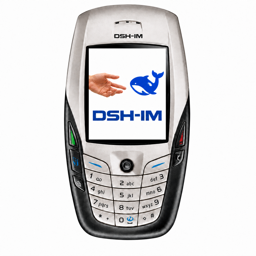
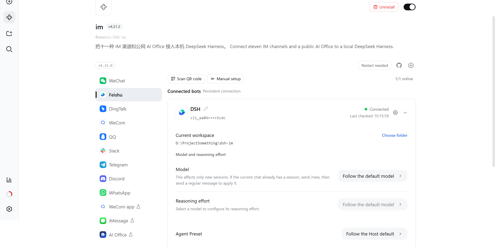
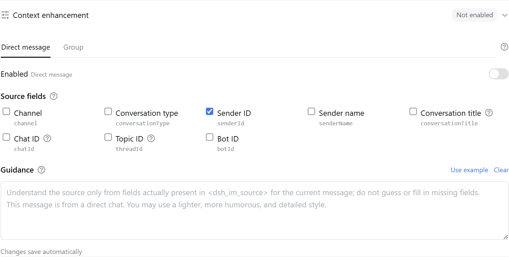
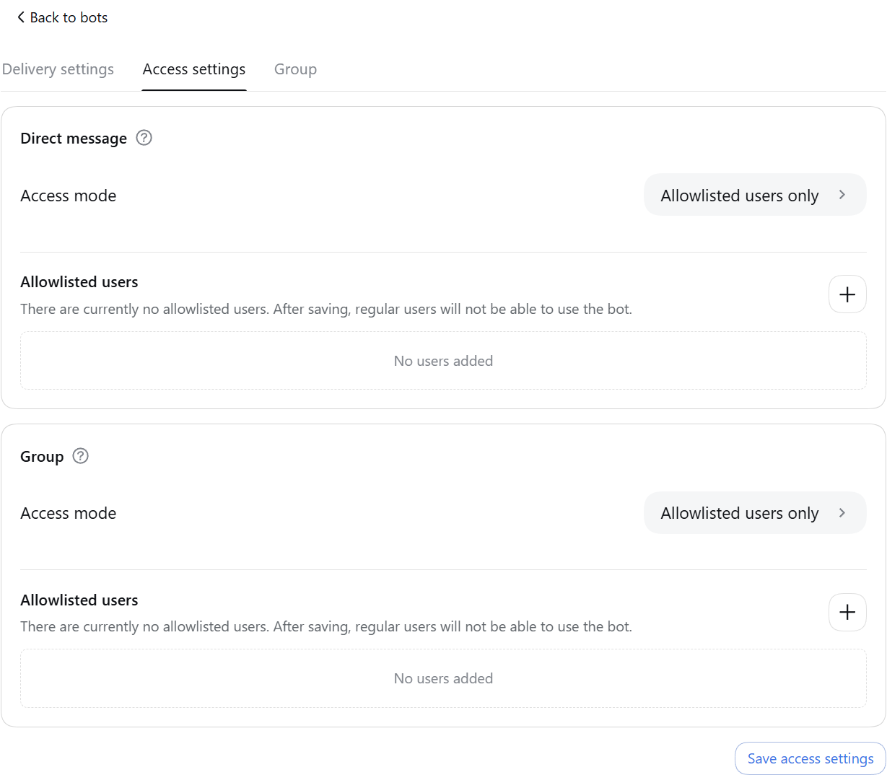
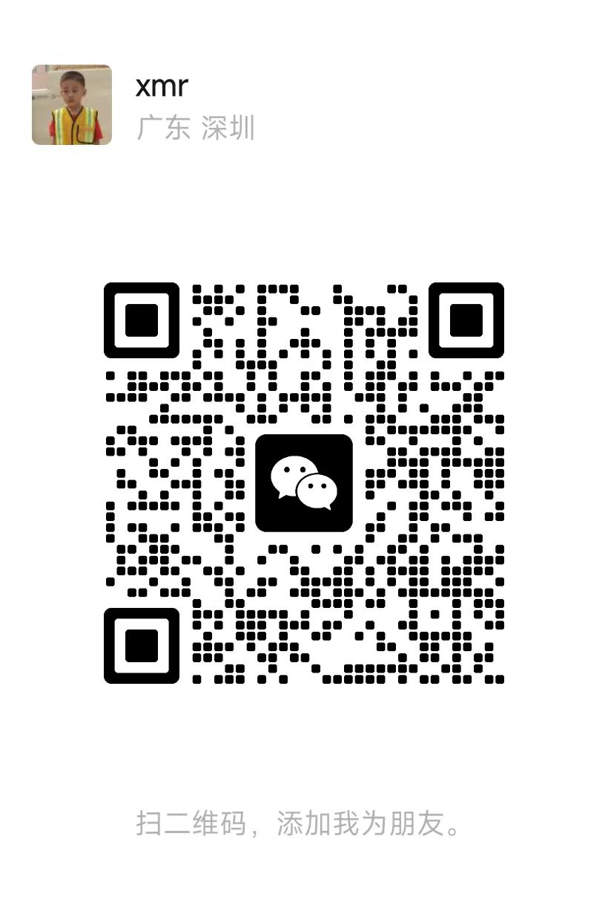
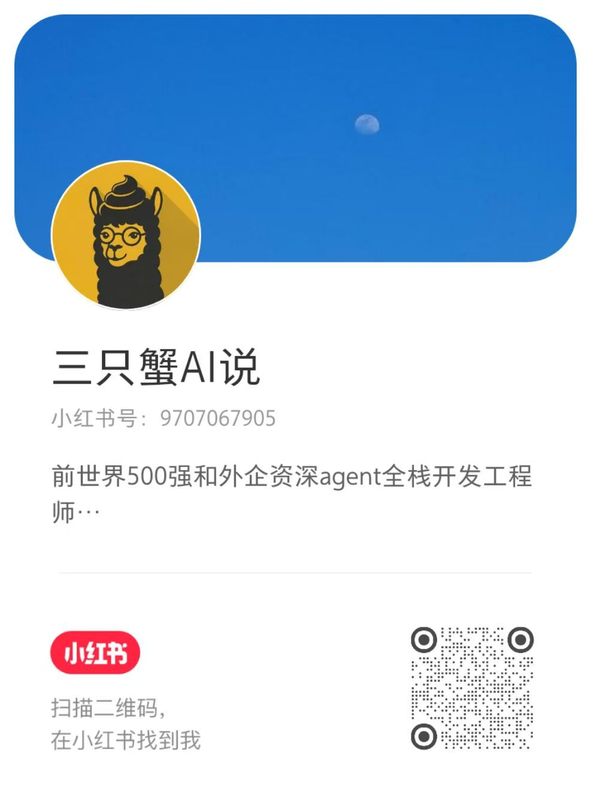

<p align="center">
  &nbsp;&nbsp;
  
</p>

---

<div align="center">
  <p><strong>Connecting DeepSeek Harness</strong></p>

  <p>
    
    <a href="LICENSE"></a>
    
    <a href="https://dshfind.com/zh/plugins/xmanrui/dsh-im?ref=badge"></a>
    <a href="https://dshfind.com/zh/plugins/xmanrui/dsh-im"></a>
    <a href="https://dshfind.com/zh/plugins/xmanrui/dsh-im?ref=badge"></a>
  </p>

  <p>
    
    
    
    
    
    
    
    
    
  </p>

  <p><a href="README.md">简体中文</a> · <strong>English</strong></p>
</div>

---

## Introduction

Connect IM bots to DeepSeek Harness by scanning a QR code, using an App Manifest, or entering existing bot credentials, and let the local Harness connect outward to a public AI Office. One plugin and one settings entry manage nine multi-bot IM channels and the AI Office Connector.

## Interface



 

## Built-in channels

| Channel | Setup | Messaging and replies |
| --- | --- | --- |
| Feishu | Create a bot by QR code, or bind one with App ID + App Secret | Persistent connection for incoming messages; streaming cards show thinking, tool progress, and replies |
| WeChat | Scan a QR code to bind a WeChat bot | Tencent iLink long polling; shows a typing indicator while Harness works, then sends the final reply in 1,800-character chunks |
| DingTalk | Create a bot by QR code, or bind one with Client ID + Client Secret | DingTalk Stream connection; streaming replies through AI Cards |
| WeCom | Create an intelligent bot by QR code, or bind one with Bot ID + Secret | Official WebSocket connection; native thinking state, tool progress, and streaming replies |
| QQ | Create a bot with mobile QQ QR scanning, or bind one with AppID + AppSecret | WebSocket connection; private chats show typing and receive one Markdown reply, while mentioned group chats receive only the final answer |
| Slack | Create an app from the bundled App Manifest, then enter a Bot Token (`xoxb-`) and App Token (`xapp-`) | Socket Mode connection; direct DM replies, mention-only channel replies, and preferred native streaming API |
| Telegram | Enter a Bot Token generated by @BotFather | Bot API long polling; DMs work by default and groups respond to mentions or replies, while each bot can optionally enable a private-DM allowlist; private chats stream through a Rich Message Draft and persist one rich final, groups and Topics finalize their placeholder in place, and unsupported Rich delivery falls back to ordinary text |
| Discord | Enter a Bot Token generated in the Developer Portal | Gateway v10 connection; direct DM replies; the first mention in a server text or announcement channel creates a native Thread, where follow-up messages no longer need to mention the bot; replies stream through message edits |
| WhatsApp | Scan a QR code with mobile WhatsApp to link a device | WhatsApp Web connection; self-chat only by default, with optional selected-contact and open-response modes; read receipt and typing indicator followed by the final answer |

Other IM platforms can be added through the same channel-adapter structure.

All nine built-in channels can send JPEG, PNG, and WebP images, plus GIFs sent as image files, with optional captions to Harness. Each image is limited to 5 MB, and images in one message are limited to 20 MB in total. Downloading images or files from Feishu user messages requires the `im:message:readonly` tenant scope, shown on the confirmation page as **Read direct and group messages**; Feishu currently offers no narrower image-only scope for that download endpoint. Apps created through the built-in QR flow request it by default; for existing or manually connected apps, click **Complete permissions** on the IM Bot settings page and scan the QR code to incrementally add that scope, `im:resource` for uploading bot-sent images or files, `application:app_slash_command:read` / `write` for the native command panel, and the card callback.

### Result-file and image delivery

All nine built-in channels can return any file readable by Harness as a native channel attachment. Existing files and files created by the current task can both be sent directly. The capability is available to every connected bot by default, with no switch or per-bot allowlist, while existing text, image, streaming, command, and Session behavior remains unchanged.

After the model calls the file-return tool, the plugin hands the specified file to the channel's native API. Images prefer native image messages; if a channel does not support or definitively rejects image delivery, the plugin falls back to a file attachment, while an uncertain result never triggers a duplicate fallback. The plugin adds no rules for file origin, creation time, workspace boundary, extension, content, count, size, or lifetime; the file only needs to exist and be readable. A channel may still reject delivery according to its own permissions, quota, file capability, or account tier, and the plugin reports that provider result.

| Channel | Platform requirements |
| --- | --- |
| WeChat | The current binding protocol and conversation must support native file messages; the WeChat API response determines the actual range. |
| Feishu | Feishu's file-upload API requires a non-empty file no larger than the platform's 30 MB limit. The app needs the `im:resource` tenant scope (**Read and upload images or other files**). Apps created through the built-in QR flow request it by default; existing or manually connected apps can add it incrementally through **Complete permissions** or `/repair` in a direct chat, followed by any approval Feishu requires. The Feishu developer console currently has no separate `im:resource:upload` scope. |
| DingTalk | The app needs `qyapi_base`, and the bot must support file messages. The current OAPI and bot capability determine the accepted formats and sizes. |
| WeCom | The app needs media-upload and file-message capability; the WeCom API response determines the actual range. |
| QQ | The bot needs file-message capability and remains subject to QQ's daily upload quota; the bot reports when the quota is exhausted. |
| Slack | The Bot Token needs `files:read`, `files:write`, and `reactions:write`; the Workspace's current policy determines the actual file-size limit. After changing scopes, re-authorize/reinstall the App and reconnect the bot. |
| Telegram | The bot must be allowed to send documents in the current chat; the Bot API response determines the actual range. |
| Discord | Enable **Message Content Intent** in the Developer Portal. The bot needs **Send Messages**, **Create Public Threads**, **Send Messages in Threads**, and **Read Message History**; result-file delivery also requires **Attach Files**. The current account and server capability determine the actual attachment allowance. |
| WhatsApp | The linked session must support Document Messages; the WhatsApp/Baileys response determines the actual range. |

## AI Office Connector

[Read the AI Office Connector guide](docs/AI-Office-Connector.en.md)

## Installation

Install the published stable release from npm (recommended):

```sh
dsh plugin --profile web add -w @xmanrui/dsh-im
```

Restart `dsh web`, refresh the browser, then open **Settings → IM Bot**. The top-level IM Bot entry uses `order: 21` to follow **Agent Presets**, and the Plugins page no longer retains the old entry. Upgrading preserves existing bots, credentials, workspaces, Agent Presets, and Session bindings.

Local `dsh web` and DSH Desktop reuse the current Host's internal services by default: legacy Harness releases use `apiProxy`, while current releases automatically use the Typert Gateway plus the Session and Workspace controllers. No Harness address or loopback HTTP connection is required. Desktop's compatibility, extended-window, and advanced modes do not require browser access or LAN access to be enabled. An explicit channel `harnessBaseUrl` is retained only for legacy remote HTTP/WebSocket Harness endpoints; failed internal calls never silently switch to another Host.

To try the latest code before it is published to npm, use the GitHub-source installer instead:

```sh
npx -y github:xmanrui/dsh-im install
```

A GitHub-source installation fetches and builds a Git dependency directly. With pnpm 10 or newer, the profile may first need an `allowBuilds` entry in `pnpm-workspace.yaml`. Most users should prefer the stable npm release.

After installation, follow the built-in instructions on each channel page to scan a QR code or enter credentials. Secrets and Tokens are sent only to the local Harness Host and stored through its protected credential provider; status responses and bot lists never return them.

If this machine must use a forward proxy to reach Feishu, set `HTTPS_PROXY` to a full HTTP proxy URL before starting `dsh web` (for example, `http://proxy:8080`; lowercase `https_proxy` is also supported, with `HTTP_PROXY` accepted as a fallback), then restart the Host after changing it. Feishu registration and credential verification reuse the SDK's proxy-aware HTTP client, while the message WebSocket explicitly uses that proxy; the WebSocket path does not currently read `ALL_PROXY` or `NO_PROXY`.

If this machine cannot reach the Telegram Bot API directly, use Node.js 22.21 or newer and enable Node's environment proxy support before starting `dsh web`:

```sh
NODE_USE_ENV_PROXY=1 \
HTTPS_PROXY=http://proxy:8080 \
HTTP_PROXY=http://proxy:8080 \
NO_PROXY=localhost,127.0.0.1 \
dsh web
```

Use the proxy URL required by your network and restart the Host after changing it. If Telegram Bot Token binding reports that the Bot API cannot be reached, first check the proxy URL, Node.js version, and `NO_PROXY` configuration.

| Default behavior | Description |
| --- | --- |
| Bot workspace | Each bot stores its workspace independently. New bots start with the Host's current working directory, which can later be changed from the bot card. |
| Agent Preset | Each bot can choose an Agent Preset on its settings card. When none is chosen, new Sessions follow the Host's `agent-presets.default`. A channel-level `config.agentPreset` is only the default for later new bots on that channel. Changing the preset never modifies or clears existing Sessions; if the current chat already has a Session, send `/new` and then a regular message to create one with the new selection. |
| Context enhancement | Open settings from a bot card to enable groups and DMs independently. Both switches default to off, including for existing bots after an upgrade. |

### Proactive delivery

All nine IM channels can proactively send text through a stable `botId + targetId` pair. Bot settings support choosing a known conversation or entering a target manually, testing the current route before saving, and copying call parameters. HTTP POST, same-Host plugins, and Connection RPC share the same target configuration and delivery core.

See the [Proactive Delivery Guide](PROACTIVE_DELIVERY.en.md) ([简体中文](PROACTIVE_DELIVERY.md)) for setup steps, native fields for all nine channels, complete call examples, management endpoints, error codes, and troubleshooting.

### Context enhancement

[Read the context enhancement guide](docs/context-enhancement.md)

### Access modes

[Read the access modes guide](docs/access-modes.md)

## Checking and installing updates

[Read the update-checking and installation guide](docs/checking-and-installing-updates.md)

## Bot commands

| Command | Description |
| --- | --- |
| `/help` | Show the commands and usage supported by the bot. |
| `/new` | Unbind the current chat so its next ordinary message starts a new Harness Session. |
| `/status` | Check the connection between the current bot and DeepSeek Harness. |
| `/version` | Show the version of the running dsh-im plugin. |
| `/models` | List every currently configured model with a number. |
| `/model` | Show the model and reasoning effort used by the Session bound to this chat. |
| `/model <number or provider/model-id> [reasoning effort ID]` | Switch the Session model and optionally select an effort supported by the target model. |
| `/reasoninglist`, `/reasonings` | Equivalent aliases that list the reasoning efforts supported by the current model. |
| `/reasoning` | Show the current Session model and reasoning effort. |
| `/reasoning <number or effort ID>` | Switch the current model's reasoning effort. |
| `/reasoning --default` | Restore the current model's default reasoning effort. |
| `/presetlist`, `/presets` | Equivalent aliases that list the Host's currently available Agent Presets, marking the Host default and this bot's selection. |
| `/preset` | Show this bot's Agent Preset setting for new Sessions. |
| `/preset <number or Preset ID>` | Set this bot's Agent Preset; use `/preset id:<ID>` for a numeric ID. |
| `/preset --default` | Clear this bot's explicit selection so later new Sessions follow the Host default. |
| `/stop` | Immediately stop this chat's running task while preserving work that has not started. |
| `/steer <additional instruction>` | Inject an additional instruction into this chat's running task. |
| `/batch` | Start batch input in a direct chat and collect up to 10 text messages. |
| `/send` | Submit the collected messages, in order, as one input. |
| `/cancel` | Cancel batch input and discard its collected messages. |
| `/repair` | In a Feishu direct chat, incrementally repair the card callback and permissions required for media and the native Slash Command panel. |
| `/compact` | Immediately compact older context in the Session bound to the current chat. |
| `/workspace <workspace index or absolute path>`, `/ws <workspace index or absolute path>` | Switch the current bot's Harness workspace by `/workspacelist` index or absolute path. |
| `/workspacelist`, `/workspaces`, `/wsl` | List workspace absolute paths that still exist on the current Harness Host. |
| `/sessionlist [workspace number or absolute path]`, `/sessions [...]` | Equivalent aliases that list every registered session ID and title in the selected workspace; omit the argument to use the current workspace. |
| `/sessionlist --limit N`, `/sessions --limit N` | List the first N sessions in the current workspace's existing order; N must be a positive integer. |
| `/session <Session ID>` | Bind the current chat to an existing Harness session. |
| `/history [count]` | Preview recent messages from the bound Session in a direct chat; defaults to 3, capped at 5. |
| Interactive question | Reply with an option number, option label, or custom text; separate multiple choices with commas. |
| Remote approval | Reply with `批准` / `拒绝` / `同意` / `不同意` / `yes` / `no`. |

### Command details

[Read the command details](docs/bot-commands.md)

## Other features

- **Image understanding**: all nine built-in channels can send JPEG, PNG, WebP, and GIF files sent as images to Harness, with an optional text description. Each image is limited to 5 MB, and all images in one message are limited to 20 MB in total.
- **Switch workspaces from a bot card**: every bot card on the settings page shows its current Harness workspace. Enter an existing absolute directory path directly or open the directory picker. Switching clears only that bot's old chat mappings; it never deletes, empties, or archives old Sessions. Replies already in progress may finish, while later messages use the new workspace.
- **Choose an Agent Preset from a bot card**: every bot card can select one of the Host's existing Agent Presets, or follow the Host default. The change applies only to that bot and only to later new Sessions; existing Sessions and replies already in progress are left unchanged.
- **Check the connection and send a test message**: when a bot is online, clicking **Check connection** verifies the platform connection and sends a “DeepSeek Harness connection test succeeded” message to the bot's most recently remembered direct conversation; WhatsApp uses the account's self-chat. The test neither creates a Harness Session nor invokes the model. The bot must have received at least one direct message before it has a remembered test target; otherwise the page reports that no test conversation is available yet.
- **Retry a connection or remove an integration**: when a bot is offline, its card action changes to **Retry connection**. Use **Remove integration** when the bot is no longer needed. Each action affects only the selected bot and leaves other bots and channels unchanged.
- **Manage multiple bots independently**: a channel can have multiple connected bots. Credentials, connection state, workspace, Agent Preset, and chat-to-Session mappings are kept separately for every bot, so card actions do not affect sibling bots.
- **Streaming replies and progress**: the plugin uses each platform's available capabilities to show thinking state, tool progress, and incremental answers. Platforms without a native streaming API complete replies through message edits, card updates, or a final message.

## Design

- Registers one top-level **IM Bot** settings page containing nine IM channels and one AI Office Connector.
- Maintains the Host, client, and runtime sources for all nine channels and the Office Connector in this repository without external standalone plugins.
- Follows the DeepSeek Harness language preference and switches the settings UI live between Chinese and English. Bot chat messages follow the Host's `language` config (Chinese by default; `en` switches them to English), with Chinese always as the fallback so untranslated text is sent verbatim.
- Uses logos for WeChat, Feishu, DingTalk, WeCom, QQ, Slack, Telegram, Discord, WhatsApp, and AI Office navigation without enable/disable switches.
- Keeps RPC endpoints, credentials, connection supervision, and session mappings isolated by IM channel; the Office Connector separately owns Device credentials, Job leases, approval waits, and concurrency limits.
- Returns only QR codes, the public Slack Manifest, redacted status data, and access modes or allowlist identifiers explicitly saved for the current Telegram or WhatsApp bot. Manually entered secrets and Tokens travel one way to the local Host; no RPC response returns App Secrets, `bot_token`, DingTalk `client_secret`, WeCom Secrets, QQ `app_secret`, Slack Bot/App Tokens, Telegram/Discord Bot Tokens, WhatsApp linked-device keys, AI Office Device Tokens, or other raw user identifiers observed from platform messages.

## Local development

```sh
npm install
npm run check
node bin/dsh-im.mjs install --source .
```

`npm run check` runs unit tests, builds the Host and Client artifacts, and verifies that the published package contains neither credentials nor standalone channel settings-page registrations.

IM management RPCs accept loopback browsers by default. When a Web profile is deliberately served on a trusted LAN, opt the plugin into the Host authorities already trusted by Connection in that profile's `cordis.patch.yml`:

```yaml
- id: xmanrui-dsh-im
  config:
    rpcAuthority: trusted-host
```

`trusted-host` reuses Harness's Host/Origin fence; it is not user authentication. Anyone who can reach that LAN authority can inspect bot status, scan or submit application credentials, reconnect bots, and remove bots. Enable it only on a trusted network.

### Bot chat message language

Bot chat messages are in Chinese by default. To switch them to English, set `language: en` in the plugin config (also accepts `en-US` or `english`), or set the `DSH_IM_LANGUAGE=en` environment variable:

```yaml
- id: xmanrui-dsh-im
  config:
    language: en
```

Without a setting, Chinese is used. Chinese is always the fallback language — any text missing from the English dictionary is sent verbatim in Chinese, so this feature never changes the behavior of existing Chinese users.

---

## Contact

Join the WeCom community group, or reach me by email, WeChat, Xiaohongshu, or WhatsApp.

<table>
  <tr>
    <th align="center">Email</th>
    <th align="center">WeCom Group</th>
    <th align="center">WeChat</th>
    <th align="center">Xiaohongshu</th>
    <th align="center">WhatsApp</th>
  </tr>
  <tr>
    <td align="center" valign="middle">
      <a href="mailto:longmanr307@gmail.com">longmanr307@gmail.com</a>
    </td>
    <td align="center" valign="top">
      <a href="docs/images/wecom.jpg"></a>
    </td>
    <td align="center" valign="top">
      <a href="docs/images/weixin.jpg"></a>
    </td>
    <td align="center" valign="top">
      <a href="docs/images/xhs.jpg"></a>
    </td>
    <td align="center" valign="top">
      <a href="docs/images/WhatsApp.jpg"></a>
    </td>
  </tr>
</table>
