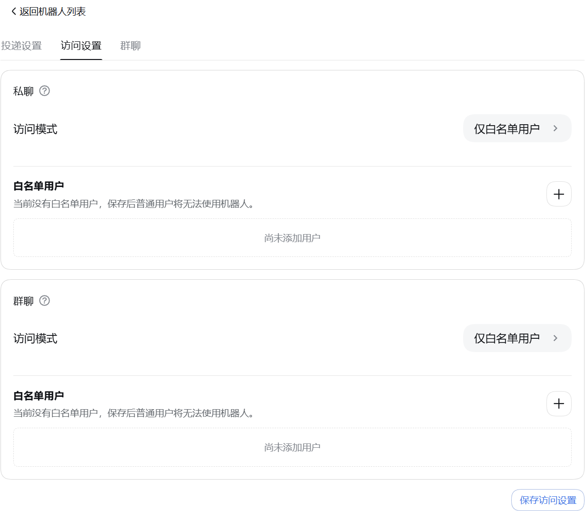

<p align="center">
  &nbsp;&nbsp;
  
</p>

---

<div align="center">
  <p><strong>让 DeepSeek Harness 触手可及</strong></p>
  <p><strong>Connecting DeepSeek Harness</strong></p>

  <p>
    
    <a href="LICENSE"></a>
    
    <a href="https://dshfind.com/zh/plugins/xmanrui/dsh-im?ref=badge"></a>
    <a href="https://dshfind.com/zh/plugins/xmanrui/dsh-im"></a>
    <a href="https://dshfind.com/zh/plugins/xmanrui/dsh-im?ref=badge"></a>
  </p>

  <p>
    
    
    
    
    
    
    
    
    
  </p>

  <p><strong>简体中文</strong> · <a href="README.en.md">English</a></p>
</div>

---

## 简介

通过扫码、App Manifest 或已有机器人凭据把 IM 机器人接入 DeepSeek Harness，并让本机 Harness 主动连接公网 AI Office。一个插件、一个设置入口，统一管理内置 IM 渠道和 AI Office Connector。**每个 IM 渠道都支持接入多个机器人**，各机器人的连接状态、工作区、模型和会话绑定彼此独立；iMessage 是本机 Messages.app 身份接入的例外，详见[iMessage 渠道说明](docs/imessage.md)。

Connect IM bots to DeepSeek Harness by scanning a QR code, using an App Manifest, or entering existing bot credentials, and let the local Harness connect outward to a public AI Office. One plugin and one settings entry manage the built-in IM channels and the AI Office Connector.

## 界面


 

## 当前内置渠道

| 渠道 | 接入方式 | 消息与回复 |
| --- | --- | --- |
| 飞书 | 扫码创建机器人，或使用 App ID + App Secret 手动绑定 | 长连接接收消息；通过飞书流式卡片显示思考、工具进度和回答 |
| 微信 | 使用微信扫码绑定机器人 | 腾讯 iLink 长轮询收发消息；等待 Harness 回答时显示“正在输入”，最终回复按 1,800 字符分段发送 |
| 钉钉 | 扫码创建机器人，或使用 Client ID + Client Secret 手动绑定 | 钉钉 Stream 长连接；通过 AI Card 流式显示回答 |
| 企业微信 | 使用企业微信 App 扫码创建智能机器人，或使用 Bot ID + Secret 手动绑定 | 官方 WebSocket 长连接；原生显示“正在思考中”、工具执行进度和流式回答 |
| 企业微信应用 | 在企业微信管理后台创建自建应用，填写企业 ID、AgentId、Secret、Token、EncodingAESKey（可选代理地址） | HTTP 回调接收；私聊支持流式回复（微信端不支持时自动改为分段文本），支持图片输入与结果文件回传；成员的微信关注该企业的微信插件后可在微信中直接使用 |
| QQ | 使用手机 QQ 扫码创建机器人，或使用 AppID + AppSecret 手动绑定 | WebSocket 长连接；私聊显示“正在输入”并以单条 Markdown 回复，群聊被 @ 后只发送最终答案 |
| Slack | 使用预置 App Manifest 创建应用，再填写 Bot Token（`xoxb-`）和 App Token（`xapp-`） | Socket Mode 长连接；私聊直接回复，频道被 @ 后响应，优先使用官方流式消息 API |
| Telegram | 使用 @BotFather 生成的 Bot Token | Bot API 长轮询；默认私聊直接响应、群聊被提及或回复时响应，也可为每个机器人独立启用私聊白名单安全模式；私聊通过 Rich Message Draft 流式预览并持久化最终富消息，群聊和 Topic 原位完成占位消息，平台不支持时回退为普通文字 |
| Discord | 使用 Developer Portal 生成的 Bot Token | Gateway v10 长连接；私信直接回复；服务器文字/公告频道首次 @ 后创建原生 Thread，后续在线程中无需重复 @，并通过编辑消息流式显示回答 |
| WhatsApp | 使用手机 WhatsApp 扫码关联设备 | WhatsApp Web 长连接；默认仅响应账号自聊，也可切换到指定联系人或开放响应模式；显示已读和“正在输入”，通过每秒编辑同一条消息显示工具进度和逐步生成的回答，长回复自动分段，编辑失败时回退为完整文字回复 |
| iMessage | 在 macOS Messages.app 中登录 iMessage，并按[渠道说明](docs/imessage.md)授予本机权限 | 使用 macOS 原生 Messages.app 收发文本私聊；不依赖 BlueBubbles；每个 macOS 用户账户使用一个本机 iMessage 身份 |

企业微信自建应用的回调基址、代理地址和企业可信 IP 配置，见[企业微信自建应用接入说明](docs/企业微信自建应用接入.md)。

其他 IM 平台可继续按同一渠道适配器结构接入。

飞书群聊默认接收其他机器人明确 @ 当前机器人的消息，无需额外开关；未 @、仅 @ 其他成员或全体、机器人自身发送的消息和机器人私聊消息仍会忽略，即使群聊响应方式设为“全部”。消息仍受群聊白名单与命令权限约束。飞书应用需要租户权限 `im:message.group_at_msg.include_bot:readonly`（“获取群组中其他机器人和用户@当前机器人的消息”）；扫码新建应用会默认申请，已有或手动绑定的应用可点击“补全权限”或私聊执行 `/repair`，扫码并完成飞书要求的发布审批后生效。详见[飞书接收消息权限说明](https://open.feishu.cn/document/server-docs/im-v1/message/events/receive)。

支持图片输入的内置渠道均支持把 JPEG、PNG、WebP 图片，以及以图片文件方式发送的 GIF，连同可选文字说明发送给 Harness；单张图片上限为 5 MB，单条消息中的图片总大小上限为 20 MB。iMessage 首版仅支持文本私聊，不包含在图片能力中。飞书下载用户消息中的图片或文件需要租户权限 `im:message:readonly`，确认页将其显示为“获取单聊、群组消息”；飞书目前没有为该下载接口提供仅限图片的更窄权限。扫码新建的应用会默认申请；已有或手动绑定的应用可私聊机器人执行 `/repair`，或在「IM机器人」设置页点击“补全权限”，扫码增量补全该权限、上传机器人图片或文件所需的 `im:resource`、原生命令面板所需的 `application:app_slash_command:read` / `write`，以及卡片回调。

### 超时后的结果补发

已接入的 IM 渠道共用超时任务跟踪：收到“等待模型回复超时”后，插件会继续检查原任务，完成后向原聊天或线程补发最终文字；插件重启或连接恢复后也会继续检查。`/stop` 只停止当前聊天提交的对应回合，切换会话后不再向该聊天补发旧会话的结果。无需新增设置，正常回复流程保持原样。

补发仍受渠道发送权限和配额限制。明确发送失败最多尝试三次；发送结果不确定时保留记录并停止自动重试，避免重复消息。此机制恢复文字结果和终态通知，不重放问题、审批或文件工具调用。详见[延迟交付说明](docs/deferred-delivery.md)。

### 结果文件与图片回传

支持文件回传的内置渠道均可把 Harness 可读取的文件作为渠道原生附件回传。已有文件和当前任务新生成的文件都可以直接发送；该能力对所有已连接机器人默认可用，无需开关或机器人白名单，原有文字、图片、流式回复、命令和会话行为保持不变。iMessage 首版不支持文件或附件回传。

模型调用文件回传工具后，插件把指定文件交给当前渠道的原生接口。图片会优先以原生图片消息呈现；渠道不支持或明确拒绝图片发送时自动回退为文件附件，发送结果不确定时不会补发文件造成重复消息。插件不额外设置文件来源、创建时间、工作区边界、扩展名、内容、数量、大小或有效期规则；文件只需真实存在且可读取。渠道平台仍可能依据自身权限、配额、文件能力或账号等级拒绝发送，插件会按平台返回结果提示。

| 渠道 | 平台要求 |
| --- | --- |
| 微信 | 当前绑定协议和会话需支持原生文件消息，实际可发送范围以微信接口返回为准。 |
| 飞书 | 飞书文件上传接口要求文件非空且不超过平台 30 MB；应用需有租户权限 `im:resource`（“读取与上传图片或文件资源”）。内置扫码流程新建应用时默认申请该权限；已有或手动绑定的应用可通过“补全权限”或私聊 `/repair` 增量补全并完成飞书要求的审批。飞书开发者后台当前没有单独的 `im:resource:upload` 权限。 |
| 钉钉 | 应用需开通 `qyapi_base`，机器人需具备文件消息能力；实际格式和大小以当前 OAPI 与机器人能力返回为准。 |
| 企业微信 | 应用需具备素材上传和文件消息能力，实际可发送范围以企业微信接口返回为准。 |
| QQ | 机器人需具备文件消息能力，并受 QQ 当日文件上传配额约束；额度耗尽时会明确提示稍后重试。 |
| Slack | Bot Token 需有 `files:read`、`files:write` 和 `reactions:write`；实际文件大小上限由 Workspace 当前策略决定。已有 App 新增或变更 Scope 后，必须重新授权/安装 App 并重新连接机器人。 |
| Telegram | 机器人必须能在当前聊天发送文档，实际可发送范围以 Bot API 返回为准。 |
| Discord | Developer Portal 的 Bot 设置中需启用 **Message Content Intent**；机器人需有 **Send Messages**、**Create Public Threads**、**Send Messages in Threads** 和 **Read Message History** 权限；发送结果文件还需 **Attach Files**。实际附件额度由当前账号与服务器能力决定。 |
| WhatsApp | 当前绑定会话需支持 Document Message，实际可发送范围以 WhatsApp/Baileys 返回为准。 |

## AI Office Connector

[查看 AI Office Connector 说明](docs/AI-Office-Connector.md)

## 安装

推荐从 npm 安装已发布的稳定版本：

```sh
dsh plugin --profile web add -w @xmanrui/dsh-im
```

重启 `dsh web`、刷新浏览器，然后打开「设置 → IM机器人」。IM机器人使用 `order: 21`，尽量排在一级设置菜单的「Agent 预设」之后；插件页面不再保留旧入口。从旧版升级不会改变已有机器人、凭据、工作区、Agent Preset 或会话绑定。

本机 `dsh web` 和 DSH Desktop 默认直接复用当前 Host 的内部服务：旧版 Harness 使用 `apiProxy`，新版 Harness 自动使用 Typert Gateway、Session Controller 和 Workspace Controller，不需要配置 Harness 地址，也不绕行本机 HTTP 端口。Desktop 的兼容模式、扩展窗口和增强模式均无需开启“允许在浏览器中打开”或局域网访问。渠道配置中显式设置的 `harnessBaseUrl` 仅保留给旧版远程 HTTP/WebSocket Harness；内部调用失败不会自动改连其他 Host。

如需试用尚未发布到 npm 的最新代码，可以改用 GitHub 源安装器：

```sh
npx -y github:xmanrui/dsh-im install
```

GitHub 源安装会直接拉取并构建 Git 依赖；pnpm 10 及以上版本可能要求先在 profile 的 `pnpm-workspace.yaml` 中允许该依赖执行构建脚本。普通用户建议优先使用 npm 稳定版。

安装后，在对应渠道页面按照内置引导完成扫码或凭据配置。所有 Secret 和 Token 只提交给本机 Harness Host，并写入受保护的凭据存储；状态接口和机器人列表不会回传这些凭据。

如果本机必须通过正向代理访问飞书，请在启动 `dsh web` 前把 `HTTPS_PROXY` 设置为包含协议的 HTTP 代理 URL（例如 `http://proxy:8080`；也支持小写 `https_proxy`，并兼容使用 `HTTP_PROXY` 作为回退），修改后重启 Host。飞书注册和凭据验证会复用 SDK 的代理感知 HTTP 客户端，消息长连接会显式通过这个代理建立 WebSocket；长连接目前不读取 `ALL_PROXY` 或 `NO_PROXY`。

如果本机无法直连 Telegram Bot API，请使用 Node.js 22.21 或更高版本，并在启动 `dsh web` 前启用 Node 的环境变量代理支持：

```sh
NODE_USE_ENV_PROXY=1 \
HTTPS_PROXY=http://proxy:8080 \
HTTP_PROXY=http://proxy:8080 \
NO_PROXY=localhost,127.0.0.1 \
dsh web
```

代理地址按本机网络环境填写；修改代理后需要重启 Host。绑定 Telegram Bot Token 时，如果页面提示无法访问 Bot API，请优先检查代理地址、Node.js 版本和 `NO_PROXY` 配置。

| 默认行为 | 说明 |
| --- | --- |
| 机器人别名 | 点击机器人名称旁的铅笔设置别名，保存后立即显示，无需重启或重连。原名称始终保留，可点击“恢复原名称”或清空别名后保存；仅影响本机设置页中的显示名称。 |
| 机器人工作区 | 每个机器人独立保存工作区。新机器人默认使用 Host 当时的工作目录；之后可在机器人卡片中修改。 |
| 模型 | 每个 IM 渠道的每个机器人都可在工作区下方独立选择模型；未选择时跟随 Host 默认。切换只影响之后新建的会话；当前聊天先发送 `/new`，再发送普通消息才会使用新选择。 |
| 思考强度 | 在模型下方显式选择该模型支持的思考强度，或跟随模型默认。档位、说明和默认值来自 DSH；切换模型后恢复新模型默认强度。每个机器人独立保存，只影响之后新建的会话。 |
| Agent Preset | 每个机器人可在设置页卡片中选择 Agent Preset。未选择时跟随 Host 的 `agent-presets.default`；渠道级 `config.agentPreset` 只作为该渠道之后新接入机器人的默认值。切换不会修改或清空已有会话；若当前聊天已有会话，需先发送 `/new`，再发送一条普通消息，才会按新选择创建会话。 |
| 上下文增强 | 从机器人卡片打开设置，分别决定群聊、私聊是否增强；两个开关默认均关闭，旧机器人升级后也不会自动开启。 |
| 会话渠道标识 | 本机 Host 的 IM 渠道与 AI Office 会话自动标记来源。Web 会话列表和搜索结果将「微信 ·」等前缀显示为渠道 Logo；保留 DSH 原有的自动标题生成与更新。已有会话在下次加载时补上。 |

渠道前缀在 DSH 生成标题后追加，完整保留原始标题与自动／手动来源，不会将自动标题锁定为手动命名，也不会额外调用模型。重复生成、刷新或重启不会叠加前缀；真实的手动命名仍遵循 DSH 原有的锁定规则。此功能由当前 Host 的会话事件驱动，显式连接远程 `harnessBaseUrl` 时需在目标 Host 上安装该插件。

Logo 由 dsh-im 的浏览器适配显示，无需修改 DSH。适配保留原始文字节点和点击、菜单、拖拽操作；复制、读屏及其他界面仍保留文字渠道名。DSH 页面结构不匹配、浏览器不支持或图标加载失败时，自动保留文字前缀；插件卸载后恢复原始显示。

### 主动投递

支持主动投递的 IM 渠道可以使用稳定的 `botId + targetId` 主动发送文字消息。机器人设置页支持从已聊会话选择或手工填写目标、保存前测试当前路由，以及复制调用参数；HTTP POST、同 Host 插件和 Connection RPC 共用同一目标配置与投递核心。

已保存的私聊目标还可以开启默认关闭的「会话双向同步」。开启后，DSH Web／CLI 在该私聊当前 Session 中发送的用户文字和最终助手文字会同步回私聊；IM 侧原有提问与 `/steer` 不会重复。开关自动跟随 `/session`、`/new` 和工作区切换后的当前 Session。首版仅支持当前 Host 的私聊文字；群聊、Topic、Thread 与显式远程 `harnessBaseUrl` 不支持。

设置步骤、各渠道字段、完整调用示例、管理端点、错误码与排错说明请查看[《主动投递使用指南》](PROACTIVE_DELIVERY.md)（[English](PROACTIVE_DELIVERY.en.md)）。

### 上下文增强

[查看上下文增强说明](docs/上下文增强.md)

### 访问模式

[查看访问模式说明](docs/访问模式.md)

## 检查与安装更新

[查看检查与安装更新说明](docs/检查与安装更新.md)

## 机器人命令

| 命令 | 作用 |
| --- | --- |
| `/help` | 显示机器人支持的命令和用法。 |
| `/menu`、`/m` | 飞书、钉钉和企业微信打开交互菜单。钉钉的会话、工作区、预设和模型按两列排列，选择后立即生效，并在原卡片更新结果。企微下拉选择后点击应用；菜单仅通过 `/m` 或 `/menu` 手动打开，进入单聊时不自动展示，按钮执行后仅反馈结果，不自动补发菜单。菜单还提供新会话、停止、压缩、状态与帮助等按钮。 |
| QQ `/menu`、`/m` | 打开按钮与数字菜单：会话选择、工作区、模式／预设、模型、新会话、会话列表、停止、压缩、补充指令、归档显示切换、状态和帮助。列表支持分页；按钮不可用时回复数字选择。菜单按聊天和操作者隔离，15 分钟或重启后失效；普通消息退出数字选择，审批、提问和批量输入保留原有优先级。 |
| `/new` | 解除当前聊天的会话绑定，让下一条普通消息开启全新 Harness 会话。 |
| `/status` | 检查当前机器人与 DeepSeek Harness 的连接状态。 |
| `/version` | 查看当前运行的 dsh-im 插件版本。 |
| `/models` | 按序号列出当前配置的全部可用模型。 |
| `/model` | 查看当前聊天绑定会话正在使用的模型和推理等级。 |
| `/model <序号或 Provider/模型ID> [推理等级ID]` | 切换当前会话模型，并可同时指定目标模型支持的推理等级。 |
| `/reasoninglist`、`/reasonings` | 等价命令；列出当前模型支持的推理等级。 |
| `/reasoning` | 查看当前会话的模型和推理等级。 |
| `/reasoning <序号或等级ID>` | 切换当前模型的推理等级。 |
| `/reasoning --default` | 恢复当前模型的默认推理等级。 |
| `/presetlist`、`/presets` | 两个等价命令；按序号列出 Host 当前可用的 Agent Preset，并标记 Host 默认项和当前机器人的选择。 |
| `/preset` | 查看当前机器人的新会话 Agent Preset 设置。 |
| `/preset <序号或 Preset ID>` | 设置当前机器人的 Agent Preset；纯数字 ID 使用 `/preset id:<ID>`。 |
| `/preset --default` | 清除当前机器人的显式选择，让后续新 Session 跟随 Host 默认。 |
| `/stop` | 立即停止当前聊天正在运行的任务，并保留尚未开始的排队消息。 |
| `/steer <补充指令>` | 把补充指令立即加入当前聊天正在运行的任务。 |
| `/batch` | 在私聊中开启批量输入，最多收集 10 条纯文字消息。 |
| `/send` | 将已收集的消息按原顺序作为一次输入提交。 |
| `/cancel` | 取消批量输入并丢弃已收集的消息。 |
| `/repair` | 在飞书私聊中增量修复卡片回调，并补全媒体、群聊机器人 @ 消息与原生 Slash Command 面板所需的权限。 |
| `/compact` | 立即压缩当前聊天绑定会话的较早上下文。 |
| `/workspace <工作区序号或绝对路径>`、`/ws <工作区序号或绝对路径>` | 按 `/workspacelist` 序号或绝对路径切换当前机器人的 Harness 工作区。 |
| `/workspacelist`、`/workspaces`、`/wsl` | 列出当前 Harness Host 上仍然存在的工作区绝对路径。 |
| `/sessionlist [工作区序号或绝对路径]`、`/sessions [...]` | 两个等价命令；列出指定工作区登记的所有会话 ID 和标题，省略参数时使用当前工作区。 |
| `/sessionlist --limit N`、`/sessions --limit N` | 列出当前工作区现有顺序中的前 N 个会话；N 必须是正整数。 |
| `/session <Session ID>` | 将当前聊天绑定到指定的已有 Harness 会话。 |
| `/history [数量]` | 在私聊中查看当前绑定会话的最近历史消息，默认 3 条，最多 5 条。 |
| 交互式提问 | 回复选项序号、选项文字或自定义文字；多选时用逗号分隔。 |
| 远程审批 | 回复 `批准` / `拒绝` / `同意` / `不同意` / `yes` / `no`。 |

### 命令说明

钉钉菜单使用插件内置的共享卡片模板，无需逐个机器人创建或配置模板。卡片打开后可操作 30 分钟；超时或 Host 重启后重新发送 `/m`。模板源文件保存在 `assets/dingtalk-menu-template.json`，供维护者导入卡片平台更新。

[查看命令说明](docs/机器人命令.md)

## 其它功能

- **图片识别**：支持图片输入的内置渠道都可以把 JPEG、PNG、WebP，以及以图片文件方式发送的 GIF 交给 Harness；图片可以附带文字说明。单张图片上限为 5 MB，单条消息中的图片总大小上限为 20 MB。iMessage 首版仅支持文本私聊。
- **在机器人卡片切换工作区**：设置页中的每张机器人卡片都会显示当前 Harness 工作区。可以直接填写已有目录的绝对路径，也可以打开目录选择器。切换只清除该机器人的旧聊天映射，不会删除、清空或归档旧 Session；已经开始的回复可以继续完成，后续消息使用新工作区。
- **在机器人卡片选择模型与思考强度**：每个 IM 渠道的每张机器人卡片都在工作区下方提供模型与思考强度入口，采用 DSH 风格的分组列表、档位说明和选中标记。先选择 Host 当前可用模型，再选择其支持的强度，或跟随模型默认；未选模型时整体跟随 Host 默认。设置按机器人独立保存，只用于之后新建的 Session；已有 Session 和正在生成的回复不受影响。
- **在机器人卡片选择 Agent Preset**：设置页中的每张机器人卡片都可以选择 Host 已有的 Agent Preset，或跟随 Host 默认。切换只作用于该机器人，并且只影响之后新建的会话；已有会话和正在生成的回复不受影响。
- **检查连接并发送测试消息**：机器人在线时，点击卡片上的「检查连接」会检查平台连接，并向该机器人最近记录的私聊发送一条“DeepSeek Harness 连接测试成功”消息；WhatsApp 会发送到账号自聊。测试消息不会创建 Harness Session，也不会调用模型。机器人必须至少收到过一条私聊才能记住测试目标，否则页面会提示尚无可用的测试会话。
- **重试连接和移除接入**：机器人离线时，卡片上的操作会变为「重试连接」；不再使用时可以点击「移除接入」。这些操作都只作用于所选机器人，不影响其他机器人或渠道。
- **多机器人独立管理**：同一渠道可以接入多个机器人。每个机器人分别保存凭据、连接状态、工作区、模型、Agent Preset 和聊天会话映射，卡片上的工作区、模型、Preset、连接检查、重试和移除操作互不影响。
- **流式回复和进度提示**：插件会按各平台能力显示正在思考、工具执行和逐步生成的回答；不支持原生流式接口的平台会通过编辑消息、卡片更新或最终消息完成回复。

微信扫码、连接或移除失败时，可展开页面中的「诊断详情」并点击「复制诊断信息」。反馈时附上操作步骤、Desktop/Web 运行方式和实际 DSH 版本；使用 `WX-CONN-…` 参考号查找同一次故障的 `[dsh-weixin]` Host 日志。诊断会区分网络、凭据、文件、Harness 和微信业务拒绝，不包含登录令牌或二维码内容。账号已移除但本机清理未完成时，页面会保留清理警告；若未取得 Host 参考号，请同时检查 DSH 管理连接和启动日志。

## 设计

- Harness 一级设置菜单中只注册一个「IM机器人」设置页，其中包含内置 IM 渠道和一个 AI Office Connector；
- 内置渠道及 Office Connector 的 Host、客户端与运行时源码都在本仓库维护，不依赖外部独立插件；
- 设置页跟随 DeepSeek Harness 的语言选择，在中文和 English 之间即时切换；机器人发出的聊天消息、命令帮助和 Telegram 命令菜单同样跟随该界面语言并即时切换，中文始终为兜底，未收录的文案原样输出；
- 左侧使用 Logo 切换微信、飞书、钉钉、企业微信、企业微信应用、QQ、Slack、Telegram、Discord、WhatsApp、iMessage 和 AI Office，不使用启用/停用开关；
- 各 IM 渠道保持独立的 RPC、凭据、连接监督和会话映射；Office Connector 另行维护设备凭据、Job 租约、审批等待与并发上限；
- 浏览器只获得二维码、Manifest、脱敏状态，以及用户为当前 Telegram 或 WhatsApp 机器人主动保存的访问模式和白名单标识；手动输入的 Secret 或 Token 仅单向提交给本机 Host，任何 RPC 响应都不会返回 App Secret、`bot_token`、钉钉 `client_secret`、企业微信 Secret、QQ `app_secret`、Slack Bot/App Token、Telegram/Discord Bot Token、WhatsApp 关联设备密钥、AI Office Device Token，或从平台消息中观察到的其他原始用户标识。

## 本地开发

Web profile 已验证兼容原版 DSH `0.1.2-alpha.4`、`0.1.2-alpha.5`、`0.1.2-rc.1`、`0.1.3-alpha.1` 和 `0.1.5-alpha.1`。这些版本共用 dsh-im 的管理 RPC 适配，通过 Connection 的公开 `/api` Fetch 注册接口工作，无需修改或重新编译 DSH。升级插件后重启 Host 并刷新设置页，使 Host 和客户端使用同一版插件。

```sh
npm install
npm run check
node bin/dsh-im.mjs install --source .
```

`npm run check` 运行单元测试、构建 Host/Client 产物，并验证发布包不包含凭据或独立渠道设置页注册。

IM 管理接口默认沿用 Harness 的浏览器认证和 Host／Origin 信任检查。只要 Harness 已允许并认证当前局域网访问，便可直接查看和配置 IM 机器人，无需额外修改 dsh-im 配置。

如需将 IM 管理额外限制为仅本机访问，可在当前 Web profile 的 `cordis.patch.yml` 中设置：

```yaml
- id: xmanrui-dsh-im
  config:
    rpcAuthority: loopback
```

`rpcAuthority` 默认为 `trusted-host`；显式设置 `loopback` 会额外要求回环 Host 和 Origin。更新与入站 TTL 管理始终仅允许回环访问。

局域网管理的 HTTP 集成测试可在构建插件后运行 `node scripts/verify-lan-management.mjs /path/to/built/deepseek-harness`。脚本启动原版 DSH CLI，使用独立临时 profile 和空机器人配置，检查默认访问、登录认证、Host／Origin 检查以及显式 `loopback` 策略，结束后停止服务并清理临时目录。测试通过回环 TCP 发送局域网 Host／Origin，不替代跨设备浏览器验收；原版 `0.1.5-alpha.1` CLI 本身拒绝 `--host 0.0.0.0`，跨设备测试需使用支持局域网访问的 Harness 环境。

### 聊天消息语言

**无需配置。** 机器人发出的聊天消息、命令帮助和 Telegram 命令菜单跟随 DeepSeek Harness 的界面语言。在 **设置 → 通用 → 语言** 中把 DSH 切换为 English，机器人即以英文回复；切换即时生效，无需重启 Host，也无需重连机器人。

语言按以下顺序取第一个有效值：

1. 插件自身的 `language` 配置（或环境变量 `DSH_IM_LANGUAGE`）。这是下文的运维级固定值；一旦设置，就不再跟随 DSH 的界面语言。
2. DSH「语言」设置项中的显式选择，从 Host 用户设置文档读取。这就是「DSH 设为 English」的含义，对所有渠道生效。
3. 设置页实际渲染所用的界面语言。当界面语言来自浏览器语言列表时 DSH 不会存储任何偏好，因此 dsh-im 会把生效语言回传 Host 并保存在 `~/.dsh/integrations/dsh-im/interface-language.json`，这样 Host 重启后、尚无浏览器连接时机器人仍以该语言回复。

中文始终是兜底语言，任何未收录到英文词典的文案都会原样以中文输出，因此该功能不会改变现有中文用户的行为。

聊天消息从下一条起即切换语言。Telegram 命令菜单会立即重新下发，但 **Telegram 客户端会缓存 `/` 菜单**，因此即使 Telegram 侧已保存新语言，你自己的客户端仍可能在一段时间内显示切换前的语言；重开客户端即可刷新，`getMyCommands` 始终反映实际存储的内容。

输入框旁的蓝色 **Menu 按钮**不受机器人控制，也不会跟随该设置：dsh-im 将其设为 `MenuButtonCommands`，而 Bot API 中该类型没有文本字段，因此按钮文案由 Telegram 按**阅读者客户端自身的语言**渲染。只有 `MenuButtonWebApp` 带有文本字段，但它需要一个 Web App URL。

端到端验证可运行 `node scripts/verify-interface-language.mjs /path/to/deepseek-harness`：脚本使用原版 DSH CLI 与独立临时 home，通过真实 `/api` 通道逐层校验语言解析顺序，并验证重启后与运维固定 `language` 时的行为。设置 `DSH_IM_TELEGRAM_TOKEN` 可额外接入真实机器人，断言 Telegram 侧实际存储的命令菜单，检查结束后会恢复其原有菜单。

如需固定一种语言、不随阅读者的界面语言变化，可在插件配置中设置 `language`（也接受 `en-US`、`english`），或设置环境变量 `DSH_IM_LANGUAGE=en`：

```yaml
- id: xmanrui-dsh-im
  config:
    language: en
```

---

## 联系方式

欢迎加入企业微信群，或通过邮箱、微信、小红书或 WhatsApp 联系我。

<table>
  <tr>
    <th align="center">邮箱</th>
    <th align="center">企业微信群</th>
    <th align="center">微信</th>
    <th align="center">小红书</th>
    <th align="center">WhatsApp</th>
  </tr>
  <tr>
    <td align="center" valign="middle">
      <a href="mailto:longmanr307@gmail.com">longmanr307@gmail.com</a>
    </td>
    <td align="center" valign="top">
      <a href="docs/images/wecom.png"></a>
    </td>
    <td align="center" valign="top">
      <a href="docs/images/weixin.jpg"></a>
    </td>
    <td align="center" valign="top">
      <a href="docs/images/xhs.jpg"></a>
    </td>
    <td align="center" valign="top">
      <a href="docs/images/WhatsApp.jpg"></a>
    </td>
  </tr>
</table>

---

## 贡献者 ✨

感谢每一位帮助 dsh-im 成长的贡献者！本项目采用 [All Contributors](https://allcontributors.org/en/reference/specification/) 规范，认可代码、文档、测试、问题反馈、想法和其他形式的贡献。

以下名单以 [GitHub Contributors](https://github.com/xmanrui/dsh-im/graphs/contributors) 中的用户账号为基础，排除 GitHub 标记为 `Bot` 的账号，并按用户名排序；贡献类型依据 Git 提交记录标注，点击 emoji 可查看对应记录。

[贡献类型说明](https://allcontributors.org/en/reference/emoji-key/)：💻 代码 · 📖 文档 · ⚠️ 测试 · 🚇 基础设施 · 🌍 翻译 · 🤔 想法与规划。

<!-- ALL-CONTRIBUTORS-LIST:START - Do not remove or modify this section -->
<!-- prettier-ignore-start -->
<!-- markdownlint-disable -->
<table>
  <tbody>
    <tr>
      <td align="center" valign="top" width="14.28%"><a href="https://github.com/alpacachen" title="alpacachen"><br /><sub><b>alpacachen</b></sub></a><br /><a href="https://github.com/xmanrui/dsh-im/commit/9d7ff2db1e44e2a7fdc5c344a662fbedcbad97d4" title="Code">💻</a> <a href="https://github.com/xmanrui/dsh-im/commit/9d7ff2db1e44e2a7fdc5c344a662fbedcbad97d4" title="Documentation">📖</a> <a href="https://github.com/xmanrui/dsh-im/commit/9d7ff2db1e44e2a7fdc5c344a662fbedcbad97d4" title="Tests">⚠️</a></td>
      <td align="center" valign="top" width="14.28%"><a href="https://github.com/baijian" title="baijian"><br /><sub><b>baijian</b></sub></a><br /><a href="https://github.com/xmanrui/dsh-im/pull/195" title="Code">💻</a> <a href="https://github.com/xmanrui/dsh-im/pull/195" title="Tests">⚠️</a> <a href="https://github.com/xmanrui/dsh-im/pull/195" title="Documentation">📖</a></td>
      <td align="center" valign="top" width="14.28%"><a href="https://github.com/bitxeno" title="bitxeno"><br /><sub><b>bitxeno</b></sub></a><br /><a href="https://github.com/xmanrui/dsh-im/commit/60e00bbca9f43a9a7dc5947d5146036e9916a84a" title="Code">💻</a> <a href="https://github.com/xmanrui/dsh-im/commit/60e00bbca9f43a9a7dc5947d5146036e9916a84a" title="Tests">⚠️</a></td>
      <td align="center" valign="top" width="14.28%"><a href="https://github.com/bulingbuling688" title="bulingbuling688"><br /><sub><b>wang shi zhuo</b></sub></a><br /><a href="https://github.com/xmanrui/dsh-im/commit/a3d36784f30a3e88934b2afda846f86a492346de" title="Code">💻</a> <a href="https://github.com/xmanrui/dsh-im/commit/a3d36784f30a3e88934b2afda846f86a492346de" title="Tests">⚠️</a></td>
      <td align="center" valign="top" width="14.28%"><a href="https://github.com/BuvkB" title="BuvkB"><br /><sub><b>BuvkB</b></sub></a><br /><a href="https://github.com/xmanrui/dsh-im/pull/171" title="Code">💻</a> <a href="https://github.com/xmanrui/dsh-im/commit/80589c1c6578ccf79124348417b8013487fb3093" title="Documentation">📖</a> <a href="https://github.com/xmanrui/dsh-im/commit/f929ab54702920e96b4187a3071329dd9eb469cd" title="Tests">⚠️</a></td>
      <td align="center" valign="top" width="14.28%"><a href="https://github.com/C3H3-AI" title="C3H3-AI"><br /><sub><b>C3H3-AI</b></sub></a><br /><a href="https://github.com/xmanrui/dsh-im/commit/3bc642bb82125c0ce438e153b1b830e50c90f23b" title="Code">💻</a> <a href="https://github.com/xmanrui/dsh-im/commit/64ba1463a847f83f087bea2d5d6db454f791e596" title="Documentation">📖</a> <a href="https://github.com/xmanrui/dsh-im/commit/7d2c93da8681c86ea0eee7d6ca8baa00b3063577" title="Tests">⚠️</a> <a href="https://github.com/xmanrui/dsh-im/commit/65b9cdbe3d39352c656937233276df2a86e9ed05" title="Infrastructure (Hosting, Build-Tools, etc)">🚇</a></td>
      <td align="center" valign="top" width="14.28%"><a href="https://github.com/Chan-0312" title="Chan-0312"><br /><sub><b>Chan</b></sub></a><br /><a href="https://github.com/xmanrui/dsh-im/commit/3562b9244e4201421113678292a5e4682b6eea75" title="Code">💻</a> <a href="https://github.com/xmanrui/dsh-im/commit/3562b9244e4201421113678292a5e4682b6eea75" title="Documentation">📖</a> <a href="https://github.com/xmanrui/dsh-im/commit/3562b9244e4201421113678292a5e4682b6eea75" title="Tests">⚠️</a></td>
    </tr>
    <tr>
      <td align="center" valign="top" width="14.28%"><a href="https://github.com/cherryFloris" title="cherryFloris"><br /><sub><b>cherryFloris</b></sub></a><br /><a href="https://github.com/xmanrui/dsh-im/commit/ff865f9c7942c8b9275efa014306d5c208d9063e" title="Code">💻</a> <a href="https://github.com/xmanrui/dsh-im/commit/ff865f9c7942c8b9275efa014306d5c208d9063e" title="Documentation">📖</a> <a href="https://github.com/xmanrui/dsh-im/commit/ff865f9c7942c8b9275efa014306d5c208d9063e" title="Tests">⚠️</a></td>
      <td align="center" valign="top" width="14.28%"><a href="https://github.com/claude" title="claude"><br /><sub><b>Claude</b></sub></a><br /><a href="https://github.com/xmanrui/dsh-im/commit/5da749be757c602c83e465482f5e2b75e3c1e679" title="Documentation">📖</a></td>
      <td align="center" valign="top" width="14.28%"><a href="https://github.com/CodeBuddy-Official-Account" title="CodeBuddy-Official-Account"><br /><sub><b>CodeBuddy-Official-Account</b></sub></a><br /><a href="https://github.com/xmanrui/dsh-im/commit/c51e8591016886e7ff2102351fc360bf4f16d5fb" title="Documentation">📖</a></td>
      <td align="center" valign="top" width="14.28%"><a href="https://github.com/codex" title="codex"><br /><sub><b>Codex</b></sub></a><br /><a href="https://github.com/xmanrui/dsh-im/commit/cfd90a41053e66c0f917ae03dd8fac765c2c3fd1" title="Documentation">📖</a></td>
      <td align="center" valign="top" width="14.28%"><a href="https://github.com/Diluka" title="Diluka"><br /><sub><b>Diluka</b></sub></a><br /><a href="https://github.com/xmanrui/dsh-im/commit/5efcfa67251582c401872b7a9166301a3b525d13" title="Code">💻</a> <a href="https://github.com/xmanrui/dsh-im/commit/5efcfa67251582c401872b7a9166301a3b525d13" title="Tests">⚠️</a></td>
      <td align="center" valign="top" width="14.28%"><a href="https://github.com/divingleee" title="divingleee"><br /><sub><b>divingleee</b></sub></a><br /><a href="https://github.com/xmanrui/dsh-im/commit/7d5bc94f64e223c610b01d4da3bd16682d99011a" title="Code">💻</a></td>
      <td align="center" valign="top" width="14.28%"><a href="https://github.com/evanfang0054" title="evanfang0054"><br /><sub><b>Evan Fang</b></sub></a><br /><a href="https://github.com/xmanrui/dsh-im/commit/da4114dfe3240f614aa573b366668db517f45d8d" title="Code">💻</a> <a href="https://github.com/xmanrui/dsh-im/commit/45ef019a1f2fa7233b6331313804f864ff1dfda5" title="Documentation">📖</a> <a href="https://github.com/xmanrui/dsh-im/commit/da4114dfe3240f614aa573b366668db517f45d8d" title="Tests">⚠️</a></td>
    </tr>
    <tr>
      <td align="center" valign="top" width="14.28%"><a href="https://github.com/evilh2019" title="evilh2019"><br /><sub><b>Evilh2019</b></sub></a><br /><a href="https://github.com/xmanrui/dsh-im/commit/adeab2dec870d646426056feee16cad0956e7b3e" title="Code">💻</a> <a href="https://github.com/xmanrui/dsh-im/commit/adeab2dec870d646426056feee16cad0956e7b3e" title="Tests">⚠️</a></td>
      <td align="center" valign="top" width="14.28%"><a href="https://github.com/ferocknew" title="ferocknew"><br /><sub><b>ferocknew</b></sub></a><br /><a href="https://github.com/xmanrui/dsh-im/commit/81884173df4479c82dc4c44fdf4a3d9769c3431c" title="Code">💻</a> <a href="https://github.com/xmanrui/dsh-im/commit/81884173df4479c82dc4c44fdf4a3d9769c3431c" title="Tests">⚠️</a></td>
      <td align="center" valign="top" width="14.28%"><a href="https://github.com/geekyfoxlab" title="geekyfoxlab"><br /><sub><b>geekyfox</b></sub></a><br /><a href="https://github.com/xmanrui/dsh-im/commit/583bfc9160f06893f60309b5603f481efa166d48" title="Code">💻</a> <a href="https://github.com/xmanrui/dsh-im/commit/583bfc9160f06893f60309b5603f481efa166d48" title="Tests">⚠️</a></td>
      <td align="center" valign="top" width="14.28%"><a href="https://github.com/gemini-code-assist" title="gemini-code-assist"><br /><sub><b>Gemini</b></sub></a><br /><a href="https://github.com/xmanrui/dsh-im/commit/63aced1fce292b6f9ff633d0dd1ee11ad322efc2" title="Documentation">📖</a></td>
      <td align="center" valign="top" width="14.28%"><a href="https://github.com/GoldJohnKing" title="GoldJohnKing"><br /><sub><b>Gold John King</b></sub></a><br /><a href="https://github.com/xmanrui/dsh-im/commit/0851e8cf30f639bb3599d5e58dfcfe499bacd0da" title="Code">💻</a> <a href="https://github.com/xmanrui/dsh-im/commit/0851e8cf30f639bb3599d5e58dfcfe499bacd0da" title="Documentation">📖</a> <a href="https://github.com/xmanrui/dsh-im/commit/0851e8cf30f639bb3599d5e58dfcfe499bacd0da" title="Tests">⚠️</a></td>
      <td align="center" valign="top" width="14.28%"><a href="https://github.com/grloper" title="grloper"><br /><sub><b>grloper</b></sub></a><br /><a href="https://github.com/xmanrui/dsh-im/commit/badeef25f1feff2238e1c47880734bf28cbdcba0" title="Code">💻</a> <a href="https://github.com/xmanrui/dsh-im/commit/af27a23299583d51360bd97e0ce02d1753135b14" title="Documentation">📖</a> <a href="https://github.com/xmanrui/dsh-im/commit/a42c5704e1e0387fb6a9956f1c100b572bec4ed4" title="Tests">⚠️</a></td>
      <td align="center" valign="top" width="14.28%"><a href="https://github.com/iamyaojie" title="iamyaojie"><br /><sub><b>iamyaojie</b></sub></a><br /><a href="https://github.com/xmanrui/dsh-im/commit/3161816cc441220196f310ab4944eef07fc7b05b" title="Code">💻</a> <a href="https://github.com/xmanrui/dsh-im/commit/3161816cc441220196f310ab4944eef07fc7b05b" title="Documentation">📖</a> <a href="https://github.com/xmanrui/dsh-im/commit/3161816cc441220196f310ab4944eef07fc7b05b" title="Tests">⚠️</a></td>
    </tr>
    <tr>
      <td align="center" valign="top" width="14.28%"><a href="https://github.com/iJetLi" title="iJetLi"><br /><sub><b>iJetLi</b></sub></a><br /><a href="https://github.com/xmanrui/dsh-im/commit/9a2956ce0a4ef1be45d13e07a64e14d7e9c347c5" title="Code">💻</a> <a href="https://github.com/xmanrui/dsh-im/commit/9a2956ce0a4ef1be45d13e07a64e14d7e9c347c5" title="Tests">⚠️</a></td>
      <td align="center" valign="top" width="14.28%"><a href="https://github.com/kimi-agent-bot" title="kimi-agent-bot"><br /><sub><b>Kimi Agent</b></sub></a><br /><a href="https://github.com/xmanrui/dsh-im/commit/b64e78d1138b0b5100cd47526bc57f5a6f3e26c8" title="Documentation">📖</a></td>
      <td align="center" valign="top" width="14.28%"><a href="https://github.com/LAN-SHH" title="LAN-SHH"><br /><sub><b>LAN-SHH</b></sub></a><br /><a href="https://github.com/xmanrui/dsh-im/commit/9d3700b1cd89a811bceeb69bedfac2715c9a1df1" title="Code">💻</a> <a href="https://github.com/xmanrui/dsh-im/commit/9d3700b1cd89a811bceeb69bedfac2715c9a1df1" title="Tests">⚠️</a></td>
      <td align="center" valign="top" width="14.28%"><a href="https://github.com/lKolabrodl" title="lKolabrodl"><br /><sub><b>Kolabrod</b></sub></a><br /><a href="https://github.com/xmanrui/dsh-im/commit/98c1e482719d38e0cd0b8d7c76fd20e5a1915f0a" title="Code">💻</a> <a href="https://github.com/xmanrui/dsh-im/commit/98c1e482719d38e0cd0b8d7c76fd20e5a1915f0a" title="Documentation">📖</a> <a href="https://github.com/xmanrui/dsh-im/commit/98c1e482719d38e0cd0b8d7c76fd20e5a1915f0a" title="Tests">⚠️</a></td>
      <td align="center" valign="top" width="14.28%"><a href="https://github.com/luochen211" title="luochen211"><br /><sub><b>落尘</b></sub></a><br /><a href="https://github.com/xmanrui/dsh-im/commit/860faad380696b5533e98672686ed00953f6a87d" title="Code">💻</a> <a href="https://github.com/xmanrui/dsh-im/commit/860faad380696b5533e98672686ed00953f6a87d" title="Documentation">📖</a> <a href="https://github.com/xmanrui/dsh-im/commit/860faad380696b5533e98672686ed00953f6a87d" title="Tests">⚠️</a></td>
      <td align="center" valign="top" width="14.28%"><a href="https://github.com/lyzhu86" title="lyzhu86"><br /><sub><b>lyzhu86</b></sub></a><br /><a href="https://github.com/xmanrui/dsh-im/pull/195" title="Ideas, Planning, & Feedback">🤔</a> <a href="https://github.com/xmanrui/dsh-im/pull/195" title="Documentation">📖</a></td>
      <td align="center" valign="top" width="14.28%"><a href="https://github.com/masucc" title="masucc"><br /><sub><b>masucc</b></sub></a><br /><a href="https://github.com/xmanrui/dsh-im/commit/34bae7c4ee5ea04b28ef7f3108479651b56c78b8" title="Code">💻</a> <a href="https://github.com/xmanrui/dsh-im/commit/34bae7c4ee5ea04b28ef7f3108479651b56c78b8" title="Tests">⚠️</a></td>
    </tr>
    <tr>
      <td align="center" valign="top" width="14.28%"><a href="https://github.com/NIU-001-LIU" title="NIU-001-LIU"><br /><sub><b>WENBO LIU</b></sub></a><br /><a href="https://github.com/xmanrui/dsh-im/commit/6366404c42f7163712bbc44c5011dbdafa63e9bd" title="Code">💻</a> <a href="https://github.com/xmanrui/dsh-im/commit/6366404c42f7163712bbc44c5011dbdafa63e9bd" title="Tests">⚠️</a></td>
      <td align="center" valign="top" width="14.28%"><a href="https://github.com/penggaolai" title="penggaolai"><br /><sub><b>penggaolai</b></sub></a><br /><a href="https://github.com/xmanrui/dsh-im/commit/03565e5a69bfd03dc246990c3376fbd794caea6e" title="Code">💻</a> <a href="https://github.com/xmanrui/dsh-im/commit/03565e5a69bfd03dc246990c3376fbd794caea6e" title="Tests">⚠️</a></td>
      <td align="center" valign="top" width="14.28%"><a href="https://github.com/qwencoder" title="qwencoder"><br /><sub><b>Qwen-Coder</b></sub></a><br /><a href="https://github.com/xmanrui/dsh-im/commit/64b9ac8b6e4ba760bc0e182f700cc5be7fffb94f" title="Documentation">📖</a></td>
      <td align="center" valign="top" width="14.28%"><a href="https://github.com/trae-agent" title="trae-agent"><br /><sub><b>Trae</b></sub></a><br /><a href="https://github.com/xmanrui/dsh-im/commit/ed47ae7db87d08a12fc6412083ece05669372929" title="Documentation">📖</a></td>
      <td align="center" valign="top" width="14.28%"><a href="https://github.com/WE-Technology" title="WE-Technology"><br /><sub><b>WE-Technology</b></sub></a><br /><a href="https://github.com/xmanrui/dsh-im/commit/b0606159e01bbb0a171323e52578324b5faea97a" title="Code">💻</a> <a href="https://github.com/xmanrui/dsh-im/commit/b0606159e01bbb0a171323e52578324b5faea97a" title="Documentation">📖</a> <a href="https://github.com/xmanrui/dsh-im/commit/b0606159e01bbb0a171323e52578324b5faea97a" title="Tests">⚠️</a></td>
      <td align="center" valign="top" width="14.28%"><a href="https://github.com/xmanrui" title="xmanrui"><br /><sub><b>xiemanR</b></sub></a><br /><a href="https://github.com/xmanrui/dsh-im/commit/b8bd681a793a87ff2a7b8d282cb4944a0ce769c3" title="Code">💻</a> <a href="https://github.com/xmanrui/dsh-im/commit/b8bd681a793a87ff2a7b8d282cb4944a0ce769c3" title="Documentation">📖</a> <a href="https://github.com/xmanrui/dsh-im/commit/b8bd681a793a87ff2a7b8d282cb4944a0ce769c3" title="Tests">⚠️</a></td>
      <td align="center" valign="top" width="14.28%"><a href="https://github.com/yhay81" title="yhay81"><br /><sub><b>Yusuke Hayashi</b></sub></a><br /><a href="https://github.com/xmanrui/dsh-im/commit/91f49a603b504762fc0c5daf50d4385bf604ce93" title="Code">💻</a> <a href="https://github.com/xmanrui/dsh-im/commit/91f49a603b504762fc0c5daf50d4385bf604ce93" title="Documentation">📖</a> <a href="https://github.com/xmanrui/dsh-im/commit/91f49a603b504762fc0c5daf50d4385bf604ce93" title="Tests">⚠️</a></td>
    </tr>
    <tr>
      <td align="center" valign="top" width="14.28%"><a href="https://github.com/yzxxy010" title="yzxxy010"><br /><sub><b>星曜</b></sub></a><br /><a href="https://github.com/xmanrui/dsh-im/commit/7a68e94f547a2412e602772dfef82af779750b5f" title="Code">💻</a> <a href="https://github.com/xmanrui/dsh-im/commit/f27c0c3018a4c26c6d29885ba0cf2b44be947a4f" title="Documentation">📖</a> <a href="https://github.com/xmanrui/dsh-im/commit/7a68e94f547a2412e602772dfef82af779750b5f" title="Tests">⚠️</a></td>
      <td align="center" valign="top" width="14.28%"><a href="https://github.com/zaakirio" title="zaakirio"><br /><sub><b>zaakir</b></sub></a><br /><a href="https://github.com/xmanrui/dsh-im/commit/dcd7cd64d80bd246e5e85912a7ee62a2d4572c05" title="Code">💻</a> <a href="https://github.com/xmanrui/dsh-im/commit/dcd7cd64d80bd246e5e85912a7ee62a2d4572c05" title="Documentation">📖</a> <a href="https://github.com/xmanrui/dsh-im/commit/dcd7cd64d80bd246e5e85912a7ee62a2d4572c05" title="Tests">⚠️</a> <a href="https://github.com/xmanrui/dsh-im/commit/dcd7cd64d80bd246e5e85912a7ee62a2d4572c05" title="Translation">🌍</a></td>
    </tr>
  </tbody>
</table>

<!-- markdownlint-restore -->
<!-- prettier-ignore-end -->

<!-- ALL-CONTRIBUTORS-LIST:END -->

名单和贡献类型统一维护在 [`.all-contributorsrc`](.all-contributorsrc) 中。若有遗漏，欢迎通过 [Issue](https://github.com/xmanrui/dsh-im/issues) 或 PR 补充，非代码贡献同样欢迎。

维护者可运行 `npx --yes --package=all-contributors-cli@6.26.1 all-contributors add <username> <type[,type...]>` 添加贡献者及贡献类型；手动修改配置后，运行 `npx --yes --package=all-contributors-cli@6.26.1 all-contributors generate` 同步更新中英文 README。也可在仓库安装 [All Contributors Bot](https://allcontributors.org/en/bot/installation/) 后，通过 Issue 或 PR 评论中的 `@all-contributors please add @username for code, doc, test` 更新名单。
