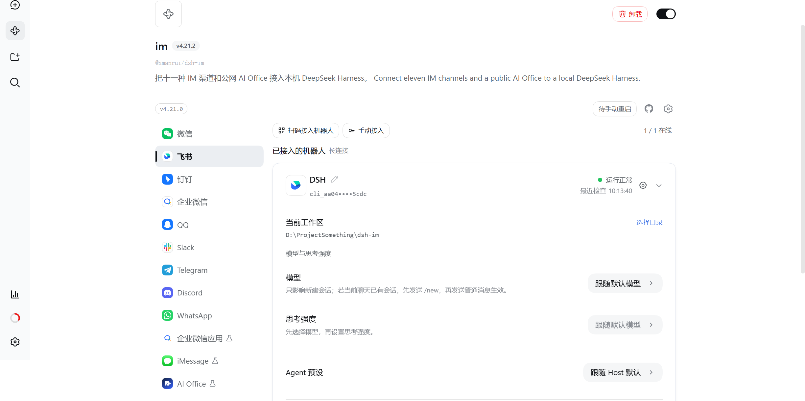
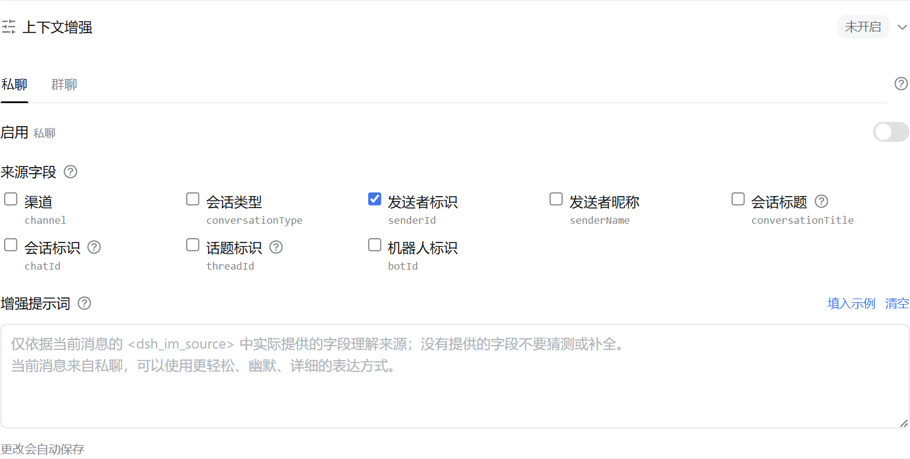

<p align="center">
  &nbsp;&nbsp;
  
</p>

---

<div align="center">
  <p><strong>让 DeepSeek Harness 触手可及</strong></p>
  <p><strong>Connecting DeepSeek Harness</strong></p>

  <p>
    
    <a href="LICENSE"></a>
    
    <a href="https://dshfind.com/zh/plugins/xmanrui/dsh-im?ref=badge"></a>
    <a href="https://dshfind.com/zh/plugins/xmanrui/dsh-im"></a>
    <a href="https://dshfind.com/zh/plugins/xmanrui/dsh-im?ref=badge"></a>
  </p>

  <p>
    
    
    
    
    
    
    
    
    
  </p>

  <p><strong>简体中文</strong> · <a href="README.en.md">English</a></p>
</div>

---

## 简介

通过扫码、App Manifest 或已有机器人凭据把 IM 机器人接入 DeepSeek Harness，并让本机 Harness 主动连接公网 AI Office。一个插件、一个设置入口，统一管理九种 IM 渠道和 AI Office Connector。**每个 IM 渠道都支持接入多个机器人**，各机器人的连接状态、工作区和会话绑定彼此独立。

Connect IM bots to DeepSeek Harness by scanning a QR code, using an App Manifest, or entering existing bot credentials, and let the local Harness connect outward to a public AI Office. One plugin and one settings entry manage nine multi-bot IM channels and the AI Office Connector.

## 界面





## 当前内置渠道

| 渠道 | 接入方式 | 消息与回复 |
| --- | --- | --- |
| 飞书 | 扫码创建机器人，或使用 App ID + App Secret 手动绑定 | 长连接接收消息；通过飞书流式卡片显示思考、工具进度和回答 |
| 微信 | 使用微信扫码绑定机器人 | 腾讯 iLink 长轮询收发消息；等待 Harness 回答时显示“正在输入”，最终回复按 1,800 字符分段发送 |
| 钉钉 | 扫码创建机器人，或使用 Client ID + Client Secret 手动绑定 | 钉钉 Stream 长连接；通过 AI Card 流式显示回答 |
| 企业微信 | 使用企业微信 App 扫码创建智能机器人，或使用 Bot ID + Secret 手动绑定 | 官方 WebSocket 长连接；原生显示“正在思考中”、工具执行进度和流式回答 |
| QQ | 使用手机 QQ 扫码创建机器人，或使用 AppID + AppSecret 手动绑定 | WebSocket 长连接；私聊显示“正在输入”并以单条 Markdown 回复，群聊被 @ 后只发送最终答案 |
| Slack | 使用预置 App Manifest 创建应用，再填写 Bot Token（`xoxb-`）和 App Token（`xapp-`） | Socket Mode 长连接；私聊直接回复，频道被 @ 后响应，优先使用官方流式消息 API |
| Telegram | 使用 @BotFather 生成的 Bot Token | Bot API 长轮询；默认私聊直接响应、群聊被提及或回复时响应，也可为每个机器人独立启用私聊白名单安全模式；私聊通过 Rich Message Draft 流式预览并持久化最终富消息，群聊和 Topic 原位完成占位消息，平台不支持时回退为普通文字 |
| Discord | 使用 Developer Portal 生成的 Bot Token | Gateway v10 长连接；私信直接回复；服务器文字/公告频道首次 @ 后创建原生 Thread，后续在线程中无需重复 @，并通过编辑消息流式显示回答 |
| WhatsApp | 使用手机 WhatsApp 扫码关联设备 | WhatsApp Web 长连接；默认仅响应账号自聊，也可切换到指定联系人或开放响应模式；显示已读和“正在输入”，再发送最终回答 |

其他 IM 平台可继续按同一渠道适配器结构接入。

九个内置渠道均支持把 JPEG、PNG、WebP 图片，以及以图片文件方式发送的 GIF，连同可选文字说明发送给 Harness；单张图片上限为 5 MB，单条消息中的图片总大小上限为 20 MB。飞书下载用户消息中的图片或文件需要租户权限 `im:message:readonly`，确认页将其显示为“获取单聊、群组消息”；飞书目前没有为该下载接口提供仅限图片的更窄权限。扫码新建的应用会默认申请；已有或手动绑定的应用可私聊机器人执行 `/repair`，或在「IM机器人」设置页点击“补全权限”，扫码增量补全该权限、上传机器人图片或文件所需的 `im:resource`、原生命令面板所需的 `application:app_slash_command:read` / `write`，以及卡片回调。

### 结果文件与图片回传

九个内置渠道均已实现把 Harness 可读取的文件作为渠道原生附件回传。已有文件和当前任务新生成的文件都可以直接发送；该能力对所有已连接机器人默认可用，无需开关或机器人白名单，原有文字、图片、流式回复、命令和会话行为保持不变。

模型调用文件回传工具后，插件把指定文件交给当前渠道的原生接口。图片会优先以原生图片消息呈现；渠道不支持或明确拒绝图片发送时自动回退为文件附件，发送结果不确定时不会补发文件造成重复消息。插件不额外设置文件来源、创建时间、工作区边界、扩展名、内容、数量、大小或有效期规则；文件只需真实存在且可读取。渠道平台仍可能依据自身权限、配额、文件能力或账号等级拒绝发送，插件会按平台返回结果提示。

| 渠道 | 平台要求 |
| --- | --- |
| 微信 | 当前绑定协议和会话需支持原生文件消息，实际可发送范围以微信接口返回为准。 |
| 飞书 | 飞书文件上传接口要求文件非空且不超过平台 30 MB；应用需有租户权限 `im:resource`（“读取与上传图片或文件资源”）。内置扫码流程新建应用时默认申请该权限；已有或手动绑定的应用可通过“补全权限”或私聊 `/repair` 增量补全并完成飞书要求的审批。飞书开发者后台当前没有单独的 `im:resource:upload` 权限。 |
| 钉钉 | 应用需开通 `qyapi_base`，机器人需具备文件消息能力；实际格式和大小以当前 OAPI 与机器人能力返回为准。 |
| 企业微信 | 应用需具备素材上传和文件消息能力，实际可发送范围以企业微信接口返回为准。 |
| QQ | 机器人需具备文件消息能力，并受 QQ 当日文件上传配额约束；额度耗尽时会明确提示稍后重试。 |
| Slack | Bot Token 需有 `files:read`、`files:write` 和 `reactions:write`；实际文件大小上限由 Workspace 当前策略决定。已有 App 新增或变更 Scope 后，必须重新授权/安装 App 并重新连接机器人。 |
| Telegram | 机器人必须能在当前聊天发送文档，实际可发送范围以 Bot API 返回为准。 |
| Discord | Developer Portal 的 Bot 设置中需启用 **Message Content Intent**；机器人需有 **Send Messages**、**Create Public Threads**、**Send Messages in Threads** 和 **Read Message History** 权限；发送结果文件还需 **Attach Files**。实际附件额度由当前账号与服务器能力决定。 |
| WhatsApp | 当前绑定会话需支持 Document Message，实际可发送范围以 WhatsApp/Baileys 返回为准。 |

## AI Office Connector

「AI Office」页让本机 Harness 主动连接公网 Office，本机无需公网 IP、端口转发或 WebSocket 服务。Device Token 只写入 Harness 凭据存储；普通配置文件仅保存设备 ID、Office Origin、工作区 alias 和 Instruction Preset alias。Office 只能选择 alias，不会收到本机绝对路径。

当前协议版本为 `office-harness.v1`。连接器使用 `POST /api/harness/connector/heartbeat` 完成鉴权和能力握手，再以 `GET /api/harness/connector/stream` 建立 SSE 下行；设置页会从 Office Base URL 自动展示全部固定 Hook，并在断线后按退避策略自动重连。

Office 的 `job.available` 会触发本机拉取任务、校验 Workspace/Preset alias、领取 90 秒租约并每 30 秒续租。连接器创建独立 Harness Session，把状态、工具名和增量文字安全回传 Office，终态只允许写入一次。Harness 发起的工具审批或补充问题会进入 Office 人工面板；批准、拒绝或文字答案再经 SSE 回到原 Session，断线时由租约与 Heartbeat 恢复。

Heartbeat 成功响应必须是 JSON：`{"ok":true,"protocolVersion":"office-harness.v1"}`。这使「连接测试通过」代表命中了兼容的 Office Connector，而不只是某个碰巧返回 200 的网址。

## 安装

推荐从 npm 安装已发布的稳定版本：

```sh
dsh plugin --profile web add -w @xmanrui/dsh-im
```

重启 `dsh web`、刷新浏览器，然后打开「设置 → IM机器人」。IM机器人使用 `order: 21`，尽量排在一级设置菜单的「Agent 预设」之后；插件页面不再保留旧入口。从旧版升级不会改变已有机器人、凭据、工作区、Agent Preset 或会话绑定。

本机 `dsh web` 和 DSH Desktop 默认直接复用当前 Host 的内部服务：旧版 Harness 使用 `apiProxy`，新版 Harness 自动使用 Typert Gateway、Session Controller 和 Workspace Controller，不需要配置 Harness 地址，也不绕行本机 HTTP 端口。Desktop 的兼容模式、扩展窗口和增强模式均无需开启“允许在浏览器中打开”或局域网访问。渠道配置中显式设置的 `harnessBaseUrl` 仅保留给旧版远程 HTTP/WebSocket Harness；内部调用失败不会自动改连其他 Host。

如需试用尚未发布到 npm 的最新代码，可以改用 GitHub 源安装器：

```sh
npx -y github:xmanrui/dsh-im install
```

GitHub 源安装会直接拉取并构建 Git 依赖；pnpm 10 及以上版本可能要求先在 profile 的 `pnpm-workspace.yaml` 中允许该依赖执行构建脚本。普通用户建议优先使用 npm 稳定版。

安装后，在对应渠道页面按照内置引导完成扫码或凭据配置。所有 Secret 和 Token 只提交给本机 Harness Host，并写入受保护的凭据存储；状态接口和机器人列表不会回传这些凭据。

如果本机必须通过正向代理访问飞书，请在启动 `dsh web` 前把 `HTTPS_PROXY` 设置为包含协议的 HTTP 代理 URL（例如 `http://proxy:8080`；也支持小写 `https_proxy`，并兼容使用 `HTTP_PROXY` 作为回退），修改后重启 Host。飞书注册和凭据验证会复用 SDK 的代理感知 HTTP 客户端，消息长连接会显式通过这个代理建立 WebSocket；长连接目前不读取 `ALL_PROXY` 或 `NO_PROXY`。

如果本机无法直连 Telegram Bot API，请使用 Node.js 22.21 或更高版本，并在启动 `dsh web` 前启用 Node 的环境变量代理支持：

```sh
NODE_USE_ENV_PROXY=1 \
HTTPS_PROXY=http://proxy:8080 \
HTTP_PROXY=http://proxy:8080 \
NO_PROXY=localhost,127.0.0.1 \
dsh web
```

代理地址按本机网络环境填写；修改代理后需要重启 Host。绑定 Telegram Bot Token 时，如果页面提示无法访问 Bot API，请优先检查代理地址、Node.js 版本和 `NO_PROXY` 配置。

| 默认行为 | 说明 |
| --- | --- |
| 机器人工作区 | 每个机器人独立保存工作区。新机器人默认使用 Host 当时的工作目录；之后可在机器人卡片中修改。 |
| Agent Preset | 每个机器人可在设置页卡片中选择 Agent Preset。未选择时跟随 Host 的 `agent-presets.default`；渠道级 `config.agentPreset` 只作为该渠道之后新接入机器人的默认值。切换不会修改或清空已有会话；若当前聊天已有会话，需先发送 `/new`，再发送一条普通消息，才会按新选择创建会话。 |
| 默认模型 | 每个机器人可在设置页卡片中选择自己的默认模型（含推理等级）。未选择时跟随 Harness 全局默认；新会话创建时立即应用该选择，已有会话不受影响。若配置的模型后来不可用，新会话创建会明确报错而不是静默改用其他模型，按提示更换或发送 `/model default clear` 即可恢复。 |
| 上下文增强 | 从机器人卡片打开设置，分别决定群聊、私聊是否增强；两个开关默认均关闭，旧机器人升级后也不会自动开启。 |

### 主动投递

九个 IM 渠道都可以使用稳定的 `botId + targetId` 主动发送文字消息。机器人设置页支持从已聊会话选择或手工填写目标、保存前测试当前路由，以及复制调用参数；HTTP POST、同 Host 插件和 Connection RPC 共用同一目标配置与投递核心。

设置步骤、九渠道字段、完整调用示例、管理端点、错误码与排错说明请查看[《主动投递使用指南》](PROACTIVE_DELIVERY.md)（[English](PROACTIVE_DELIVERY.en.md)）。

### 上下文增强

点击机器人卡片中的「上下文增强」，分别设置群聊和私聊的启用开关、来源字段与增强提示词，点击「保存」后原子生效。两个场景互不共用配置；五个可选字段均为 `channel`、`conversationType`、`senderId`、`senderName`、`botId`，各自默认只选择 `senderId`。插件只发送当前场景勾选且当前消息已有的值，不查询平台 API 补全。微信当前只支持私聊。

开启后，插件在普通用户消息前附加当前场景的 `<dsh_im_source>` 来源块；当前场景非空的增强提示词自动包裹为 `<dsh_im_source_guidance>`。两个场景的提示词默认留空，并分别提供说明、示例、「填入示例」和「清空」；当前场景字段全部取消时不生成来源块。命令、审批和问题回答继续走原有控制链路。

升级前已经保存的共用字段与增强提示词会自动复制到群聊、私聊两份配置，原有两个开关也分别保留。升级后的首次读取不会改写配置文件；之后任意一次机器人设置成功保存时，会随现有设置写入机制自动落盘为新结构，无需手工迁移。

当前会话类型未开启时，原有文字、图片、文件和会话处理保持不变，不组装增强内容，也不新增网络查询。草稿、清空后取消等操作不改变运行配置；保存不重连机器人、不重建会话，已经接收的消息仍使用接收时的配置。

来源与提示词都属于**用户消息内容**，不修改 Harness、系统提示词或权限。来源标识可能包含平台用户 ID 或电话号码形式的信息，并随消息交给当前模型、留在会话历史中；关闭只停止后续附加，不删除已经写入的历史。

### 访问模式

每个 Telegram 机器人都可以在自己的卡片中切换访问模式。旧机器人和新接入机器人均默认使用**兼容模式**：私聊直接响应，群聊仅在提及机器人或回复机器人消息时响应。只有主动切换到**安全模式（私聊白名单）**后，机器人才会忽略全部群聊，并只接受该机器人白名单中的数字 User ID。白名单每行一个 ID、按机器人独立保存；切回兼容模式时会保留但不使用，再切回安全模式即可继续使用。安全模式的空白名单会拒绝该机器人的所有入站消息。

每个 WhatsApp 机器人也有独立的访问模式。旧机器人升级后和新接入机器人都默认使用**仅自己模式**，只响应已绑定账号的自聊消息。**指定联系人模式**额外接受白名单电话号码的私聊并忽略群聊；号码需包含国家或地区代码，每行一个，可带开头的 `+`。**开放响应模式**响应所有私聊、已绑定账号自己发出的群聊消息，以及其他群成员对该账号的提及或回复；因此也可以把“仅自己”的群当作独立会话使用。切换模式会保留白名单；指定联系人模式的空白名单等同于仅自己模式。未授权消息会被静默忽略。

## 检查与安装更新

在「设置 → IM机器人」右上角点击 GitHub 左侧的「检查更新」。只有点击后才查询 npm 官方源；发现新版后，确认目标版本和当前 profile 再安装。更新只涉及 `@xmanrui/dsh-im`，不拉取 GitHub，不更新 Harness 或 Desktop 本体。

安装完成后，后台仍需手动重启，页面根据 Host 状态显示「已安装，待手动重启」。更新功能不会主动重启、执行热更新或刷新页面。宿主自带的模块监视机制可能自行刷新插件界面，但界面变化不代表后台版本已生效，运行版本以 Host 报告为准。请在机器人任务空闲时更新，并自行重启当前 Harness / Desktop。关闭设置页不会取消已提交的安装任务。

手动重启后，如果原页面仍显示待重启，点击窗口中的「刷新状态」，或重新打开「待手动重启」窗口。该操作只重新读取当前 Host 状态，不查询 npm，也不刷新页面。

按钮复用 Desktop 内置包管理服务或标准 Harness 的 CLI，执行相当于以下命令的精确版本安装（将示例 profile、版本替换为确认值）：

```sh
dsh plugin --profile web add -w --save-exact @xmanrui/dsh-im@3.1.0 --registry=https://registry.npmjs.org/
```

更新窗口下方的「手工更新」会按当前 profile 生成精简命令，例如 `dsh plugin --profile web add -w @xmanrui/dsh-im@3.1.1`，点击命令最右侧的复制图标后可在终端执行。已知目标版本时指定该版本；尚未查到版本时使用 `@latest`，以执行时 npm 返回的版本为准。手工命令沿用本机 npm 源配置，不拉取 GitHub；按钮安装仍固定使用官方源并保存精确版本。浏览器无法复制时可选中文本手动复制。Desktop 请使用当前 Desktop 的内置终端；Web 请使用启动当前 Harness 的环境并保持相同 `DSH_HOME`。如果已经提示「待手动重启」，通常只需重启，无需再次安装。源码链接或无法安全确认的 profile 不生成可能覆盖安装的命令。

源码 `link:`、`file:`、Git 来源或无法确认归属的安装只提供版本检查，不会替换开发链接；如需迁移为 npm 安装，请自行确认对应 profile。作用域 registry 冲突、Node 版本不满足要求或缺少当前 Host 的执行器时，按钮会说明原因。标准 Windows CLI 暂需手动更新；Desktop 使用其原有执行器。

安装期间不要同时在终端或插件市场修改该 profile。失败可能已经改变部分依赖，不能视为自动回滚；先检查安装状态，必要时按上述命令重装原精确版本，再手动重启。更新器只在当前 `DSH_HOME/updates/dsh-im` 下保存该 profile 最近一次任务与清单备份，不复制机器人凭据；残留安装进程或锁状态不明确时，请先人工确认，不要盲目重试或删除锁。

## 机器人命令

| 命令 | 作用 |
| --- | --- |
| `/help` | 显示机器人支持的命令和用法。 |
| `/new` | 解除当前聊天的会话绑定，让下一条普通消息开启全新 Harness 会话。 |
| `/status` | 检查当前机器人与 DeepSeek Harness 的连接状态。 |
| `/version` | 查看当前运行的 dsh-im 插件版本。 |
| `/models` | 按序号列出当前配置的全部可用模型。 |
| `/model` | 查看当前聊天绑定会话正在使用的模型和推理等级。 |
| `/model <序号或 Provider/模型ID> [推理等级ID]` | 切换当前会话模型，并可同时指定目标模型支持的推理等级。 |
| `/model default` | 查看当前机器人用于新会话的默认模型设置。 |
| `/model default <序号或 Provider/模型ID> [推理等级ID]` | 设置当前机器人的新会话默认模型。 |
| `/model default clear` | 清除当前机器人的默认模型，恢复跟随 Host 默认。 |
| `/reasoninglist`、`/reasonings` | 等价命令；列出当前模型支持的推理等级。 |
| `/reasoning` | 查看当前会话的模型和推理等级。 |
| `/reasoning <序号或等级ID>` | 切换当前模型的推理等级。 |
| `/reasoning --default` | 恢复当前模型的默认推理等级。 |
| `/presetlist`、`/presets` | 两个等价命令；按序号列出 Host 当前可用的 Agent Preset，并标记 Host 默认项和当前机器人的选择。 |
| `/preset` | 查看当前机器人的新会话 Agent Preset 设置。 |
| `/preset <序号或 Preset ID>` | 设置当前机器人的 Agent Preset；纯数字 ID 使用 `/preset id:<ID>`。 |
| `/preset --default` | 清除当前机器人的显式选择，让后续新 Session 跟随 Host 默认。 |
| `/stop` | 立即停止当前聊天正在运行的任务，并保留尚未开始的排队消息。 |
| `/steer <补充指令>` | 把补充指令立即加入当前聊天正在运行的任务。 |
| `/batch` | 在私聊中开启批量输入，最多收集 10 条纯文字消息。 |
| `/send` | 将已收集的消息按原顺序作为一次输入提交。 |
| `/cancel` | 取消批量输入并丢弃已收集的消息。 |
| `/repair` | 在飞书私聊中增量修复卡片回调，并补全媒体与原生 Slash Command 面板所需的权限。 |
| `/compact` | 立即压缩当前聊天绑定会话的较早上下文。 |
| `/workspace <工作区序号或绝对路径>` | 按 `/workspacelist` 序号或绝对路径切换当前机器人的 Harness 工作区。 |
| `/workspacelist` | 列出当前 Harness Host 上仍然存在的工作区绝对路径。 |
| `/sessionlist [工作区序号或绝对路径]`、`/sessions [...]` | 两个等价命令；列出指定工作区登记的所有会话 ID 和标题，省略参数时使用当前工作区。 |
| `/session <Session ID>` | 将当前聊天绑定到指定的已有 Harness 会话。 |
| `/history [数量]` | 在私聊中查看当前绑定会话的最近历史消息，默认 3 条，最多 5 条。 |
| 交互式提问 | 回复选项序号、选项文字或自定义文字；多选时用逗号分隔。 |
| 远程审批 | 回复 `批准` / `拒绝` / `同意` / `不同意` / `yes` / `no`。 |

示例：先发送 `/models`，再发送 `/model 2` 切换到列表中的第 2 个模型；先发送 `/reasoninglist`，再发送 `/reasoning 2` 切换到当前模型的第 2 个推理等级；先发送 `/presetlist`，再发送 `/preset 2` 为当前机器人选择第 2 个 Agent Preset。其他命令示例：`/help`、`/new`、`/status`、`/version`、`/model deepseek-official/deepseek-v4-pro max`、`/model default`、`/model default 2`、`/model default deepseek-official/deepseek-v4-pro max`、`/model default clear`、`/reasoning --default`、`/preset marketing-jeep`、`/preset --default`、`/steer 只检查配置文件`、`/stop`、`/compact`、`/workspace /Users/alice/projects/my-app`、`/sessionlist 2`、`/sessionlist /Users/alice/projects/my-app`、`/session session-id`、`/history` 或 `/history 5`

Slack 桌面端若未注册同名的原生 Slash Command，会拦截直接以 `/` 开头的消息。此时请加一个前导空格发送，例如 ` /presetlist`、` /preset 2`、` /history` 或 ` /history 10`；插件命令层会去除首尾空白，执行效果与无空格命令相同。

**飞书输入框的 `/` 命令面板**：机器人启动时，dsh-im 会调用飞书 `app_slash_commands` OpenAPI，把常用命令（`menu`、`new`、`help`、`status`、`compact`、`sessionlist`、`workspacelist`、`watch`、`unwatch`、`watchlist`、`archived`）注册成原生 Slash Command，这样在飞书单聊输入框输入 `/` 会弹出命令面板，点选即触发。命令列表由 dsh-im 自己持有并推送注册，不依赖 dsh/Harness 后端。扫码新建的应用会默认申请 `application:app_slash_command:read` 和 `application:app_slash_command:write`；已有应用可通过“补全权限”或私聊 `/repair` 增量补全并按飞书提示发布。注册后飞书客户端约有几分钟缓存延迟。该能力是尽力而为的，注册失败不会影响机器人消息收发。

### 命令说明

- `/help` 不需要参数，也不会创建会话；它会返回当前机器人支持的完整命令列表。
- `/status` 不需要参数，也不会向模型发送消息或改变会话绑定；它用于确认当前机器人能够连接 DeepSeek Harness。
- `/version` 不需要参数，也不会访问 Harness、创建会话或调用模型；它返回当前运行的 dsh-im 插件版本。
- `/new` 只解除当前聊天在 dsh-im 中保存的会话绑定，不会删除、清空或归档旧 Session。下一条普通消息会在当前工作区创建并绑定一个新 Session。任务正在运行或等待问题、审批时，应先完成交互或使用 `/stop`，再使用 `/new`。
- `/models` 不需要参数，也不会创建会话。它为 Harness 当前配置的全部可用模型分配序号，同时显示可稳定复制的 `Provider/模型ID`；某个 Provider 查询失败时，其他 Provider 的结果仍会显示。
- `/model` 不带参数时查看当前会话的模型和推理等级；带参数时接受 `/models` 列出的序号或精确完整模型 ID，并可追加目标模型元数据公布的精确推理等级 ID，例如 `/model 2 max`。省略推理等级时，由 Harness 解析目标模型的当前默认值。聊天尚无会话时，有效的切换命令会创建并绑定一个空白会话，但不会触发模型回复。
- `/reasoninglist` 和 `/reasonings` 完全等价，按当前模型的元数据列出可选推理等级并标记当前值和默认值。`/reasoning` 查看当前值；`/reasoning <序号或等级ID>` 接受列表序号或元数据中的精确 ID；`/reasoning --default` 让 Harness 重新采用当前模型的默认推理等级。所有 `/reasoning...` 命令都要求当前聊天已有 Session，不会自行创建 Session 或触发模型回复。
- 正在运行任务或等待审批、问题回答时不能修改模型或推理等级；请等待完成，或先使用 `/stop`。修改从下一次模型请求起生效，并沿用 Harness 的默认保存语义：Harness 会尝试把已接受的模型和推理等级保存为以后新会话的默认选择，已有其他会话不受影响。含图片的会话无法切换到不支持图片输入的模型。
- `/presetlist` 和 `/presets` 完全等价，不需要参数，也不会创建会话。它们每次都读取 Host 当前可用的 Agent Preset，显示名称、稳定 ID、Host 默认项和当前机器人的选择；已删除或损坏的当前选择会保留并标记为“已不可用”，不会被自动清除。列表只公开安全的名称和 ID，不公开 Preset 路径、错误或其他 Host 内部字段。
- `/preset` 不带参数时查看当前机器人的“新会话设置”，不是查看或修改当前 Session。带参数时接受最近一次 `/presetlist` 在当前聊天中显示的序号或完整 ID；纯数字 ID 使用 `/preset id:<ID>`。选择序号时会先按该次列表解析 ID，再用 Host 最新目录复验，目录已经变化时会要求重新列出。
- `/preset --default` 清除当前机器人的显式覆盖值，让以后新建的 Session 在创建时跟随 Host 当前默认；显式选择一个恰好等于 Host 默认的 ID 则会固定该 ID。目录暂时不可读时仍可恢复为跟随 Host 默认。
- Agent Preset 修改是机器人级配置，会影响该机器人所有聊天以后创建的新 Session，但不会修改、停止、解绑或重建已有 Session，也不会自动执行 `/new`。若当前聊天已有会话，继续发送消息仍使用原 Session；发送 `/new` 后的下一条普通消息才会按新设置创建 Session。任务正在运行或等待交互时也可查询或修改 Preset，因为命令不会触碰当前 Session。
- `/model default` 是机器人级配置，语义与 Agent Preset 一致：只影响该机器人之后新建的 Session，已有会话不变。设置时按 `/models` 的序号或完整 `Provider/模型ID` 解析，并可附加推理等级 ID；`clear`（或 `--default`）恢复跟随 Host 默认。设置页机器人卡片中的“默认模型”下拉框与其完全等价。若已配置的默认模型后来被移除或暂时不可用，该机器人创建新会话会明确失败并提示原因，不会静默回退到其他模型；恢复模型、更换默认模型或执行 `/model default clear` 后即可继续。
- `/stop` 和 `/steer` 只控制当前聊天自己发起的运行任务，即使多个聊天绑定同一个 Session，也不会有意控制其他聊天的任务。`/stop` 不删除会话或历史，并保留尚未开始的排队消息；重复发送是安全的。
- `/steer` 只接受文字，可包含多行；它不会创建新会话或第二个任务。没有运行任务时请直接发送普通消息；等待审批或问题回答时请先处理交互，或使用 `/stop`。
- `/batch`、`/send` 和 `/cancel` 仅在与机器人的私聊中可用。发送 `/batch` 后，接下来的纯文字消息会暂存，最多 10 条；第 10 条仍会收录并提示提交，之后的消息不会收录，也不会自动提交。发送 `/send` 后，机器人会按原顺序将整批内容作为一次输入处理；发送 `/cancel` 会直接丢弃当前批次。图片、文件和其他命令不会被收录。机器人重启会丢失尚未提交的批次。未进入批量输入模式时，普通聊天流程不变。
- 飞书 `/repair` 仅在私聊中可用，并与其他命令一样只服从当前飞书机器人的渠道访问策略；插件不另行区分管理员和普通用户。它增量补全当前缺少的 `card.action.trigger`、`im:message:readonly`、`im:resource`、`application:app_slash_command:read` 和 `application:app_slash_command:write`，确认页只显示当前应用缺少的项。授权页必须由在飞书开放平台中有权访问目标应用的账号打开。普通 `/repair` 会启动修复；若旧任务仍在等待授权，会先作废旧的一次性链接再生成新链接。发送 `/repair qr` 获取当前链接的二维码，`/repair status` 查询当前任务，`/repair verify` 重新查询验证状态，`/repair cancel` 取消任务；这四个补充命令均不会另起授权。平台已接受更新、正在等待测试按钮回调时，不会并发启动第二次修复。
- `/compact` 只作用于当前聊天已经绑定的 Harness 会话，不会把命令发送给模型。当前聊天尚未创建会话、会话正在生成回复或没有可压缩历史时，机器人会直接返回对应状态。
- 只接受已经存在的绝对目录；路径无效时机器人会返回具体提示和正确用法。
- `/workspacelist` 不需要参数。它合并 Harness 全局登记项与当前机器人的路径；当前路径仍存在且可安全显示时会排在首位并标记为“当前”。`/workspace N` 会在执行时按最新列表顺序切换，也可继续使用绝对路径。
- `/sessionlist` 和 `/sessions` 完全等价。数字参数按命令执行时与 `/workspacelist` 相同的最新顺序解析；也可使用绝对路径直接指定工作区。结果会回显最终选中的路径。
- 两个会话列表命令都会列出该工作区登记的所有会话。已归档会话会标记为“已归档”；空白会话和子代理会话在它们归属该工作区时也会列出；没有标题的会话显示为“暂无标题”。结果中的 ID 可直接用于 `/session Session ID`。
- `/session` 只接受一个由 `/sessionlist` 获得的 Session ID。它不会新建会话或立即向模型发送消息；绑定成功后，当前聊天的后续消息会继续该会话。普通归档会话可以绑定但不会自动取消归档，子代理会话不能绑定。
- `/history` 在九个渠道的私聊中统一可用，只读取当前聊天已经绑定的会话，不新建会话、不调用模型，也不影响正在运行的任务或待处理交互。默认返回最近 3 条；`/history N` 接受正整数，超过 5 自动按 5 条处理，数量不足时返回实际条数。零、负数、小数、非数字和多个参数会提示用法，附带图片或文件时会拒绝处理；批量输入收集中请先 `/send` 或 `/cancel`。
- 历史预览中，一条用户消息或一条助手最终回复各算一条，不按轮次或天数计数。先取最新 N 条，再按从旧到新的顺序显示；不展示工具、推理、注入内容或尚未完成的助手片段，不下载或重发历史附件。长正文会截断并注明，全部结果最多发送 3 段文字，不自动翻页。绑定会话后可手动发送 `/history`，不会自动重发历史。正文仍可能包含会话原有的敏感信息，请只向可信用户开放机器人。
- `/session` 会自动定位会话唯一所属的工作区。同工作区绑定只替换当前聊天的映射；跨工作区绑定会切换该机器人的工作区、清除该机器人所有聊天的旧会话映射，再绑定当前聊天，因此会影响该机器人的其他聊天。已经开始生成的回复仍可完成。
- 工作区切换和会话绑定只会清除或替换 dsh-im 的聊天映射，不会删除、清空或归档任何旧 Session 内容；旧 Session 仍可再次列出和绑定。
- 任何通过当前渠道访问策略的用户都可以执行这些命令，不另行区分管理员和普通用户。Telegram 兼容模式遵循原有私聊及群聊提及/回复规则；安全模式只允许当前机器人白名单中的私聊用户执行。WhatsApp 仅自己模式只接受自聊，指定联系人模式接受自聊和白名单私聊，开放响应模式接受所有私聊、已绑定账号自己发出的群聊消息，以及其他群成员的提及或回复。
- Agent Preset 名称和 ID 来自同一个 Harness Host，且任何有命令权限的用户都能修改该机器人所有聊天未来新 Session 的 Preset；请只向可信用户开放 `/presetlist` 和 `/preset`。
- 工作区列表来自 Harness Host 的全局登记信息，可能包含其他机器人、其他渠道或非 IM 项目的本机绝对路径。请将机器人可见范围限制给可信用户。
- 会话列表同样来自该全局 Harness Host；会话 ID 和标题可能属于其他机器人、其他渠道或非 IM 项目，并可能包含敏感元数据。开放命令前请确保所有可见用户都可信。
- 任何能执行 `/session` 的用户都能接续所选会话，并通过后续消息写入会话或触发其可用工具。请只向可信用户开放机器人及其会话列表。
- 切换成功后只清除当前机器人的旧 Harness 会话映射，不影响其他机器人。
- 新工作区对后续消息生效；已经开始生成的回复会继续完成。

## 其它功能

- **图片识别**：九个内置渠道都可以把 JPEG、PNG、WebP，以及以图片文件方式发送的 GIF 交给 Harness；图片可以附带文字说明。单张图片上限为 5 MB，单条消息中的图片总大小上限为 20 MB。
- **在机器人卡片切换工作区**：设置页中的每张机器人卡片都会显示当前 Harness 工作区。可以直接填写已有目录的绝对路径，也可以打开目录选择器。切换只清除该机器人的旧聊天映射，不会删除、清空或归档旧 Session；已经开始的回复可以继续完成，后续消息使用新工作区。
- **在机器人卡片选择 Agent Preset**：设置页中的每张机器人卡片都可以选择 Host 已有的 Agent Preset，或跟随 Host 默认。切换只作用于该机器人，并且只影响之后新建的会话；已有会话和正在生成的回复不受影响。
- **检查连接并发送测试消息**：机器人在线时，点击卡片上的「检查连接」会检查平台连接，并向该机器人最近记录的私聊发送一条“DeepSeek Harness 连接测试成功”消息；WhatsApp 会发送到账号自聊。测试消息不会创建 Harness Session，也不会调用模型。机器人必须至少收到过一条私聊才能记住测试目标，否则页面会提示尚无可用的测试会话。
- **重试连接和移除接入**：机器人离线时，卡片上的操作会变为「重试连接」；不再使用时可以点击「移除接入」。这些操作都只作用于所选机器人，不影响其他机器人或渠道。
- **多机器人独立管理**：同一渠道可以接入多个机器人。每个机器人分别保存凭据、连接状态、工作区、Agent Preset 和聊天会话映射，卡片上的工作区、Preset、连接检查、重试和移除操作互不影响。
- **流式回复和进度提示**：插件会按各平台能力显示正在思考、工具执行和逐步生成的回答；不支持原生流式接口的平台会通过编辑消息、卡片更新或最终消息完成回复。

## 设计

- Harness 一级设置菜单中只注册一个「IM机器人」设置页，其中包含九个 IM 渠道和一个 AI Office Connector；
- 九个渠道及 Office Connector 的 Host、客户端与运行时源码都在本仓库维护，不依赖外部独立插件；
- 设置页跟随 DeepSeek Harness 的语言选择，在中文和 English 之间即时切换；机器人发出的聊天消息跟随 Host 的 `language` 配置（默认中文；设为 `en` 即为英文），中文始终为兜底，未收录的文案原样输出；
- 左侧使用 Logo 切换微信、飞书、钉钉、企业微信、QQ、Slack、Telegram、Discord、WhatsApp 和 AI Office，不使用启用/停用开关；
- 九个 IM 渠道保持独立的 RPC、凭据、连接监督和会话映射；Office Connector 另行维护设备凭据、Job 租约、审批等待与并发上限；
- 浏览器只获得二维码、Manifest、脱敏状态，以及用户为当前 Telegram 或 WhatsApp 机器人主动保存的访问模式和白名单标识；手动输入的 Secret 或 Token 仅单向提交给本机 Host，任何 RPC 响应都不会返回 App Secret、`bot_token`、钉钉 `client_secret`、企业微信 Secret、QQ `app_secret`、Slack Bot/App Token、Telegram/Discord Bot Token、WhatsApp 关联设备密钥、AI Office Device Token，或从平台消息中观察到的其他原始用户标识。

## 本地开发

```sh
npm install
npm run check
node bin/dsh-im.mjs install --source .
```

`npm run check` 运行单元测试、构建 Host/Client 产物，并验证发布包不包含凭据或独立渠道设置页注册。

IM 管理 RPC 默认仅接受回环浏览器。如果 Web profile 在受信任的局域网内对外提供服务，可在该 profile 的 `cordis.patch.yml` 中显式开放给 Connection 已信任的 Host authority：

```yaml
- id: xmanrui-dsh-im
  config:
    rpcAuthority: trusted-host
```

`trusted-host` 只复用 Harness 的 Host／Origin 防护，不是用户认证。启用后，能访问该局域网地址的人也能查看机器人状态、扫码或提交应用凭据、重连和删除机器人；只应在可信网络中使用。

### 聊天消息语言

机器人发出的聊天消息默认使用中文。要切换为英文，在插件配置中设置 `language: en`（也接受 `en-US`、`english`），或设置环境变量 `DSH_IM_LANGUAGE=en`：

```yaml
- id: xmanrui-dsh-im
  config:
    language: en
```

未设置时保持中文；中文始终是兜底语言，任何未收录到英文词典的文案都会原样以中文输出，因此该功能不会改变现有中文用户的行为。

---

## 联系方式

欢迎加入企业微信群，或通过邮箱、微信、小红书或 WhatsApp 联系我。

<table>
  <tr>
    <th align="center">邮箱</th>
    <th align="center">企业微信群</th>
    <th align="center">微信</th>
    <th align="center">小红书</th>
    <th align="center">WhatsApp</th>
  </tr>
  <tr>
    <td align="center" valign="middle">
      <a href="mailto:longmanr307@gmail.com">longmanr307@gmail.com</a>
    </td>
    <td align="center" valign="top">
      <a href="docs/images/wecom.jpg"></a>
    </td>
    <td align="center" valign="top">
      <a href="docs/images/weixin.jpg"></a>
    </td>
    <td align="center" valign="top">
      <a href="docs/images/xhs.jpg"></a>
    </td>
    <td align="center" valign="top">
      <a href="docs/images/WhatsApp.jpg"></a>
    </td>
  </tr>
</table>
