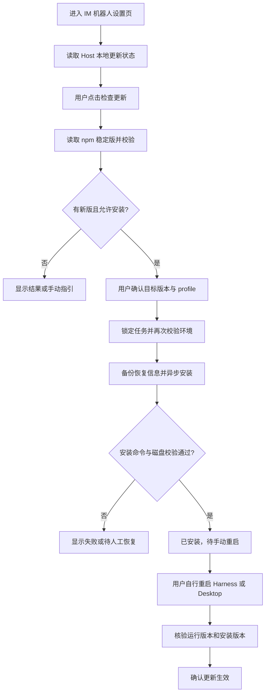

# Issue #61：npm 更新检查与手动更新方案

日期：2026-08-28。实现基线：v3.0.8 / `8c6c31a`。状态：已实施，自动化检查、本机 Desktop 与 npm 全局安装版 Web 验收通过。

需求来源：[Issue #61](https://github.com/xmanrui/dsh-im/issues/61)。本文保留评审时的设计和验收要求；第 13、14 节记录实际实现、实测结果和未验收边界，不能把计划中的用例当作已经通过。

## 1. 本期范围

| 项目 | 决定 |
| --- | --- |
| 更新对象 | 仅 `@xmanrui/dsh-im` 插件，不更新 Harness、Desktop 本体或其他插件 |
| 更新来源 | npm；不查询 GitHub Release、不拉 GitHub 源码、不提供 GitHub 回退源 |
| 更新版本 | npm `latest` 指向的稳定版本；安装用户确认的具体版本号 |
| 检查方式 | 用户点击“检查更新”；首期不做启动时或后台定时检查 |
| 安装方式 | 用户确认后，由当前 Host 在当前 profile 中异步执行安装 |
| 更新生效 | 安装后显示“已安装，待手动重启”；用户重启后核验运行版本 |
| 自动重启、热更新 | 不做，不调用 Desktop 重启接口，不主动刷新页面或重载插件 |
| 按钮位置 | “设置 → IM机器人”页右上角，现有 GitHub 入口左侧 |
| 版本显示 | 继续保留左上角版本号，并处理前端、Host、磁盘版本不同的情况 |
| 本地源码安装 | 允许检查 npm 版本，但不自动替换 `link:`、`file:` 或源码目录 |
| GitHub 等其他安装来源 | 只提供手动迁移说明，不自动改成 npm 来源 |
| 主要真机验收环境 | 本机 DSH Desktop 2.0.3 / macOS；同时验证标准 `dsh web` |

现有 GitHub 帮助链接可以保留，只有用户主动点击才打开网页。更新流程不调用它。本期也不从 GitHub 拉更新日志；确认窗口只展示版本、来源、目标 profile 和重启提示。以后如需内嵌更新日志，应从 npm 发布包提供的数据获取，另行设计。

## 2. 实施前的基础与调研事实

- 版本号从 v3.0.2 起已经常驻在品牌标题旁，入口为 `plugin-src/client/index.js`；当前构建从 `package.json` 注入版本。
- Host 已有管理 RPC，默认使用 `loopback` 权限；可新增插件级通道，不需要给九个渠道各做一套更新接口。
- 标准安装由 `dsh plugin --profile <name> ...` 转交给该 profile 中的 pnpm，完成后协调插件 bundle 列表。[Harness CLI 实现](https://github.com/deepseek-ai/deepseek-harness/blob/master/apps/cli/src/plugin.ts)
- 现有 `bin/dsh-im.mjs` 安装器默认拉 GitHub，且使用 `spawnSync`。新更新功能不能直接复用其默认安装流程，也不能把同步子进程调用搬进 Host。
- 本机默认 Harness home 中，`web` 与 `desktop` 的 dsh-im 都通过 `link:<项目绝对路径>` 指向源码。它们是开发环境，不是应该被按钮自动替换的 npm 安装。
- 已确认本机应用为 `/Applications/DSH Desktop.app`，版本 2.0.3；已用其内置 `desktop-cli.js --help` 做只读探测，退出码为 0。没有执行包安装、启动 Desktop 窗口或重启。

**Desktop 的平台差异必须保留在方案中：**这版应用给 Host 注入内置 pnpm，但 `dsh` 的 Host PATH shim 仅在 Windows 安装；macOS 内置终端拥有自己的 `dsh` shim，不能据此推断 Host 直接 `spawn('dsh')` 也可用。Desktop 终端、profile 与手动重启行为另见[用户指南](https://github.com/anywhere-labs/dsh-desktop/blob/master/docs/user-guide.md#打开终端)。

## 3. 界面与交互

### 3.1 入口

```text
DSH-IM v3.0.8                  [检查更新] [GitHub ↗]
让 DeepSeek Harness 触手可及
```

这是整个插件的统一入口，不放进微信、飞书等渠道页面。不改变现有渠道导航、机器人卡片和设置入口。

### 3.2 状态文案

| 状态 | 按钮或提示 | 可执行操作 |
| --- | --- | --- |
| 尚未检查 | 检查更新 | 请求 npm 版本信息 |
| 正在检查 | 检查中… | 禁止重复发起同一请求 |
| 已是最新版 | 已是最新版本，并显示检查时间 | 可再次检查 |
| 当前版本高于 npm 稳定版 | 当前版本高于 npm 稳定版 | 不降级 |
| 发现新版且允许安装 | 更新至 vX.X.X | 打开确认窗口 |
| 发现新版但不能自动安装 | 有新版本；显示源码模式、权限或环境限制原因 | 查看手动更新说明 |
| 安装中 | 正在安装 vX.X.X… | 不再启动安装；关闭面板不取消任务 |
| 安装后校验中 | 正在校验安装结果… | 等待真实结果 |
| 安装完成，Host 未重启 | 已安装，待手动重启 | 查看手动重启说明；重启后可手动刷新状态 |
| 手动重启后核验一致 | 已更新至 vX.X.X | 恢复正常检查入口 |
| 检查或安装失败 | 简短原因和可执行建议 | 按失败类型重试或手动恢复 |

网络失败不能显示“已是最新版”。下载或安装没有可靠百分比时，只展示阶段和耗时，不伪造进度。

### 3.3 确认窗口

窗口展示当前运行版本、目标版本、npm 来源和目标 profile 名称，提供“取消”“确认安装”。提示内容至少包含：

> 安装后需要手动重启 Harness 或 DSH Desktop 才能生效。请在机器人任务空闲时更新，安装期间不要同时通过终端或插件市场修改该 profile。

不能承诺安装过程对运行中机器人完全无影响：包文件及依赖可能在磁盘上发生变化。按钮不会主动停止任务、断开机器人或安排重启。

右上角操作组在窄屏允许换行，不挤压品牌和渠道内容；补齐中英文文案、键盘操作、可访问名称及状态播报。离开页面停止前端轮询，不停止已提交的 Host 安装任务。

## 4. npm 来源与版本规则

### 4.1 首期来源选择

为使检查结果与实际安装一致，首期使用公开 npm 官方 registry：`https://registry.npmjs.org/`。本期不新增镜像、私有 registry 或源切换设置。

版本检查由 Host 发起，请求固定包的 npm 元数据，例如 `https://registry.npmjs.org/@xmanrui%2Fdsh-im/latest`。浏览器不直接访问 registry，不提交自定义 URL、包名或安装 spec。

安装时明确使用同一 registry。安装前还要核对 `@xmanrui` 的有效作用域 registry：如果它覆盖到了其他地址，不能以为仅传 `--registry` 就必然消除了覆盖。首期对此显示手动处理说明，不改写用户 `.npmrc`、不读取或回传其中的认证值，不混用两个来源。pnpm 的 registry 与认证配置规则见[配置文档](https://pnpm.io/cli/config)。

不进行 GitHub 回退，不执行 `git clone`、`git pull` 或 GitHub 安装 spec。发行检查应保证 dsh-im 发布包的运行依赖不依赖 GitHub 拉取；不对同一 profile 中其他插件已有的依赖来源做自动迁移。

### 4.2 检查规则

1. 校验返回的包名、版本、运行时要求和必要发布字段；响应不合法就报告检查失败。校验下载来源和完整性元数据，实际包校验交给包管理器，不关闭其完整性检查，也不把响应中的任意 tarball URL 拼进安装命令。
2. 使用成熟 SemVer 库比较，不能按字符串大小或简单拆分比较 `3.0.9` 与 `3.0.10`。
3. 只接受 `latest` 指向的稳定版；不自动选择 `beta`、`rc`、其他 dist-tag，也不把意外指向预发布版的 `latest` 当成稳定升级。
4. 目标必须高于当前运行版本；若磁盘已有尚未生效的更新，先显示待重启，不叠加第二次安装。
5. 校验目标 `engines.node` 与实际 Host 运行时；Desktop 使用 Electron 内置 Node 的版本，不使用外部终端 Node 版本冒充。
6. 显式检查成功后生成短时有效的更新确认记录，绑定目标版本、registry、profile 和当前安装状态。
7. 确认前若记录过期、安装状态改变或目标元数据改变，应重新检查并要求确认，不能静默改装另一个版本。

初始建议：检查超时 10 秒，完整响应限制 256 KiB，同一 Host 合并并发检查；短时间连续点击做限流。上次成功结果可以保留用于展示，但失败后必须标出它是旧结果。确认记录有效期建议 10 分钟。这些是实现默认值，不是已经存在的配置项。

### 4.3 三个版本必须分开

| 字段 | 来源 | 用途 |
| --- | --- | --- |
| `clientVersion` | 前端构建时的版本 | 识别旧页面、旧缓存 |
| `runningVersion` | Host 模块加载时固定的版本 | 判断当前实际运行的插件 |
| `installedVersion` | 从当前 profile 的包入口重新解析并读取 | 判断磁盘上安装了什么 |

不能用安装结束后读取的 `package.json` 冒充当前 Host 已运行的新版本；不能通过旧模块缓存读取磁盘版本。npm 的 `latestVersion` 是第四个独立事实。

状态接口可用后，页面以 Host 的运行版本为准。若前后端不同，明确提示手动刷新或重启；旧 Host 没有新接口时只展示静态版本和手动升级说明，不循环报错。

## 5. 环境识别与安装资格

### 5.1 当前 profile 的确定

Desktop 优先读取已声明的可选 `desktopProfiles` 服务的 `current.name` 和 `current.dir`；不得调用 `select()`，因为切换 profile 本身可能触发 Desktop 重启。可选服务使用 Cordis 的可选注入或受支持的 `ctx.get` 方式，不能随意读取未声明的 `ctx` 属性。

标准 CLI 只识别明确支持的启动形式：`dsh web` 和 `dsh --profile <name>`。按 CLI 参数语义解析，结合实际加载包的位置与 profile 清单校验；不能从当前工作目录猜 profile，也不能扫描到第一个装有 dsh-im 的 profile 就选择它。

安装前验证 Harness home、profile 目录、插件依赖声明、bundle 列表及实际加载包属于同一环境。来源不明、存在多义性或无法证明当前运行包归属时，禁止自动安装。

### 5.2 资格矩阵

| 安装或运行方式 | 检查 npm | 一键安装 |
| --- | --- | --- |
| 标准 npm 依赖，profile 与执行器可确认 | 支持 | 支持 |
| Desktop 中的标准 npm 安装，适配器通过检查 | 支持 | 支持 |
| `link:`、本地目录、`file:`、workspace 开发安装 | 支持 | 禁用，保留源码链接 |
| GitHub、Git、任意远程 tarball、来源不明 | 支持 | 禁用，不自动换源 |
| 只读安装、缺少运行命令、profile 不明确 | 支持或给出检查环境限制 | 禁用，提供说明 |
| 目标 Node 要求不满足 | 显示发现的版本和不兼容原因 | 禁用，不升级 Host 运行时 |
| 已安装更新但尚未重启 | 可展示已知信息 | 禁用第二次安装 |

**不能把所有符号链接都判定为开发安装。** pnpm 正常依赖可能通过符号链接指向其存储目录；必须结合依赖 spec、清单和解析结果判断。相反，不能仅因目录里有 `package.json` 就把 `link:` 安装当成 npm 包。

源码模式的手动说明应警告：执行 npm 安装会替换该 profile 的开发链接。本期不提供一键迁移，也不替用户恢复、切换或拉取源码。

## 6. 实际执行命令与 Desktop 适配

### 6.1 标准 Harness

以 `web` profile、目标版本 `3.0.8` 为示例，安装命令语义为：

```sh
dsh plugin --profile web add -w --save-exact @xmanrui/dsh-im@3.0.8 --registry=https://registry.npmjs.org/
```

实际 profile 和版本来自 Host 已验证的更新记录，不写死为示例值。`--save-exact` 保存精确版本；不使用 `@latest` 在点击后重新选择版本，不执行无包名的全量 `update`。[pnpm 参数说明](https://pnpm.io/cli/add)

Host 通过异步子进程执行，传递参数数组，不拼接 shell 命令。包管理器可能为了目标包而调整共享依赖，因此不能承诺 profile 的其他依赖文件完全不变；必须记录并检查变更。

系统没有可用 `dsh` 时不自动全局安装它，也不转而执行 `npx ...@latest` 下载另一个 Harness。本机源码启动可使用明确的源码 CLI 入口，但只用于已验证的开发适配；无法确定时给出手动指引。

### 6.2 DSH Desktop

**实际实现已简化：**直接复用 Desktop 提供的 `desktopPnpm.runPlugin(args, profileDir, signal)`，由宿主自己配置以下 bootstrap、Electron Node、pnpm 和进程生命周期；不在插件里另造执行器。通过 `ctx.get()` 读取并验证 `desktopProfiles.current`、`desktopPnpm`、`desktopPnpmBootstrap`，不切换 profile。

macOS 适配器使用 Desktop 内置的 CLI bootstrap，与 Desktop 自己的终端执行路径保持一致：

```text
可执行程序：当前 Desktop 的 process.execPath
参数：--expose-internals <已验证的 desktop-cli.js>
      plugin --profile <当前 profile> add -w --save-exact
      @xmanrui/dsh-im@<确认版本> --registry=https://registry.npmjs.org/
子进程环境：ELECTRON_RUN_AS_NODE=1，当前 DSH_HOME，Desktop 的 pnpm PATH
```

`desktop-cli.js` 路径从当前安装的 Desktop 解析，核对包身份、版本与文件存在性，不把本机 `/Applications/...` 路径写死在插件里。保留 Desktop 的 pnpm、Electron 原生依赖构建环境和安全策略；不偷偷改用外部 Node 处理 Desktop 的依赖。

这属于有版本边界的 Desktop 适配，不应被描述成所有 Electron 应用都提供的通用 API。已完成的只读帮助探测证明入口可以启动，尚不证明安装、失败恢复和各平台兼容已经通过。

Windows 应使用受控的 Node/CLI 启动方式，或专门处理 `.cmd` shim 的适配器；不能假设 `shell: false` 能直接执行所有 `.cmd`。未知 Desktop 版本或入口变化时返回“不支持自动更新”，保留手动入口，不跨 Host 回退。

无论哪个执行器，都不调用 Desktop 的 `requestRestart()`、profile 切换、Loader 刷新、浏览器 reload 或进程退出接口来应用更新。

## 7. 一次更新的完整流程



安装任务由 Host 持有。RPC 提交后立即返回任务标识，页面轮询状态，不把整个安装过程挂在一个长连接请求上。建议安装期间每 1 秒查询一次，结束后停止轮询；卸载组件时清理定时器和正在读取状态的请求。

开始安装前获取该 profile 的更新锁，校验确认记录和权限，重新读取清单，确认来源仍为 npm、已安装版本未变化，随后写任务记录及恢复信息。只有全部预检成功才启动子进程。

安装退出码为 0 后，还需重新解析当前 profile 的包入口，核对包名、目标版本、必要的 Host/Client 入口和 bundle 声明。通过后仅进入 `restart-required`，不提前宣布新代码已运行。

手动重启后，新 Host 读取自己的运行版本及该 profile 的任务记录；只有运行版本、安装版本与该任务目标一致，才记录生效。若外部操作装了另一个版本，显示实际状态和不一致原因，不冒认本次任务成功。

## 8. RPC 与状态设计

新增独立逻辑通道 `/dsh-im`，不挂到任一渠道 RPC 下。

| 方法 | 输入 | 职责 |
| --- | --- | --- |
| `update.status` | 空对象 | 返回当前版本、安装资格、检查结果和安装任务状态，不访问外网 |
| `update.check` | 空对象 | 查询固定 npm 包，返回校验结果和短时有效的 `checkId` |
| `update.install` | `checkId`、`requestId` | 消费已确认记录，幂等创建安装任务，立即返回任务状态 |

前端不传包名、registry URL、shell 命令、profile、文件路径或任意版本。即使用户绕过页面直接调用 RPC，也必须执行同一套预检。

公开状态字段包括：`runningVersion`、`installedVersion`、`latestVersion`、`profileName`、`environmentKind`、`canInstall`、`blockedReason`、`checkedAt` 和任务的 `id/state/targetVersion/message`。绝对路径、环境变量、认证值及子进程原始输出不直接返回浏览器。

检查结果与安装任务分开记录。安装状态至少包含：`idle`、`installing`、`verifying`、`restart-required`、`completed`、`failed`、`interrupted`。页面刷新后从 Host 恢复，不能仅靠 React state 判定成功。

同一 `requestId` 重试应返回原任务，不启动第二个安装。提交响应丢失时先查询状态；`checkId` 失效不自动安装当前最新版本。安装期间的其他提交返回“已有更新任务”，待重启状态也不接受新安装。

## 9. 权限、失败与恢复

### 9.1 权限与并发

更新属于安装本机代码的管理操作。本期 RPC 固定使用 Harness 已有的本机/受信 IPC 授权边界，采用 `loopback` 策略，不因为普通机器人管理配置使用 `trusted-host` 就自动放宽更新权限。不得只靠隐藏按钮、User-Agent 或客户端声明来识别权限。

不新增聊天内 `/update` 命令，不让普通 IM 联系人触发安装。不使用 `sudo`，不自动授权构建脚本，不绕过 pnpm 安全策略，不修改全局 PATH 或用户 shell 配置。

锁以 Harness home 与 profile 为作用域，同时防止本插件多窗口、多 Host 重复安装。它不能阻止用户另开终端或插件市场修改同一个 profile；对此必须提示并检测异常变化，不能声称已经提供跨所有工具的全局互斥。

锁必须原子获取，并记录任务所有者；释放时核对所有者，不能用“先检查文件不存在，再创建”的方式冒充互斥。任务状态文件采用原子替换，写入失败时不继续启动安装。

### 9.2 持久记录

任务与恢复信息放在 Harness home 下独立的 dsh-im 更新状态目录，按 profile 分隔，不能放进会被替换的包目录。目录和文件使用适当的私有权限，并校验路径归属。

记录目标包和版本、旧版本、profile 身份、阶段、时间、已脱敏错误，以及安装前 `package.json`、锁文件和必要 pnpm 工作区配置的快照/摘要。不要备份整份 Harness home，不复制机器人 Token、会话历史或 `.npmrc` 认证内容。

子进程输出限长、脱敏后仅保留必要诊断，不收集完整环境变量。恢复信息的保留与清理限定在更新器自有目录，不能删除包管理器缓存、现有 profile 或正在运行的任务记录。

### 9.3 失败行为

| 情况 | 处理 |
| --- | --- |
| npm 网络失败、超时、限流、非法响应 | 检查失败；可展示带时间的旧结果，不显示已是最新，不换源 |
| 确认记录过期、版本或 profile 已变化 | 拒绝安装，重新检查和确认 |
| 目录不可写、命令缺失、运行时不兼容 | 尽量在启动安装前拒绝，返回明确原因 |
| 构建策略或交互确认阻塞 | 不自动批准；终止该次自动流程，转手动处理 |
| 命令非零退出 | 记录失败；重新读取磁盘状态，不能假定包完全没变 |
| 命令成功但版本/入口校验不符 | 校验失败，不显示待重启成功 |
| 页面关闭、切换渠道或刷新 | Host 任务继续，页面再次打开读取同一任务 |
| Host 正常退出或插件卸载 | 对本任务子进程做有界清理，记录中断；不安排自动重启 |
| Host 崩溃或断电 | 下次启动检查残留任务和安装状态，不自动继续安装或直接删除锁 |
| 用户通过其他工具更改包 | 显示实际状态；不恢复旧快照覆盖他人的变更 |

建议给安装设置 15 分钟截止时间及有界的子进程清理时间；只处理本任务拥有的进程树，不能误杀其他 pnpm、Node 或 Harness 进程。无法确认残留安装是否结束时保持“需人工检查”，不直接重试。

**本期不承诺自动回滚或零中断升级。** pnpm 失败可能已经修改部分依赖；备份清单不等于还原安装目录。首期提供旧版本和对应的精确 npm 重装指引，避免自动覆盖整个 profile。回滚是否完成同样需要重新校验及手动重启，不以执行过一条恢复命令为准。

## 10. 本机与 Desktop 测试方案

### 10.1 保留日常开发环境

现有 `web`、`desktop` 的源码链接保持不变。实现后在这套环境构建并手动重启，可验证入口位置、npm 检查、状态显示，以及“源码安装不能自动替换”的保护逻辑。

不修改当前仓库版本号来伪造旧版本，不把生产 `link:` 安装改成 npm 安装来凑一次演示。测试用版本和故障只通过测试工厂、临时包及受控 fixture 注入，不新增生产可调用的“强制更新”“忽略来源”开关。

### 10.2 真实安装测试必须隔离数据

真实安装使用单独的 `DSH_HOME`、测试 profile 和临时工作目录，不复制已有机器人凭据、会话、用户 patch 或设置，不绑定日常机器人。

仅新建 profile 不足以隔离：当前渠道默认把配置和会话映射放在 `DSH_HOME/integrations` 下。Desktop 还要核对 Electron user-data、profile 选择状态和单实例锁；不能仅凭 `open -n` 或另一个窗口就断言隔离成功。具体隔离启动方式需在安装前实测，未确认时不在日常实例上尝试升级。

在 Desktop 的测试终端先核对欢迎信息中的 profile 和 DSH home，再验证内置 CLI、pnpm 与目标目录一致。测试准备阶段的任何 profile 切换或重启均由用户明确操作，不由更新按钮触发。

### 10.3 分层验证，分别记录证据

| 层次 | 验证内容 | 不可替代的部分 |
| --- | --- | --- |
| 纯逻辑与 RPC 测试 | SemVer、来源、权限、确认记录、任务互斥、脱敏、重启状态 | 不能证明真实包安装成功 |
| UI 交互测试 | 真实组件的检查、确认、错误、轮询、卸载与窄屏表现 | Mock 安装成功不等于完成更新 |
| 安装器集成测试 | 临时 profile 中实际执行 npm 旧版到新版安装，检查清单与入口 | 不证明旧版 npm 包拥有新按钮 |
| Desktop 按钮集成测试 | 含新功能的测试构建，在隔离 Desktop 中走完整按钮流程 | 使用测试 registry/fixture 时必须如实标注 |
| 公开 npm 完整验收 | 含更新功能的旧版检测并安装公开 npm 新版，手动重启后确认 | 需要实际存在合适的已发布版本 |

目前公开的 3.0.7、3.0.8 不含此更新按钮；把它们互相安装只能验证安装器，不能声称验收了新按钮。

首次开发期间可以使用测试专用 npm Registry 和临时测试构建覆盖完整交互，但生产包不能带可远程开启的测试来源或版本伪造功能。公开 npm 的完整闭环需要合适的已发布候选与目标版本；如采用独立 dist-tag 的预发布流程，必须另获发布授权，不默认发布测试包或改动 `latest`。

### 10.4 重点测试用例

- 相等版本、正常升级、`3.0.9 → 3.0.10`、预发布版、当前高于 npm、非法元数据。
- 源码 `link:` 与正常 pnpm 链接区分；GitHub 来源不自动迁移。
- Web 和 Desktop 的 profile 识别；多个 profile 共用源码时不误选。
- macOS Desktop 不依赖全局 `dsh`；缺少内置入口时明确降级；Windows shim 参数边界单独覆盖。
- registry 配置冲突、网络超时、401/403/429/5xx、镜像/重定向异常不触发 GitHub 回退。
- 未授权 RPC、畸形输入、伪造 `checkId`、重复 `requestId`、跨窗口并发、过期确认记录。
- 安装失败、部分写入、校验失败、超时、页面刷新、Host 中断及残留锁。
- 安装后 Host 仍旧版时必须显示待重启；旧前端不能把新磁盘版本当成运行版本。
- 手动重启后核对运行版本、前后端一致性、界面可用及机器人配置未被重置。
- 所有路径均不调用自动重启、热更新、GitHub 网络请求或全局安装。

标准 Web 与 macOS Desktop 真机测试通过后再声明相应支持。Windows 和其他 Desktop 版本分别记录测试结果，不能用 macOS 的帮助命令探测替代平台验收。

## 11. 实现拆分与文件范围

实际新增四个功能文件：`update-panel.js`、`update-runtime.mjs`、`update-service.mjs`、`update-rpc.mjs`。原方案的 environment/installer 合并为 runtime；请求适配复用现有页面，不新增 update-api 文件。以下表格保留原职责拆分，实际文件以第 13 节为准。

| 位置 | 改动 |
| --- | --- |
| `plugin-src/client/index.js` | 标题操作组，注入插件级 RPC；不改渠道业务 |
| `plugin-src/client/update-panel.js`（新增） | 更新按钮、确认窗口、任务状态与轮询生命周期 |
| `plugin-src/client/update-api.js`（新增） | 通道和 endpoint 常量、请求适配 |
| `plugin-src/client/styles.js`、`i18n.js` | 布局、窄屏与中英文文案 |
| `plugin-src/host/update-service.mjs`（新增） | 检查、确认记录、任务状态与恢复协调 |
| `plugin-src/host/update-environment.mjs`（新增） | profile、安装来源、运行时和 registry 资格判断 |
| `plugin-src/host/update-installer.mjs`（新增） | 标准 CLI / Desktop 执行器及有界子进程管理 |
| `plugin-src/host/update-rpc.mjs`（新增） | 参数验证、权限和公开状态投影 |
| `plugin-src/host/index.mjs` | 注册独立更新能力；初始化失败不得拖垮已有渠道 |
| `test/update-*.test.mjs`、现有 UI/Host 测试 | 测试矩阵与回归 |
| `package.json`、锁文件及构建检查 | 按需加入 SemVer 依赖，确认 Host/Client 打包正确 |
| `README.md`、`README.en.md`、`CHANGELOG.md` | 更新来源、操作步骤、限制和手动恢复说明 |

不修改九个渠道的消息处理、登录、会话或凭据协议。`lib/index.js`、`lib/client.js` 只通过构建生成，不手改产物。本期无需修改现有 GitHub 源安装 CLI；新更新功能不调用该路径。如要调整 CLI 默认安装来源，应另列改动，避免混入本需求。

## 12. 实施顺序与完成标准

### 实施顺序

1. 实现只读检查、版本区分和安装资格判断，先验证源码模式保护。
2. 实现有测试接缝的异步执行器、持久任务、锁、校验和失败说明。
3. 接入统一页面按钮、确认、进度与待重启状态。
4. 在隔离环境验证真实 npm 安装器，再做 Desktop 和 Web 交互测试。
5. 执行目标测试与既有 `npm run check`，更新文档和发布说明，列出尚未实测的平台。

### 完成标准

- 页面位置与状态符合第 3 节，版本号和渠道页面不回退。
- 更新链路只使用 npm，确认版本与安装版本一致，不安装其他目标包。
- 只有可确认的 npm 安装、正确 profile 和受信执行器能启动更新。
- 安装结果经过磁盘校验，重启前不显示已生效，重启后能核验。
- 不自动重启、不热更新、不改动现有源码链接，不重置机器人数据。
- 网络、权限、并发、中断和部分安装失败均有真实测试证据及明确提示。
- Web、Desktop、模拟测试与公开 npm 验收分开记录；未执行的步骤不写成已通过。

本次已实施并执行隔离 Desktop 和本机 npm 全局安装版 Web 的安装与手动重启测试；未发布 npm 包或关闭 Issue。仓库版本号仍为 3.0.8。

## 13. 实施与验收记录

### 实际改动

- `plugin-src/host/update-runtime.mjs`：校验当前 profile、包来源、入口和作用域 registry；复用宿主的 Desktop/CLI 异步执行能力。
- `plugin-src/host/update-service.mjs`：固定 npm 检查、SemVer、确认记录、任务锁、持久状态和磁盘校验。
- `plugin-src/host/update-rpc.mjs`：独立 `/dsh-im` 通道，严格输入和固定 `loopback` 权限。
- `plugin-src/client/update-panel.js`：一个按钮和对话框，复用轮询调度器，重新挂载后从 Host 恢复状态；手动重启后也可在原页面刷新本地状态。
- 修改现有 client/host 入口、样式、翻译、包验证脚本和文档；新增四组更新测试。
- 新增构建依赖 `semver@7.8.5`，打入 Host；未改渠道消息、登录、会话或凭据协议。
- 没有新配置项、强制更新开关、全局安装、自动回滚或自动重启逻辑；未改独立 GitHub 源安装器。

### Desktop 自带前端刷新

真机发现 Desktop 2.0.3 的 `dsh-client-hmr` 每 500ms 检测前端 bundle，改变后重建插件界面；Host HMR 则默认关闭。该刷新是宿主已有行为，不是更新功能主动调用。

本实现不包装宿主服务、不禁用全局 HMR，也不新增旧 bundle 路由。新版页面挂载后立即查询 `update.status`，以旧 Host 的 `runningVersion` 显示标题和“待手动重启”。界面更新不代表后台新代码已经生效。UI 和中英文文档已据此修正文案。

### 隔离启动

测试使用本机已安装的 `/Applications/DSH Desktop.app`（2.0.3），同时隔离 `DSH_HOME` 和 Electron user-data：

```sh
DSH_HOME="<独立临时目录>/dsh-home" \
DSH_TELEMETRY_DISABLED=1 \
"/Applications/DSH Desktop.app/Contents/MacOS/DSH Desktop" \
  --user-data-dir="<独立临时目录>/electron-data"
```

本次使用系统临时目录下的独立根目录，profile 为 `update-test`；具体路径仅保留在本地验收记录中。没有复制日常配置、机器人凭据或模型 Key；日常源码链接没有替换为 npm 安装。

### Desktop 实测结果

1. 在隔离 profile 从官方 npm 安装真实 3.0.7，再覆盖含本功能的 3.0.7 测试构建；仓库版本未降低。覆盖使用新文件加原子替换，没有原地修改 pnpm 硬链接。
2. 在原生设置页点击新按钮，查到官方 npm 3.0.8，并显示正确目标 `update-test`。
3. 原生界面确认安装后，真实 pnpm 完成 3.0.7 → 3.0.8，profile 保存精确依赖 3.0.8；磁盘入口校验通过，任务为 `restart-required`。
4. 安装期间 Desktop PID 17477 及启动时间保持不变，没有更新器发起的重启。
5. 公开 3.0.8 尚不含新按钮，宿主加载该前端后按钮消失。为验证含功能目标版本的状态恢复，在隔离包覆盖当前代码的 3.0.8 测试构建；没有伪造 registry 或再次安装。
6. 新前端正确显示：后台运行 3.0.7、已安装 3.0.8、页面 3.0.8、待手动重启。由此确认后台没有随前端重新挂载而升级。
7. 在测试窗口使用 Desktop 原有 Restart 菜单并手动确认；新 PID 19287，界面从新 Host 获取 3.0.8，任务变为 completed。
8. 临时给测试 profile 设置冲突的作用域 registry，界面正确显示源冲突且不允许安装；该临时设置已删除。

真实安装记录位于临时根目录 `real-npm-install-result.json`，截图位于 `evidence/`。记录不包含模型或机器人凭据。

### 验收边界

- 已验证新按钮驱动真实官方 npm 安装、磁盘校验、重启前旧 Host、手动重启后新 Host和前端状态恢复。
- 当前公开 3.0.7/3.0.8 都不含更新器，因此还不能验证“已发布且含更新器的旧版 → 已发布且含更新器的新版”完整闭环；没有为此发布包或改动 latest。
- 开发期间连续覆盖同版本前端测试构建后，旧设置页曾无法再次打开对话框；手动刷新后最终构建的检查和已生效状态均通过。没有为此加入自动刷新或修改宿主 HMR，发布后的版本间前端替换仍需单独验收。
- Windows/Linux Desktop 未真机验收；不能把 macOS 的测试推广为所有平台和版本已通过。
- 标准 Windows CLI 目前关闭按钮安装，保留检查和手动更新；没有猜测执行 .cmd shim。
- Desktop 阶段的 `npm run check`：1619/1619 通过，0 失败、跳过或取消；Host/Client 构建和发行包校验均通过。当时更新专项为 59 项，后续 Web 修复增加了回归用例。
- 早期 Web 烟测使用本机已有的 `apps/cli/lib/bin.js` 和独立临时 DSH_HOME：`update.status`、`update.check` 均 HTTP 200，正确返回 web/cli、运行及安装版本 3.0.8、官方 npm 最新版本 3.0.8、`source-install` 和 `canInstall:false`。首页 200 且包含插件；进程及监听已清理。当时未做视觉测试或真实安装；该限制已通过第 14 节的本机 npm 全局安装版 Web 验收补充。源码 CLI 的外部 FiberState 导出不匹配没有通过修改外部仓库来绕过。
- 模型调用和 IM 发消息不属于本次更新功能验收，无需模型 Key，本次没有使用或保存。

## 14. 本机 npm 全局安装版 Web 验收

### 环境与实际命令

本次使用已安装的 `@deepseek-ai/dsh@0.1.1-rc.2`，其目录不是源码链接：

- Node：`~/.nvm/versions/node/v24.13.0/bin/node`，版本 24.13.0。
- CLI：`~/.nvm/versions/node/v24.13.0/lib/node_modules/@deepseek-ai/dsh/lib/bin.js`。
- pnpm：10.29.2，由该 CLI 的既有插件管理流程调用。
- 独立测试根目录：系统临时目录下的新目录，仅使用其中的 `dsh-home/profiles/web` 和空 workspace；具体路径仅保留在本地验收记录中。
- 浏览器：本机内嵌浏览器，默认 1280 × 720 视口。

启动的是全局安装入口的 `web --host 127.0.0.1 --port 63972 --no-open`。测试设置独立 `DSH_HOME`、禁用 telemetry，没有填写模型 Key 或机器人凭据。没有把源码仓库直接启动当作本机安装版 Web 验收。

按钮使用当前 Node 和已校验 CLI 入口执行的命令，等价于：

```sh
dsh plugin --profile web add -w --save-exact @xmanrui/dsh-im@3.0.8 --registry=https://registry.npmjs.org/
```

`web` 来自当前 Host 的 profile，不接受浏览器传入的替代 profile。这里的 3.0.8 是本次官方 npm 检查和用户确认的目标，不是运行时写死的更新版本。

### 实测结果与修复

1. 从官方 npm 安装真实 3.0.7 到隔离 profile，并原子替换为含新功能的 3.0.7 测试 bundle。仓库版本始终为 3.0.8，不修改公开 npm 元数据。
2. 在「设置 → IM bots」确认按钮位于 GitHub 左侧，查询到官方 npm 3.0.8，确认窗口显示正确版本、来源、目标 `web` 和手动重启提示。
3. 第一轮安装成功，但发现同端口手动重启后，原页面会继续显示 3.0.7 / 待重启，而 Host 已是 3.0.8 / completed。没有用刷新整页掩盖此问题。
4. 增加手动「刷新状态」；重新打开「待手动重启」窗口也读取一次本地 `update.status`。不增加待重启期间的持续轮询，不查询 npm、不重启、不刷新页面。
5. 补充安装重试的迟到响应回归：读取到权威新状态时同步取消旧轮询，旧 Host 的迟到结果不能把 3.0.8 改回 3.0.7；新状态仍在安装时继续正常轮询。刷新失败可再次操作，卸载页面会取消读取。
6. 使用修复后的构建重新执行真实按钮安装。安装前后 PID 均为 30383，启动时间均为 `2026-08-28 06:17:44`；profile 清单和磁盘包均为精确 3.0.8，旧 Host 仍为 3.0.7，任务为 `restart-required`。
7. 真实安装结果先保存，再在隔离包覆盖含功能的 3.0.8 测试 bundle。原页面正确显示运行 3.0.7、已安装 3.0.8、页面 3.0.8。
8. 保持更新窗口打开，人工停止测试 Host 并以相同入口、profile 和端口 63972 重启；新 PID 31522。原页面仍保留待重启状态，证明没有通过重载页面自动恢复。
9. 点击「刷新状态」后，原页面标题和运行版本变为 3.0.8，状态为 `Updated version is active`；该 Host 的 `latestVersion`、`checkedAt` 仍为 null，确认没有额外查询 npm。
10. 修复动作按钮变为禁用时的焦点丢失：提交刷新、检查或安装前先聚焦现有更新窗口；「刷新状态 / 重新检查」复用同一按钮节点。最终 Web 实测「重新检查」期间及完成后焦点都在更新窗口，按钮可再次操作，控制台没有 error。没有为此新增全局监听或刷新页面。

### 保护行为

- 临时冲突的 `@xmanrui:registry` 会显示源冲突并移除安装操作；移除该测试配置后可重新检查。未改用户的 registry 配置。
- 任意附加安装选项被 `bad-request` 拒绝，伪造确认被 `check-expired` 拒绝，跨源安装请求返回 HTTP 403。
- 另用相同的全局安装 CLI 验证源码 profile：status/check 正常，但始终是 `source-install`、`canInstall:false`、`checkId:null`；伪造安装没有创建任务，清单和锁文件不变。
- 日常 `~/.dsh/profiles/web` 和 `desktop` 仍通过 `link:<项目绝对路径>` 指向原源码目录，未替换为 npm 安装。

### 证据与边界

Web 测试根目录下的 `real-npm-install-result-fixed.json` 保存真实 npm 安装及进程不变的结果；`web-run-fixed-after-restart.json` 保存人工重启记录；`evidence/fixed-web-update-completed.txt` 和同名 PNG 保存原页面恢复结果。首次旧状态问题、registry 冲突、RPC 拒绝和磁盘校验也保留了独立记录。

公开 3.0.7/3.0.8 均尚未包含此更新功能，所以两端界面使用隔离测试构建，真实包安装使用官方 npm；不能写成公开发布版已经具备新按钮。未发布 npm 或关闭 Issue，也未增加任何自动重启、热更新或页面刷新逻辑。

### 最终回归与清理

- 最终 `npm run check`：**1626/1626 通过**，0 失败、取消或跳过；Host/Client 构建和发行包校验通过。更新专项共 66 项。
- `git diff --check` 通过。最终焦点和完成状态保存在 `evidence/final-web-focus.json`、`final-web-completed.txt` 和同名 PNG。
- 本次 Web 测试标签页已关闭，测试 PID 31522 及其进程组已退出，63972 端口已释放；临时 `.npmrc` 和更新锁均不存在。
- 对比日常 `web`、`desktop` profile 的清单、锁文件及链接目标，均未改变；未停止或重启用户的日常实例。
- `cleanup.json` 保存清理结果。隔离 profile、测试构建和验收证据继续保留在临时目录，未宣称删除整个目录。
