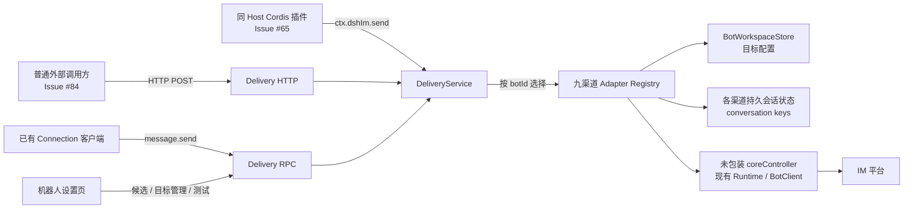

# Issue #65 / #84：基于 `botId + targetId` 的九渠道稳定主动投递方案

日期：2026-08-30。代码基线：v4.0.1 / `92ec91b`。状态：主动投递已实现并通过九渠道真实环境验收；已聊候选选择已通过九渠道自动化测试和最新版 DSH 真实页面验证。

需求来源：[Issue #65](https://github.com/xmanrui/dsh-im/issues/65)、[Issue #84](https://github.com/xmanrui/dsh-im/issues/84)。本文记录实现设计与已完成的验收结果。

## 1. 最终决定

两项需求一起实现，共用一套主动投递核心，提供三个薄调用入口：

| 场景 | 调用入口 | 适用调用方 |
| --- | --- | --- |
| #65 | Host 进程内 Cordis 服务 `ctx.dshIm` | 与 dsh-im 运行在同一 Host 的 cron、提醒、看板等插件 |
| #84 | `POST /api/dsh-im/delivery/messages` | 普通外部程序、自动化平台和编排器 |
| 内部管理 | Connection RPC 通道 `/dsh-im-delivery` | 机器人设置页和已有 Connection 客户端 |

三个入口都只使用 `botId + targetId` 定位投递位置，再加本次要发送的 `text`。它们必须调用同一个 `DeliveryService.send()`，不能各自解析路由、维护目标或连接渠道。

```text
路由地址 = botId + targetId
消息内容 = text
```

本方案不把 `sessionId`、`chatRef`、入站消息 ID、回复目标或临时 Webhook 当作主动投递地址，也不引入 `deliveryHandle`。dsh-im 只持久化用户明确配置的投递目标，不保存主动投递历史、业务任务、幂等键或重试队列。

## 2. 要解决的问题

### 2.1 两种使用场景

- #65 需要让同一个 Host 内的其他 Cordis 插件复用 dsh-im 已有的机器人凭据、连接和发送能力，而不是再接一套机器人。
- #84 需要让回复链之外的进程调用主动投递，例如长任务到达审批点后主动提醒用户。
- 两种场景的差异只是调用边界，目标选择、渠道适配、错误语义和实际发送都相同。

### 2.2 现有候选标识为什么不合适

| 标识 | 结论 | 原因 |
| --- | --- | --- |
| `sessionId` | 不使用 | 表示 Harness 会话，不一定绑定机器人或聊天；切换、重建后也不能代表投递地址 |
| `chatRef` | 不作为公共协议 | 九渠道内容不统一，容易混入消息 ID、线程上下文或临时 Webhook；调用方还要理解渠道内部格式 |
| 入站 `replyTarget` | 不使用 | 依赖最近一条入站消息，只适合回复链，不能长期保存为公共地址 |
| 钉钉 `sessionWebhook` | 不使用 | 有效期和会话上下文有限，不适合长期主动投递 |
| 平台原生用户或群 ID | 只存入内部路由 | 各渠道字段数量和类型不同，部分目标还包含话题或线程字段，不适合作为统一接口结构 |
| `botId + targetId` | 采用 | 两个值都由 dsh-im 展示和持久化；渠道路由变化时可保持公共调用参数不变 |

### 2.3 稳定性的边界

- `botId` 沿用现有机器人配置记录中的真实 ID。它在该机器人配置记录的生命周期内稳定，Host 重启、断线重连和凭据刷新不改变它。
- 删除机器人再重新接入视为新机器人；此时不保证沿用旧 `botId`，旧目标也随旧机器人一起删除。
- `targetId` 是某个机器人下由用户填写的稳定、不透明标识，例如 `daily-report`、`ops-oncall`。同一机器人内唯一、区分大小写，创建后不能改名。
- 如果某个平台原生主 ID 本身适合作为稳定标识，用户也可以直接把它填写为 `targetId`；dsh-im 仍将它当作不透明键，不从字符串猜测渠道或目标类型。
- 平台原生地址保存在该目标的 `route` 中。用户可以修改 `route` 而不改变外部系统使用的 `botId + targetId`。

### 2.4 `botId` 直接复用现有身份

本期不重新发明 Bot ID。九渠道当前都已经把 `botId` 写入机器人配置并在状态响应中返回：

| 渠道 | 当前 `botId` 来源 | 本方案处理 |
| --- | --- | --- |
| 飞书 | 首次接入生成 `bot_...` 并持久化 | 原样展示和使用 |
| 微信 | 由平台 `accountId` 稳定派生 | 原样展示和使用 |
| 钉钉 | 由应用 `clientId` 稳定派生 | 原样展示和使用 |
| 企业微信 | 由平台机器人 ID 稳定派生 | 原样展示和使用 |
| QQ | 由 `appId` 稳定派生 | 原样展示和使用 |
| Slack | 由当前 Bot 的平台身份稳定派生 | 原样展示和使用 |
| Telegram | 由 Telegram Bot 平台 ID 稳定派生 | 原样展示和使用 |
| Discord | 由 Discord Bot 平台 ID 稳定派生 | 原样展示和使用 |
| WhatsApp | 由已连接账号 JID 稳定派生 | 原样展示和使用 |

因此设置页只需把状态模型中已经存在的真实 `botId` 显示出来，不增加“获取 Bot ID”请求，也不把左上角当前展示的遮罩平台身份误当成 `botId`。

## 3. 需求范围

### 3.1 必须实现

1. 九个 IM 渠道统一支持文字主动投递：微信、飞书、钉钉、企业微信、QQ、Slack、Telegram、Discord、WhatsApp。
2. 一个机器人可以配置零个、一个或多个投递目标。
3. 目标配置在 Host 重启后仍然存在；机器人删除时一并清理。
4. #65 和 #84 的发送请求经过同一个核心服务和同一个渠道适配器。
5. 机器人卡片右上角增加设置齿轮；卡片已有身份、状态、工作区、Agent Preset、上下文增强、连接检查和移除入口保持不变。
6. 设置页展示可复制的真实 `botId`，并提供目标的新建、编辑、删除和复制调用参数；每个已保存的 `targetId` 都有自己的测试按钮。
7. 目标配置不依赖机器人在线；实际发送和测试要求机器人当前已连接。
8. 设置页优先列出该机器人已持久化的聊天会话候选；用户选择后自动填入渠道原生路由，再确认稳定的 `targetId`。无候选或需要其他地址时，仍可手动填写并查看字段格式提示。
9. 严格校验 HTTP、RPC 端点、字段和渠道路由，不把平台原始错误、凭据或临时回复上下文返回给调用方。
10. 保持所有现有入站回复、连接检查和文件发送行为不变。

### 3.2 本期明确不做

- 不调用平台 API 扫描联系人、群或频道全量目录，不提供公共 `listChats/chatRef` 发送协议；候选仅来自 dsh-im 已持久化的 conversation key。
- 不返回聊天正文、Harness `sessionId`、消息 ID 或临时回复对象，也不承诺候选具有会话名称、最后活跃时间或平台全量覆盖。
- 不提供绑定码、认领流程、用户目录同步或跨渠道身份合并。
- 不接受 `sessionId`、`chatRef`、`sessionWebhook`、消息 ID 或 `replyToMessageId` 作为公共发送参数。
- 不支持图片、文件、卡片、Markdown 类型选择；首期公共能力只有文字，渠道内部继续复用现有文字分段逻辑。
- 不实现定时任务、消息队列、离线补发、自动重试、回执查询、已读状态或发送历史。
- 不接收或生成 `idempotencyKey`；调用方重试造成的重复消息由调用方负责。
- 不新增 API Key、签名或用户权限模型。HTTP 只复用现有 WebServer 的监听地址，RPC 继续沿用 `loopback` / `trusted-host` 可达性边界；两者都不是业务鉴权，不能直接暴露到公网。
- 不为 AI Office 增加主动投递。本文“九渠道”不包含实验性的 AI Office。
- 不保证平台原生目标永久有效；被平台删除、机器人无权限或用户屏蔽后，发送应明确失败。

## 4. 领域模型与不变量

### 4.1 数据关系

```text
Bot（现有机器人）
├── DeliveryTarget（投递目标，0..n）
│   ├── targetId：对调用方稳定的键
│   ├── name：可选显示名称
│   ├── kind：渠道内的目标类型
│   └── route：可更新的渠道原生路由
└── TargetSuggestion（临时候选，0..n）
    ├── kind / route：从持久化 conversation key 解析
    └── 不含 targetId、sessionId 或聊天正文
```

投递目标的唯一键是 `(botId, targetId)`，不是全局 `targetId`。两个机器人可以各自拥有名为 `daily-report` 的目标，互不影响。

### 4.2 不变量

- `botId` 必须对应一个仍然存在的机器人配置。
- `targetId` 长度为 1～128，只允许 ASCII 字母、数字、`.`、`_`、`:`、`@`、`-`，不得有首尾空白；保存时不静默改写大小写。
- `name` 可省略；填写时去除首尾空白后长度为 1～80。
- `kind` 和 `route` 必须通过所属渠道的严格校验，未知字段一律拒绝。
- `targetId` 创建后不可修改。改名操作等价于新建目标、切换调用方、再删除旧目标，避免外部调用方在不知情时失效。
- 更新目标时完整替换 `name + kind + route`，不做深层 PATCH，避免残留旧类型字段。
- 发送开始时读取一份目标快照。并发更新可能使正在发送的那一次使用旧路由，但更新完成后的下一次发送必须使用新路由。
- 删除目标不取消已经交给渠道的发送；删除完成后的新请求返回 `unknown-target`。
- 候选不是已保存目标，不占用 `targetId`；只有用户选择候选、确认表单并保存后，才创建 `DeliveryTarget`。

## 5. 总体架构



| 组件 | 职责 | 不负责 |
| --- | --- | --- |
| `DeliveryService` | 参数校验、按 `botId` 选择适配器、目标 CRUD、候选列表、统一发送和错误码 | 不理解九渠道 conversation key 或原生字段，不保存消息 |
| 渠道适配器 | 判断是否拥有机器人、把本渠道持久化 conversation key 解析为候选、校验 `kind/route`、调用对应核心 controller | 不暴露 RPC，不管理调用方业务 |
| `BotWorkspaceStore` | 持久化机器人下的已保存目标，复用现有原子写入、机器人队列和删除清理 | 不发送消息，不把候选自动保存为目标 |
| Cordis 服务 | 把 #65 调用转发给 `DeliveryService` | 不复制渠道选择逻辑 |
| Delivery HTTP | 把 #84 的普通 JSON POST 转发给 `DeliveryService`，映射安全 HTTP 状态和错误 | 不直接调用 Runtime，不另开端口 |
| Delivery RPC | 把设置页和已有 Connection 客户端请求转发给 `DeliveryService`，转换安全错误包络 | 不直接调用 Runtime |
| 设置页 | 展示 `botId`、让用户从已聊候选选择或手动编辑渠道路由、调用测试 | 不解析 conversation key，不读取聊天正文，不查询平台全量目录 |

### 5.1 为什么 HTTP 和 RPC 都保留

现有 `/dsh-im` 通道只承载更新功能，并固定为 `loopback`。如果把主动投递直接塞进该通道，想让 #84 使用现有 `trusted-host` 配置时会同时改变更新接口的暴露边界。

因此设置页和已有 Connection 客户端继续使用 `/dsh-im-delivery`；普通外部应用使用 `POST /api/dsh-im/delivery/messages`。HTTP 路由通过现有 `ctx.webServer.register()` 注册，不新增 HTTP Server 或端口，并直接复用 RPC 的严格 payload 校验与同一个 `DeliveryService`。两者都不改动 `/dsh-im` 更新接口。

## 6. 目标持久化

### 6.1 复用现有 `workspaces.json`

每个渠道已经有一份 `workspaces.json`，由 `BotWorkspaceStore` 保存工作区、Agent Preset 和上下文增强设置，并具备：

- 机器人粒度的写入队列；
- 临时文件加 `rename` 的原子落盘；
- 机器人删除事务和启动时 `reconcile()`；
- 九渠道生产组合已经统一创建该 Store。

目标是机器人级设置，直接为这个文档增加 `deliveryTargets`，不再创建九份独立 Store、数据库或消息表。

```json
{
  "version": 2,
  "workspaces": {
    "bot_abc": "/Users/example/project"
  },
  "agentPresets": {},
  "contextEnhancement": {},
  "deliveryTargets": {
    "bot_abc": {
      "daily-report": {
        "name": "每日汇报群",
        "kind": "group",
        "route": {
          "chatId": "oc_xxx"
        }
      }
    }
  }
}
```

`route` 仅为示意；真实字段由渠道决定。`targetId` 已经是对象键，不在记录内重复保存。不增加创建时间、最后发送时间、状态、计数或幂等信息。

### 6.2 Store 最小扩展

在 `src/channels/shared/bot-workspace-store.mjs` 增加：

```js
listDeliveryTargets(botId)
deliveryTargetFor(botId, targetId)
createDeliveryTarget(botId, target)
updateDeliveryTarget(botId, targetId, replacement)
deleteDeliveryTarget(botId, targetId)
```

实现规则：

1. 文档 v1 读取为“没有投递目标”，第一次目标变更时按 v2 写回；现有工作区、Preset 和上下文增强原样保留。
2. v2 严格校验目标对象的基本结构；渠道适配器在创建、更新和发送前再校验具体路由。
3. CRUD 复用已有 `#enqueue(botId, operation)` 和写入回滚模式，不增加第二把锁。
4. `reconcile()` 的候选集合、`#retireCurrentIncarnation()`、`#persist()` 和空文档删除判断同时包含 `deliveryTargets`。
5. 机器人配置删除成功后，目标与工作区在同一删除事务中清理；配置删除回滚时目标也保留。
6. 返回值使用结构化副本，调用方不能直接修改 Store 内部状态。
7. 继续使用现有目录 `0700`、文件 `0600` 的落盘权限；路由中的用户或群标识不写日志、不进入发送历史。

## 7. 共用主动投递核心

### 7.1 对内服务形状

建议新增 `plugin-src/host/delivery-service.mjs`：

```js
service.registerAdapter(adapter)                              // 返回 unregister
service.listBots()
service.listTargets(botId)
service.listSuggestions(botId)
service.createTarget(botId, target)
service.updateTarget(botId, targetId, replacement)
service.deleteTarget(botId, targetId)
service.send(botId, targetId, text, { signal } = {})
```

`send()` 的唯一流程：

1. 校验 `botId`、`targetId` 和非空 `text`；空白文本拒绝，但发送时保留原文格式。
2. 按现有九渠道启动顺序查找第一个 `adapter.ownsBot(botId)` 为真的适配器。最多检查九个内存对象，不建立另一份机器人注册数据库。
3. 从该适配器所属的 `BotWorkspaceStore` 读取 `(botId, targetId)` 快照。
4. 再次用渠道定义校验持久化的 `kind/route`，防止手工损坏文件后向错误地址发送。
5. 调用未包装 `coreController.sendProactiveText(botId, route, text, { signal })`。
6. 渠道接受发送后只返回 `{ sent: true }`；不创建投递句柄、不落发送记录。

### 7.2 渠道适配器契约

```js
{
  channel: 'feishu',
  ownsBot(botId),
  listTargets(botId),
  listSuggestions(botId),
  createTarget(botId, target),
  updateTarget(botId, targetId, replacement),
  deleteTarget(botId, targetId),
  sendText(botId, target, text, { signal })
}
```

- `ownsBot()` 使用同一生产组合中的 `workspaces.has(botId)`，删除中的机器人不会继续接受新发送。
- `listSuggestions()` 只读该机器人已持久化的 conversation keys，输出经本渠道严格校验的 `kind/route`；它不要求 Runtime 在线，也不调用平台 API。
- 公共服务不从 `botId` 前缀猜渠道；前缀只是现有实现细节。
- 每个生产组合把自身 `workspaces` 和未包装 `coreController` 闭包进适配器。
- 适配器只在对应渠道成功启动后注册，关闭渠道时注销。

### 7.3 必须绕过 Workspace RPC 装饰层

#65 已指出 `createWorkspaceAwareController()` 会装饰 controller 的所有返回值，数组方法可能因此改变形状。主动投递适配器必须使用生产组合中已有的未包装 `coreController`；渠道管理 RPC 继续使用包装后的 `controller`。

不在 `createWorkspaceAwareController()` 中加入主动投递特例，也不把目标列表塞进机器人状态响应，这样现有管理接口不会扩大或改变。

### 7.4 统一错误

| code | 含义 |
| --- | --- |
| `bad-request` | 接口、字段、文本或基本 ID 格式不合法 |
| `unknown-bot` | 没有已注册适配器拥有该 `botId` |
| `unknown-target` | 机器人存在，但找不到该 `targetId` |
| `target-conflict` | 同一机器人下创建了重复 `targetId` |
| `invalid-target` | `kind/route` 不符合该渠道约束，或持久化内容已损坏 |
| `bot-not-connected` | 机器人存在，但 Runtime 当前不能发送 |
| `target-rejected` | 平台明确拒绝该地址或机器人没有权限 |
| `delivery-failed` | 网络、平台异常或其他不可安全细分的发送失败 |
| `cancelled` | 调用在交给平台前被取消 |

进程内服务抛出带 `code` 的错误；RPC 转成 `{ ok: false, error: { code, message } }`。RPC 不返回平台原始响应、Webhook、Token、堆栈或内部文件路径。

成功只表示平台发送接口已接受或当前 SDK 已成功返回，不承诺对方已读。dsh-im 不主动重试；调用方自行重试可能产生重复消息。

## 8. #65：Host 进程内 Cordis 服务

Host 启动时创建唯一的 `DeliveryService`，并通过现有 Cordis 机制提供：

```js
ctx.provide('dshIm', Object.freeze({
  send: (botId, targetId, text, options) =>
    deliveryService.send(botId, targetId, text, options),
  listTargets: (botId) => deliveryService.listTargets(botId),
  listBots: () => deliveryService.listBots(),
}))
```

消费方示例：

```js
export const inject = ['dshIm'];

await ctx.dshIm.send(
  'bot_7f4c...',
  'daily-report',
  '今日构建已经完成。',
);
```

约束：

- 服务名沿用 #65 建议的 `dshIm`，方法名保持最小，只暴露 `send`、`listTargets` 和 `listBots`。
- 目标 CRUD 由设置页/管理 RPC 完成，避免 Host 插件顺便承担配置 UI。
- `listTargets()` 返回已保存的 `{ targetId, name, kind, route }[]`。Cordis 公共服务不暴露 `listChats/chatRef`；设置页候选使用第 9 节的专用 RPC 端点。
- `listBots()` 返回已配置机器人的 `{ botId, channel }[]`，只包含稳定公开元数据，不暴露凭据、平台路由或目标内容。
- Cordis 服务和 RPC 持有的是同一个 `DeliveryService` 实例；测试必须证明两者不是两套 registry。
- Host/渠道关闭时用现有 `ctx.effect()` 注销服务、RPC 和渠道适配器，不留下失效 Runtime 引用。

## 9. #84：HTTP POST 与管理 RPC

### 9.1 普通外部调用接口

HTTP 只提供一个发送端点：

```http
POST /api/dsh-im/delivery/messages
Content-Type: application/json

{
  "botId": "bot_7f4c1234",
  "targetId": "daily-report",
  "text": "流水线正在等待审批。"
}
```

成功返回 HTTP 200：

```json
{ "sent": true }
```

HTTP handler 通过现有 `ctx.webServer.register()` 注册 exact route，不新增 Server 或端口。它调用 `createDeliveryRpcHandler(service)` 的 `message.send` 分支，复用严格字段校验、安全错误码和同一个 `DeliveryService.send()`。请求 JSON 上限为 1 MiB；当前不实现鉴权、CORS、目标 CRUD、队列或幂等。

### 9.2 Connection RPC 管理端点

设置页和已有 Connection 客户端继续使用通道 `/dsh-im-delivery`：

| endpoint | payload | 成功 value |
| --- | --- | --- |
| `message.send` | `{ botId, targetId, text }` | `{ sent: true }` |
| `target.list` | `{ botId }` | `{ botId, channel, targets }` |
| `target.suggestion.list` | `{ botId }` | `{ botId, channel, suggestions: [{ kind, route }] }` |
| `target.create` | `{ botId, target: { targetId, name?, kind, route } }` | 新目标完整记录 |
| `target.update` | `{ botId, targetId, target: { name?, kind, route } }` | 更新后的完整记录 |
| `target.delete` | `{ botId, targetId }` | `{ deleted: true }` |
| `target.test` | 已保存目标：`{ botId, targetId }`；表单草稿：`{ botId, target: { kind, route } }` | `{ sent: true }` |

`target.test` 使用固定文案“DSH-IM 主动投递测试成功。”。表单草稿测试不携带 `targetId/name`，也不创建、更新或落盘目标。`target.suggestion.list` 只返回从持久 conversation keys 解析的 `kind/route`，不返回 `sessionId`、聊天正文或临时回复对象。

RPC 结果继续使用 `{ ok: true, value }` / `{ ok: false, error }` 包络；HTTP 则把成功 value 解包为 `{ sent: true }`，并把公共错误码映射为 4xx/5xx。

### 9.3 可达性边界

- HTTP 仅在当前 Host 存在 WebServer 时注册，并复用其 host/port；默认回环地址只能本机调用。
- HTTP 当前没有鉴权，只能在本机、可信局域网、防火墙或反向代理之后使用，不能直接暴露公网。
- RPC 默认 `authority: 'loopback'`；顶层 `rpcAuthority: 'trusted-host'` 时沿用现有解析机制。
- 每个端点只接受列出的键；缺字段、额外字段、数组冒充对象或已取消请求均拒绝。
- `target.suggestion.list` 不要求机器人在线；未知机器人返回 `unknown-bot`，无候选时成功返回空数组。

## 10. 九渠道适配

### 10.1 目标字段和现有发送链路

| 渠道 | `kind` | 设置页要求用户填写的 `route` | 复用的现有发送链路 |
| --- | --- | --- | --- |
| 微信 | `user` | `{ toUserId }` | `createWeixinApi().sendText()`；不带 `contextToken/runId` |
| 飞书 | `user` / `group` | 用户 `{ openId }`；群 `{ chatId }` | `FeishuRuntime` 当前 `im.v1.message.create` 文字发送 |
| 钉钉 | `user` / `group` | 用户 `{ userId }`；群 `{ openConversationId }` | 在 `dingtalk-api.mjs` 增加稳定机器人文字发送，复用现有 Access Token 和机器人主动文件消息端点 |
| 企业微信 | `user` / `group` | `{ chatId }`；私聊填用户 ID，群聊填群 `chatid` | 已连接客户端的 `sendMessage(chatId, markdown)` |
| QQ | `user` / `group` | 用户 `{ userOpenId }`；群 `{ groupOpenId }` | `QqRuntime` 中的 `QQBot.sendText()`，适配为 SDK 的 `{ scope, targetId }` |
| Slack | `conversation` / `thread` | `{ channelId }`；线程再加 `{ threadTs }` | `SlackBotClient.sendText()` |
| Telegram | `chat` / `topic` | `{ chatId }`；话题再加 `{ messageThreadId }` | `TelegramBotClient.sendText()`，不带回复消息 ID |
| Discord | `channel` | `{ channelId }`；私信、频道和 Thread 都使用可发消息的 Channel ID | `DiscordBotClient.sendText()`，不带回复消息 ID/notice |
| WhatsApp | `user` / `group` | `{ jid }`，分别接受用户 JID 或群 JID | `WhatsappBotClient.sendText()`，不带 `quoted` |

注意：表中的 `route` 是内部持久化结构，#65/#84 的发送调用都不传这些字段。设置页候选只用同一份 `kind/route` 预填表单。

### 10.2 已聊候选的来源

候选不是平台聊天列表。它仅读取每个机器人状态文件中已持久化的 `sessions` conversation keys，按渠道规则转换并去重：

| 渠道 | 持久化 conversation key | suggestion `kind/route` |
| --- | --- | --- |
| 微信 | `p2p:<userId>` | `user / { toUserId }` |
| 飞书 | `p2p:<openId>`、`group:<chatId>` | `user / { openId }`、`group / { chatId }` |
| 钉钉 | `p2p:<staffId>`、`group:<conversationId>` | `user / { userId }`、`group / { openConversationId }` |
| 企业微信 | `direct:<userId>`、`group:<chatId>` | `user / { chatId }`、`group / { chatId }` |
| QQ | `c2c:<userOpenId>`、`group:<groupOpenId>` | `user / { userOpenId }`、`group / { groupOpenId }` |
| Slack | `direct:<channelId>`、`group:<channelId>:<threadTs>` | `conversation / { channelId }`、`thread / { channelId, threadTs }` |
| Telegram | `direct:<chatId>`、`group:<chatId>[:<messageThreadId>]` | `chat / { chatId }`、`topic / { chatId, messageThreadId }` |
| Discord | `direct|group:<channelId>` | `channel / { channelId }` |
| WhatsApp | `direct:<userJid>`、`group:<groupJid>` | `user / { jid }`、`group / { jid }` |

conversation key 只证明 dsh-im 曾经为该聊天建立持久会话映射。它不带最后活跃时间或可靠的平台会话名称，且可能因工作区切换、会话清理或从未建立 Harness Session 而不完整。因此产品文案使用“已聊过的会话”而不是“平台最近聊天”，手动填写始终作为高级兜底。

飞书私聊候选只接受能明确识别为 `open_id` 的 `ou_...` key；旧事件若仅提供 `user_id`，由于历史 key 没有记录 ID 类型，将安全忽略而不生成不可投递候选。WhatsApp 群候选同时接受当前数字群 JID 和带连字符的旧式群 JID。

### 10.3 各渠道的实现要点

1. **微信**：只支持用户目标。复用现有 API 的无上下文文字发送能力；不把入站 `contextToken` 或当前 `runId` 保存进目标。
2. **飞书**：`kind` 决定 `receive_id_type` 为 `open_id` 或 `chat_id`。把连接检查中的局部发送函数提取为 Runtime 的稳定文字发送方法，继续使用同一 SDK Client。
3. **钉钉**：即时回复链仍可保留 `sessionWebhook`，但主动投递绝不能使用它。新增 `sendRobotText()`，用户目标调用 `v1.0/robot/oToMessages/batchSend`，群目标调用 `v1.0/robot/groupMessages/send`；`robotCode` 从当前机器人配置取得，不让用户重复填写。请求复用现有 Access Token Header，文字体为 `msgKey: 'sampleText'`、`msgParam: JSON.stringify({ content: text })`，目标字段分别为 `userIds` 或 `openConversationId`。为路径、Header、消息体和拒绝响应增加契约测试。
4. **企业微信**：直接复用 Runtime 当前连接检查使用的客户端；私聊的 `chatId` 是用户 ID，群聊为平台 `chatid`，类型只用于校验和页面说明。
5. **QQ**：公共 `targetId` 与 QQ SDK 内部字段 `targetId` 不是一回事。适配器将 `userOpenId/groupOpenId` 映射为 `{ scope: 'c2c'|'group', targetId: 原生 ID }`，避免调用方接触 SDK 结构。
6. **Slack**：用户必须提供会话 Channel ID，不能只填 Member ID。线程目标额外保存稳定的根消息 `threadTs`。
7. **Telegram**：`chatId` 以十进制字符串持久化，调用 API 前校验并转换；Topic 使用可选整数 `messageThreadId`，不保存最近入站消息 ID。
8. **Discord**：DM 也要求已经存在且机器人可访问的 Channel ID；Thread 本身同样是 Channel ID，因此无需额外线程字段。
9. **WhatsApp**：只接受当前 SDK 支持的用户或群 JID，拒绝 Status/Broadcast 等特殊 JID。发送目标只有 `jid`，不保存引用消息对象或 `selfChat` 状态。

### 10.4 共用已有代码，但不复用临时目标

- Slack、Telegram、Discord 已共用 `TextHarnessBridge`。为它增加一个只委托 `#bot.sendText()` 的公共方法，三个 Runtime 再统一暴露 `sendProactiveText()`，不复制分段代码。
- Telegram 和 Discord 继续通过 `TokenBotController` 统一委托 Runtime；其他 controller 各增加同名薄方法。
- 渠道的 `sendText()` 继续负责自身长度切分和平台错误分类；`DeliveryService` 不做统一切段。
- 现有 `sendConnectionTest()` 可以复用底层发送函数，但它记住的测试目标不会自动成为投递目标。
- 候选仅使用持久化 conversation key 中可证明为稳定地址的部分；连接检查 WeakMap、消息正文和平台临时路由都不是候选来源。
- 所有主动路由明确拒绝 `sessionId`、`sessionWebhook`、`contextToken`、`runId`、`messageId`、`replyToMessageId`、`quoted` 等瞬时字段。

## 11. 机器人卡片与设置页

### 11.1 卡片入口

机器人卡片原有内容和顺序不变，仅在右上角状态区域增加齿轮：

```text
┌────────────────────────────────────────────────────┐
│ [渠道图标] 机器人名称        ● 运行正常      [⚙] │
│            现有平台身份        最近检查 10:30      │
│                                                    │
│              原有设置内容全部保持不变              │
│                         [检查连接] [移除接入]       │
└────────────────────────────────────────────────────┘
```

- 在 `channel-card-meta.js` 新增共享 `BotSettingsButton`，九种卡片都使用它。
- 右侧使用 `dim-botCardTools` 包住现有 `BotStatusMeta` 和齿轮，不修改健康状态本身。
- 按钮为 32×32 px、16 px 齿轮、8 px 圆角；默认透明，Hover 使用现有浅灰交互底色，键盘焦点使用现有蓝色 focus ring。
- `aria-label` 和 Tooltip 都是“机器人设置”。按钮不显示 `botId` 或目标数量，避免继续挤占卡片。
- 机器人离线时仍可进入设置；仅“发送测试”不可用。

### 11.2 独立设置页

点击齿轮后，在当前渠道右侧面板内从机器人列表切换到独立设置页，不使用弹窗，也不增加左侧导航项：

```text
← 返回机器人列表                         飞书机器人

调用标识
Bot ID
bot_7f4c9d...                                      [复制]

投递目标                                      [新建目标]
每日汇报群 [群聊]
targetId: daily-report
                    [复制调用参数] [测试] [编辑] [删除]

告警负责人 [私聊]
targetId: ops-oncall
                    [复制调用参数] [测试] [编辑] [删除]
```

页面规则：

- Bot ID 显示 `status.bots[].botId` 的真实值，使用等宽字体，可单独复制；不显示卡片上经过遮罩的平台应用 ID 来冒充。
- “复制调用参数”复制 JSON：`{ "botId": "...", "targetId": "..." }`，不包含路由和消息文本。
- 点击“新建目标”后默认进入“从已聊过的会话选择”，并通过 `target.suggestion.list` 加载候选。候选使用一个原生下拉选择框展示，不平铺卡片；无候选时提示“先在对应平台与机器人聊一条消息，再刷新”，同时保留“手动填写（高级）”。
- 下拉选项展示可用的本地名称、目标类型和脱敏路由摘要；不将这些展示值说成平台会话名称或最后活跃时间。
- 已存在相同 `kind + route` 的选项显示“已添加”并禁用；去重不依赖 `targetId`。
- 目标行预览只展示名称、目标类型徽标和 `targetId`；渠道原生路由仅在新建或编辑表单中显示，避免列表泄露实现细节并保持紧凑。
- 每个已保存目标行都固定显示“测试”按钮，点击后只把该行的 `{ botId, targetId }` 发送给 `target.test`。所有新建和编辑表单也显示“测试”按钮，使用当前表单中的 `{ kind, route }` 发送 `{ botId, target: { kind, route } }`；这不会先保存目标，手动填写与会话候选预填的表单行为一致。
- 测试期间仅禁用当前按钮并显示“测试中…”；平台发送成功后在对应目标行或表单内显示“测试消息已发送，请到目标会话确认”，失败则在同一位置显示该次安全错误并允许重试。测试结果只保留在页面内，不落盘、不改变目标健康状态。
- 删除先在页面内确认，并提示“使用这个 targetId 的外部调用将返回 unknown-target”。
- 返回机器人列表后保留当前渠道；尽量保留此前滚动位置，不重新切换渠道。

### 11.3 新建和编辑表单

新建流程：

1. 默认先显示已聊候选；点选后打开新建表单，自动预填 `kind/route`、本地兜底显示名称和未占用的随机 `targetId`（例如 `tgt_7f3a91c8d2e64b10`）。随机值不包含渠道或目标类型，用户保存前仍可改为有业务含义的别名。
2. 预填不是保存；用户可继续修改名称、`targetId` 和路由，并必须点击“保存目标”才调用 `target.create`。
3. 点击“手动填写（高级）”进入新建表单并同样预填随机 `targetId`，用于尚未出现在 conversation keys 或需要输入其他稳定地址的场景。
4. 无论从候选还是手动进入，新建表单都可在保存前点击“测试”；请求只使用当前 `kind/route`，不会调用 `target.create`。

共享表单字段：

1. `targetId`：必填；编辑时只读。
2. 显示名称：可选。
3. 目标类型：仅展示该渠道支持的 `kind`。
4. 渠道路由字段：按第 10 节表格动态显示。

编辑表单同样测试当前字段值，而不是已保存记录中的旧路由；测试不调用 `target.update`。路由必填字段完整且机器人在线时按钮才可用，反馈显示在当前表单内。

实现一个共享 `DeliveryTargetSettingsPage`，用一份九渠道字段定义驱动标签、占位说明、类型选项和路由摘要，不复制九个页面。渠道自己的 `SettingsTab` 只维护 `selectedBot` 并传入 `channel/account/deliveryRpcCall/onBack`。

候选不来自连接检查目标或平台群列表，页面也不会读取聊天正文。它只把服务端已归一化的 `kind/route` 作为建立稳定投递目标的输入。

## 12. 最小代码改动建议

### 12.1 新增共享文件

| 文件 | 内容 |
| --- | --- |
| `plugin-src/host/delivery-service.mjs` | Adapter registry、目标 CRUD、候选列表、统一 `send()`、Cordis 服务对象 |
| `plugin-src/host/delivery-suggestions.mjs` | 九渠道 conversation key 到稳定 `{ kind, route }` 的纯解析、畸形过滤和去重 |
| `plugin-src/host/delivery-rpc.mjs` | `/dsh-im-delivery` 端点（包括 `target.suggestion.list`）、严格 payload 校验、安全错误包络 |
| `plugin-src/client/delivery-settings.js` | 候选选择、设置页、目标表单、九渠道字段定义和调用参数复制 |

不需要新增第三方依赖。

### 12.2 修改现有共享文件

| 文件 | 改动 |
| --- | --- |
| `src/channels/shared/bot-workspace-store.mjs` | v2 文档、`deliveryTargets` CRUD、迁移和机器人删除清理 |
| `src/channels/shared/text-harness-bridge.mjs` | 为 Slack/Telegram/Discord 增加薄的文字发送委托 |
| `src/channels/shared/token-bot-controller.mjs` | 委托 Telegram/Discord Runtime 的主动文字发送 |
| `src/channels/wecom/state-store.mjs` | 补齐只读 `snapshot()`，使持久化 conversation keys 可与其他渠道一致提取候选 |
| `plugin-src/host/index.mjs` | 创建唯一服务、提供 `dshIm`、安装 Delivery RPC、向九渠道传注册回调 |
| `plugin-src/host/channels/shared/production.mjs` | 返回由 `coreController + workspaces + stateFor` 构成的适配器，候选可从磁盘状态离线读取 |
| `plugin-src/client/index.js` | 建立 `deliveryRpcCall` 并传给九渠道设置页 |
| `plugin-src/client/loopback-recovery.js` | 将 Delivery RPC 纳入现有 loopback 恢复包装 |
| `plugin-src/client/channel-card-meta.js` | 共享齿轮按钮 |
| `plugin-src/client/styles.js` | 齿轮、设置页、目标列表和响应式样式 |

### 12.3 渠道文件

- 共享 token 生产组合覆盖 Telegram、Discord；Slack 使用自己的生产组合。
- 飞书、微信、钉钉、企业微信、QQ、Slack、WhatsApp 的 production 返回同形适配器，并向适配器注入对应的 `stateFor`。
- 九渠道现有 controller/runtime 各增加一个薄的 `sendProactiveText()`；底层继续调用现有 BotClient/API。
- 钉钉额外修改 `src/channels/dingtalk/dingtalk-api.mjs`，增加稳定用户/群文字发送方法。
- 九个客户端卡片把现有 `BotStatusMeta` 与共享齿轮放进右侧工具组；卡片其余 JSX 不搬迁、不重排。

### 12.4 推荐实施顺序

1. 先扩展 `BotWorkspaceStore` 和迁移测试。
2. 实现 `DeliveryService`、适配器契约、Cordis 服务和 Delivery RPC，用假适配器打通双入口。
3. 接入九渠道 Runtime/controller；先做现有共用程度最高的 Telegram/Discord/Slack，再完成其余渠道和钉钉稳定发送。
4. 实现共享设置页和九张卡片的齿轮入口。
5. 补充 README/README.en、CHANGELOG、接口示例和九渠道真实环境验收记录。

每一步都使用同一公共契约，不先合入只支持飞书的公共 API，避免一经发布就形成“接口声称九渠道、实际只有一个渠道”的兼容包袱。

## 13. 测试方案

### 13.1 Store 与生命周期

| 编号 | 用例 | 预期 |
| --- | --- | --- |
| S01 | 读取现有 v1 `workspaces.json` | 工作区等设置不变，目标为空；首次目标变更写为 v2 |
| S02 | 新建两个目标后重建 Store | 完整恢复 `targetId/name/kind/route` |
| S03 | 两个机器人使用相同 `targetId` | 各自读取自己的目标，不冲突 |
| S04 | 同一机器人重复创建 `targetId` | `target-conflict`，原记录不变 |
| S05 | 更新名称、类型和路由 | `targetId` 不变，下一次读取是完整新快照 |
| S06 | 落盘失败 | 内存回滚到提交前状态，不返回虚假成功 |
| S07 | 同一机器人并发增删改 | 经过已有机器人队列串行化，文件合法且不丢其他目标 |
| S08 | 删除机器人成功/失败回滚 | 成功时目标清理；配置删除失败时目标保留 |
| S09 | 启动 `reconcile()` 遇到已不存在机器人 | 清理该机器人的孤儿目标 |

### 13.2 共用核心与双入口

| 编号 | 用例 | 预期 |
| --- | --- | --- |
| C01 | 两个适配器分别拥有不同 `botId` | 只调用拥有该机器人的适配器一次 |
| C02 | 未知机器人/目标 | 分别返回 `unknown-bot` / `unknown-target`，不尝试平台发送 |
| C03 | 目标路由损坏 | `invalid-target`，不把损坏数据交给 Runtime |
| C04 | 机器人离线 | `bot-not-connected`，不排队、不落消息记录 |
| C05 | 发送过程中更新目标 | 当前调用使用一个完整快照；后续调用使用新路由 |
| C06 | 调用取消 | 交给平台前返回 `cancelled`；已交给平台后不承诺撤回 |
| C07 | 平台拒绝和网络失败 | 映射为安全公共错误，不泄露原始响应 |
| C08 | Cordis `send` 与 RPC `message.send` 使用同一 pair | 命中同一个 service spy、同一个适配器和同一返回语义 |
| C09 | Host/渠道关闭 | 适配器注销，旧 Runtime 不再可调用 |
| C10 | 列出已聊候选 | 按 `botId` 命中同一适配器，只返回 `{ kind, route }`；离线可读，无候选返回空数组 |
| C11 | 发送成功 | 只返回 `{ sent: true }`，没有 handle、历史或幂等状态 |

建议新增 `test/delivery-service.test.mjs`、`test/delivery-rpc.test.mjs`，并扩展 `test/host.test.mjs` 验证 `ctx.provide('dshIm')` 和清理生命周期。

### 13.3 #65 Cordis 入口测试

#65 只保留一个自动化入口用例；未知机器人、未知目标、离线和平台失败已经由第 13.2 节共享核心测试覆盖，不在 Cordis 入口重复一遍。真实环境则按第 13.7 节在九渠道各执行一次同样的最小发送。

**自动化用例：**在 Host 测试中提供 `dshIm`，让一个声明 `inject: ['dshIm']` 的假消费插件执行：

```js
await ctx.dshIm.send('bot_test', 'daily-report', '测试消息');
```

预置假目标和假渠道 sender，断言 sender 收到正确路由和文字一次、结果为 `{ sent: true }`，并断言 `connection.rpc.call` 为 0 次。这个用例证明 #65 使用 Cordis 服务而不是 #84 RPC。可直接放进现有 `test/host.test.mjs`，不新建复杂测试框架。

**真实冒烟用例：**每个渠道只选择一个当前可用机器人和一个可用目标，让同一 Host 内的最小测试插件调用一次 `ctx.dshIm.send()`。目标收到“#65 Cordis 主动投递测试”即通过，不要求把该渠道的私聊、群聊和线程类型全部测一遍。

### 13.4 RPC 契约

- 七个端点分别覆盖成功、缺字段、额外字段、错误类型、未知端点和取消。
- `target.suggestion.list` 只接受 `{ botId }`，并严格返回 `{ botId, channel, suggestions: [{ kind, route }] }`；混入 `sessionId`、正文、名称、时间或回复字段的适配器结果必须被拒绝或归一化掉。
- `target.test` 严格接受 `{ botId, targetId }` 或 `{ botId, target: { kind, route } }` 二者之一；前者测试已保存目标，后者测试未落盘的当前表单路由，且不得触发 `target.create/target.update`。
- `target.update` 不能提交新的 `targetId`；`target.create` 不能覆盖已有记录。
- 默认 authority 为 `loopback`，显式 `trusted-host` 走现有解析器；`/dsh-im` 更新 RPC 仍固定 loopback。
- `message.send` 只接受 `{ botId, targetId, text }`，显式验证 `sessionId/chatRef/idempotencyKey/route` 等额外字段会被拒绝。
- 错误包络只含允许的 code 和安全文案。

### 13.5 九渠道适配器契约

每个渠道至少有以下自动化用例：

1. 每种受支持 `kind` 的合法路由准确映射到现有 sender。
2. 缺字段、空字段、错误类型和未知字段均为 `invalid-target`。
3. Runtime 离线时不调用 SDK。
4. 长文本仍由该渠道现有分段函数处理，核心服务不重复切段。
5. 主动发送不携带回复消息、引用对象或最近会话状态。
6. 平台 sender 只调用一次业务发送入口；其内部分段次数按现有规则。
7. 从该渠道的持久化 conversation keys 解析候选，过滤畸形 key，对相同 `kind + route` 去重，且不读取 Harness `sessionId` 值。

重点断言：

| 渠道 | 必须断言 |
| --- | --- |
| 微信 | 请求没有 `contextToken`、`runId` |
| 飞书 | user/group 分别使用 `open_id/chat_id` |
| 钉钉 | 使用稳定 OpenAPI 路径；任何主动发送都没有读取或调用 `sessionWebhook` |
| 企业微信 | user/group 的 `chatId` 原样传给当前 Client |
| QQ | user/group 分别映射 `c2c/group`，不混淆公共 `targetId` |
| Slack | `threadTs` 仅在线程目标出现 |
| Telegram | Topic 映射 `messageThreadId`，始终没有 `replyToMessageId` |
| Discord | 只传 `channelId + content`，没有 reply/notice |
| WhatsApp | 只传 `jid + text`，没有 `quoted` |

候选提取另用一张九渠道表驱动测试固定第 10.2 节的映射。每个渠道至少同时提供合法 key、重复 key 和畸形 key，断言输出项严格只有 `kind/route`，不含 `targetId/name/time/sessionId/text/messageId/replyTarget`。

这些测试加入各渠道现有 runtime/controller/production 测试文件，不为同一行为新建九套测试框架。

### 13.6 客户端测试

| 编号 | 用例 | 预期 |
| --- | --- | --- |
| U01 | 九种机器人卡片渲染 | 状态右侧均有可访问齿轮，原有内容和操作仍在 |
| U02 | 点击齿轮和返回 | 在当前面板切换设置页/机器人列表，不改变渠道 |
| U03 | Bot ID 复制 | 复制真实完整 `botId`，不是遮罩平台 ID |
| U04 | 目标空状态及新建 | 按渠道显示正确字段，保存后出现在列表 |
| U05 | 编辑目标 | `targetId` 只读，名称/类型/路由可完整替换 |
| U06 | 删除目标 | 先确认，成功后移除；失败时保留并显示安全错误 |
| U07 | 复制调用参数 | JSON 只含正确 `botId + targetId` |
| U08 | 每个目标行测试 | 每个已保存 `targetId` 都有测试按钮；点击哪一行就用该行 pair 调用 `target.test`，成功和失败反馈只显示在该行 |
| U09 | 窄屏和键盘操作 | 不横向溢出，焦点顺序、Tooltip、状态播报可用 |
| U10 | Delivery RPC 不可用 | 只影响目标设置，不破坏机器人列表和现有连接操作 |
| U11 | 候选列表 | 点击“新建目标”调用 `target.suggestion.list`，展示类型和脱敏路由摘要 |
| U12 | 选择候选 | 只预填 `kind/route`、本地兜底名称和未占用的随机 `targetId`；选择时不调用 `target.create` |
| U13 | 已添加候选 | 相同 `kind + route` 显示“已添加”并不可再选 |
| U14 | 候选空状态和高级兜底 | 提示先与机器人聊天再刷新；“手动填写（高级）”始终可用 |
| U15 | 新建/编辑表单测试 | 候选新建、手动新建和编辑表单均显示测试按钮；只提交当前 `{ kind, route }`，不调用 create/update，成功或失败反馈仅显示在当前表单 |

复用现有 `test/client-ui.test.mjs` 和九渠道 `client-ui.test.mjs` 的渲染方式；共享设置页可新增 `test/client-delivery-settings.test.mjs`。

### 13.7 回归和真实环境

自动化必须通过 `npm run check`，并特别回归：机器人接入/删除、断线重连、检查连接、工作区切换、Agent Preset、上下文增强、入站回复、Telegram 长轮询和 WhatsApp 回声过滤。

本次按下表执行最小真实验收。每个渠道只选一个当前可用机器人和一个目标，并对同一组 `botId + targetId` 分别发送两条容易区分的消息：

- #65：同 Host 测试插件调用 `ctx.dshIm.send()`，消息带 `#65` 标识。
- #84：进程外测试调用 `POST /api/dsh-im/delivery/messages`，消息带 `#84 HTTP` 标识。

| 渠道 | 机器人和目标 | #65 | #84 | 目标测试 |
| --- | --- | --- | --- | --- |
| 微信 | 1 组已连接机器人和脱敏目标 | 通过 | 通过 | 通过 |
| 飞书 | 1 组已连接机器人和脱敏目标 | 通过 | 通过 | 通过 |
| 钉钉 | 1 组已连接机器人和脱敏目标 | 通过 | 通过 | 通过 |
| 企业微信 | 1 组已连接机器人和脱敏目标 | 通过 | 通过 | 通过 |
| QQ | 1 组已连接机器人和脱敏目标 | 通过 | 通过 | 通过 |
| Slack | 1 组已连接机器人和脱敏目标 | 通过 | 通过 | 通过 |
| Telegram | 1 组已连接机器人和脱敏目标 | 通过 | 通过 | 通过 |
| Discord | 1 组已连接机器人和脱敏目标 | 通过 | 通过 | 通过 |
| WhatsApp | 1 组已连接机器人和脱敏目标 | 通过 | 通过 | 通过 |

每个要求验收的入口各验证一次成功发送，不扩展到该渠道的所有目标类型，也不增加并发或故障注入。验收记录只保存渠道、脱敏 `botId/targetId`、入口、时间和结果，不保存凭据或完整原生用户 ID。

### 13.8 当前实施验证记录（2026-08-30）

- `npm run check` 已通过：全部测试、构建和发布文件校验通过。
- 使用最新版 DSH 源码 `0.1.2-alpha.1-cd5ef81` 启动当前 `web` profile，最新版 Connection RPC 包络兼容验证通过。
- 真实宿主页面共加载 19 张现有机器人卡片，九个渠道的机器人卡片数量与齿轮按钮数量完全一致；九个设置页均能显示 Bot ID、新建表单和对应渠道的原生路由字段，浏览器控制台无错误。
- 已增加九渠道表驱动候选测试，固定 conversation key 到 `kind/route` 的映射、去重、畸形 key 过滤和临时字段隔离；RPC 和客户端测试另覆盖 `target.suggestion.list`、选择预填、已添加禁用及手动高级兜底。
- 在最新版 DSH 的真实设置页面逐渠道调用 `target.suggestion.list`，九个渠道均读取到至少一个已有会话候选；QQ 在选择存在历史会话的机器人后同样读取成功。点选候选可自动预填目标类型、原生路由和未占用的随机调用别名；验证过程未保存草稿、未发送消息，浏览器控制台无错误。
- 经使用者明确授权，从九渠道已有真实私聊/自聊的持久化入站路由中提取平台原生地址，为每个渠道保存一个机器人级投递目标；只把平台地址写入 `route`，没有把 `sessionId` 当作投递地址。九份 `workspaces.json` 均由 v1 正常迁移为 v2，并可通过 `target.list` 回读。
- 在增加普通 HTTP 接口前，曾通过 `/dsh-im-delivery` 的 `message.send` 对九渠道各真实发送一次，9/9 成功；该记录保留为 Connection RPC 回归证据。
- 首次真实 #65 验证发现 `dshIm` 在最新版 DSH 的现代依赖注入组合中被提供在过窄作用域。实现已改为在 Host 插件根上下文提供服务，再把同一个 `DeliveryService` 传入延迟激活的渠道；现代 Cordis 注入回归测试已固定该行为。
- Host 重启后，一次性同 Host Cordis 插件仅注入 `dshIm` 并调用 `ctx.dshIm.send()`，九渠道各真实发送一次，9/9 成功；测试插件没有注入或调用 Connection RPC。
- 使用进程外脚本依次调用 `POST /api/dsh-im/delivery/messages`，从本机已有配置自动选择九渠道各一个在线机器人和私聊目标；九次请求均只提交 `botId + targetId + text`，全部返回 HTTP 200 与 `{ "sent": true }`，9/9 成功且没有自动重试。
- 每个已保存目标又通过测试按钮所调用的 `target.test` 端点真实发送一次，九渠道 9/9 成功。WhatsApp 测试前发生一次平台连接离线，使用现有 `bot.reconnect` 恢复后，同一 `botId + targetId` 无需修改即测试成功。
- 验收记录只保留渠道和结果，不记录完整 `botId`、平台原生地址、凭据或会话 ID。

## 14. 验收标准

以下条件全部满足才能关闭 #65 和 #84：

1. 同 Host 插件可以注入 `dshIm`，使用 `send(botId, targetId, text)` 完成投递。
2. #65 自动化测试通过真实 Cordis `inject: ['dshIm']` 激活消费插件，成功发送期间 `connection.rpc.call` 为 0 次。
3. 普通进程外调用方可以通过 `POST /api/dsh-im/delivery/messages` 使用同一组参数完成投递。
4. 自动化测试证明 HTTP、Cordis 和 Connection RPC 三个入口调用同一个 `DeliveryService`，不存在多套路由解析或渠道连接。
5. 九渠道各选择一个可用机器人和私聊目标，#84 HTTP POST 均真实发送成功一次；已有 #65 与 Connection RPC 验收记录继续作为回归证据。
6. Host 重启后同一 `botId + targetId` 仍可使用；编辑渠道路由后公共 pair 不变且下一次发送走新路由。
7. 公共发送接口没有 `sessionId`、`chatRef`、`sessionWebhook`、`deliveryHandle` 或 `idempotencyKey`。
8. 钉钉主动投递只使用稳定用户/群接口；临时 `sessionWebhook` 仅保留在原即时回复链。
9. 每种机器人卡片右上角都有齿轮，原卡片内容、顺序和连接检查功能没有退化。
10. 设置页可从已聊过的会话候选预填新目标，候选仅含 `kind/route`；九渠道 conversation key 映射均有自动化测试，且手动填写高级兜底始终可用。
11. 设置页可复制真实 Bot ID，并完整支持目标的新建、编辑、删除和复制 pair；每个已保存 `targetId` 都有独立测试按钮，新建和编辑表单也可在不保存的情况下测试当前路由。
12. 一个机器人可配置多个目标；相同 `targetId` 在不同机器人下隔离。
13. 机器人离线时仍可管理目标并读取已持久化的候选；发送返回明确的 `bot-not-connected`，不建立隐式队列。
14. 删除机器人会清理其全部目标；删除失败回滚不会丢失目标。
15. dsh-im 不落主动发送历史、不自动重试、不管理幂等状态。
16. `npm run check` 全部通过，HTTP 协议测试和九渠道现有接入、回复、主动投递与连接检查回归通过。

## 15. 风险与控制

| 风险 | 控制方式 |
| --- | --- |
| 用户填错平台 ID | 默认从已聊候选选择；手动输入作为高级兜底时，仍使用渠道严格校验、字段级提示和目标测试 |
| 候选被误解为平台全量最近聊天 | 文案明确仅来自持久化 conversation keys，不显示伪造的名称/时间，缺少时使用手动兜底 |
| 平台目标以后失效 | 保持 `targetId` 不变，用户只更新内部 route |
| 配置文件升级损坏原设置 | v1→v2 迁移、原子写入、失败回滚和迁移测试 |
| #65 与 #84 行为逐渐分叉 | 三个入口只做协议转换，测试直接断言同一 service 实例 |
| 九渠道复制实现 | 目标 Store、Service、RPC 和设置页共享；渠道层只保留路由校验和薄发送委托 |
| 钉钉误用临时 Webhook | 主动发送 API 不接受该字段，并以负向测试固定 |
| 对外 RPC 被误认为已有完整鉴权 | 文档明确本期只复用可达性边界；真正远程开放前另行设计鉴权 |
| 调用方超时后重试导致重复 | 不伪造“恰好一次”；文档明确调用方负责幂等，dsh-im 不落盘去重 |

## 16. 方案收口

本方案只有一个需要长期维护的公共概念：投递目标。外部调用方认 `botId + targetId`，dsh-im 在内部把它解析成当前渠道路由并复用已有发送连接。

后续即使增加富文本或文件，也应在 `DeliveryService` 上扩展消息内容类型，而不是再引入 `sessionId`、`chatRef` 或新的地址体系；本期不提前实现这些扩展点。
