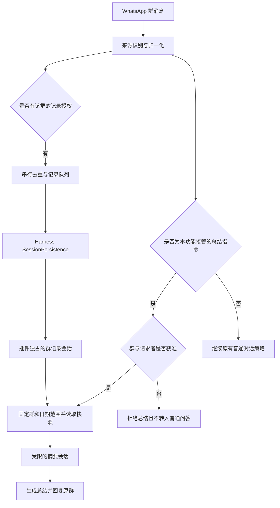

# WhatsApp 群聊记录与按日总结方案

> 状态：方案草案，尚未实施。
>
> 日期：2026-08-28。
>
> 硬约束：只修改 dsh-im；不修改、打补丁或重新构建 Harness 核心；优先复用 Harness 的会话存储，不新增聊天内容数据库。

## 1. 方案结论

机器人账号加入指定 WhatsApp 群后，dsh-im 持续记录实际收到的群消息。记录过程不调用模型；授权成员发送 `@机器人 总结今天` 时，插件从已保存的记录中取出当天内容，生成总结并发回原群。已经启用的普通问答规则独立生效，不因记录功能被改写。

建议采用下面的存储分工：

| 对象 | 保存内容 | 是否运行 AI |
| --- | --- | --- |
| 群记录会话 | 群成员的原始消息、收到的修订事件、记录状态 | 否 |
| 摘要会话 | 一次总结所选的消息、摘要提示词和 AI 回复 | 是，仅收到明确指令后 |
| 现有普通对话会话 | 原有机器人问答 | 保持现状 |

三者都可以使用 Harness 已有的会话设施，但不能混用其写入方式。群记录会话由 dsh-im 独占，通过宿主公开的 `sessionPersistence` 服务读写；摘要会话通过现有 `session.create`、`session.prompt` 等接口运行。普通对话的绑定、访问模式和命令保持原有行为。

**“保存到会话记录”在本方案中指保存到 Harness 的会话持久化后端，不意味着每条群消息自动变成现有聊天窗口中的用户气泡。** 第一版由 dsh-im 提供群记录查看入口。要求原有聊天窗口原样显示全部群消息，属于另一个展示需求，不能在不改核心的前提下直接承诺。

该路径有源码和已有后端测试支持，但尚未完成目标安装版本的插件集成验证。必须先通过第 15 节的兼容性验证，再进入功能开发；不能把“能调用一个方法”当作整条链路已经可用。

## 2. 目标、范围与明确不做的事情

### 2.1 第一版目标

1. 只记录用户在设置页明确启用的群，默认关闭。
2. 未 @ 机器人的文字消息也能入库；记录操作本身不触发 AI、已读提示、输入状态或群内回复。
3. 支持按群时区总结今天、昨天、指定日期及日期内的明确时间段。
4. 记录保存发言人、原始消息时间、收到时间和消息 ID，能够去重、排序和说明来源。
5. 重启后能够读取已持久化记录；中断、缺失、未解析媒体等情况在总结中说明。
6. 全部实现位于 dsh-im，使用 Harness 的公开插件服务和现有 RPC。

### 2.2 第一版不承诺

- 不修改 Harness 源码、事件白名单、RPC 协议、内置聊天 UI 或存储表结构。
- 不直接编辑 Harness 的 JSONL、压缩日志或 SQLite 文件。
- 不保证获取入群前、启用前、设备离线期间的完整历史。
- 不启用全量历史同步，不把手机上可见的全部旧聊天等同于程序已保存的数据。
- 不转写语音，不识别图片，不读取文件正文，不下载媒体。
- 不记录阅后即焚内容；第一版不支持启用了消息自动消失的群。
- 不自动每天发送总结，不增加定时任务。
- 不把普通群聊内容作为需要执行的命令、审批或工具指令。
- 不承诺自动物理删除过期记录，原因见第 12 节。
- 不在这一版本扩展其他八个 IM 渠道。

## 3. 当前代码与核验发现

### 3.1 dsh-im 已有能力

| 位置 | 已有行为 | 对本需求的影响 |
| --- | --- | --- |
| `src/channels/whatsapp/whatsapp-web-session.mjs` | 监听 `messages.upsert`；关闭历史同步；对旧 `append` 消息设置时间过滤 | 能收到实时消息，但不能直接宣称完整历史已接入 |
| `src/channels/whatsapp/whatsapp-runtime.mjs` | 区分群聊、私聊、自己发出的消息、提及和回复 | 可复用账号接入和归一化基础；需要补原始时间、来源及记录策略 |
| `src/channels/shared/text-harness-bridge.mjs` | 未被寻址的群消息不会进入 AI 处理 | 记录必须在回复过滤之前拥有独立的授权和写入流程 |
| `src/channels/shared/harness-client.mjs` | 创建会话、读取历史、提交提示词 | 可复用摘要执行链路；没有现成的静默群记录方法 |
| `plugin-src/host/harness-connection.mjs` | 默认同 Host 进程内接入，显式远程地址使用 HTTP | 第一版限定同 Host 的插件模式 |
| `src/channels/shared/conversation-state-store.mjs` | 保存会话绑定和最近消息 ID，不保存群聊正文 | 不能把当前 `state.json` 当作群聊天记录 |

当前 `addressed` 还包含 `fromMe`，不能简单把它等同于“发生了真正的 @”。新增逻辑必须分别保留实际提及、回复、本人发送和机器人出站回声的信息。

### 3.2 对前期讨论的一项修正

前期讨论提出过直接使用 `session.append()` 写自定义群消息事件。进一步检查发现，这条路径不能直接作为可上线方案：

- 当前 Harness 的已知事件集合是构建时生成的；仓库外插件新增的事件类型不在其中。
- 未携带顶层 `ignorable: true` 的未知事件，会在持久化读取时被拒绝。写入成功并不证明重启后能恢复。
- 所检查版本的 `Session.append()` 不提供设置该顶层标记的参数，返回的事件又是冻结对象。
- 把聊天正文伪装成标题、待办或其他已有事件，或者修改内部白名单，均不采用。

因此，主方案调整为：**使用公开的 `sessionPersistence.create / append / inspect / load / readFrom` 管理插件独占的群记录会话，并为纯信息记录设置 `ignorable: true`。不向正在运行的普通 Agent 会话旁路写入事件。**

这里的标记表示：Harness 不认识这些事件时，可以不把它们解释为 Agent 执行状态。原始事件仍会被保存和读回，由 dsh-im 校验并解释；不能用这个标记掩盖会改变正常模型历史或执行状态的事件。

### 3.3 其他已确认限制

| 限制 | 设计处理 |
| --- | --- |
| 普通 HTTP RPC 没有静默追加接口 | 远程模式不开放本功能，不增加自定义 Harness RPC |
| 仅包含日志事件、没有执行轮次的会话可能被原生会话列表视为未开始 | dsh-im 管理自己的记录目录和预览入口，不伪造执行轮次使其显示 |
| 现有全文检索不为未知插件事件生成正文索引 | 按插件目录和时间分段读取原始事件，不依赖现有全文搜索 |
| JSONL 的 `readFrom` 仍可能解析整个日志文件 | 记录按日期和大小分段，避免无限增长的单个会话 |
| 统一持久化服务没有删除接口 | 不提供会让人误以为已物理删除的保留期限或清空按钮 |

## 4. 总体结构



记录和总结分别授权。未通过记录授权的消息不落入记录队列；被接管但未通过总结授权的指令不读取历史、不调用模型，也不转入普通问答。功能关闭时的原有行为保持不变，普通对话策略不能因为启用了记录而被整体放开。

### 4.1 会话路由与归属

记录归属由 `channel + botId + groupId + workspaceScope + recordingEpoch` 确定，不使用群名或昵称作为身份。

- 每个群独立记录，不跨机器人或跨群合并数据。
- 归档会话 ID 使用插件生成的随机标识，不把电话号码或群 JID 放进文件名。
- 一组归档会话只属于一个记录归属，不接受用户从聊天正文指定任意 Session ID。
- 原有 `/new` 和 `/session` 只影响普通对话，不清除、改绑或接管群记录。
- 摘要会话单独创建，不复用可能已经绑定其他群或私聊的普通会话。
- 工作区切换时暂停记录，要求用户确认新的作用域后开始新记录阶段；旧记录不自动复制到新作用域。

## 5. 设置、权限与用户体验

### 5.1 设置入口

在 WhatsApp 机器人卡片下新增“群记录与总结”区域，保存以下配置：

| 设置 | 第一版规则 |
| --- | --- |
| 启用群记录 | 默认关闭，老配置缺少此项也按关闭处理 |
| 允许记录的群 | 必须明确选择；空列表不记录任何群 |
| 群时区 | 启用时明确确认 IANA 时区，例如 `Asia/Taipei`，保存后不跟随机器时区漂移 |
| 可发起总结的成员 | 默认仅绑定账号本人；其他成员需要在此功能的白名单中明确添加 |
| 摘要 Agent Preset | 选择经验证的受限组合；不能直接假定普通编程 Agent 适合处理不可信群记录 |
| 运行与容量限制 | 使用插件配置字段；达到限制时暂停或拒绝，不静默丢弃后宣称完整 |

选择群时，可以由当前 WhatsApp 连接查询账号已加入的群，只返回群名、脱敏标识和插件内部选择标识，不返回成员名单、聊天内容或关联设备凭据。也可提供管理员手工输入群标识的高级入口，但必须验证该账号确实已加入。

启用前明确说明：会复制群消息到宿主会话存储；生成总结时所选内容会交给配置的模型；关闭功能不删除已保存记录。需由使用者确认有权记录并已告知群成员。不能仅因“账号已经在群里”就默认允许归档。

### 5.2 与现有访问模式的关系

“普通对话访问”和“群记录与总结”是两个显式授权项。界面文案必须体现这一点，不能继续让用户把“仅自己模式”理解为整个插件完全不会处理群消息。

| 情形 | 记录 | 总结 | 普通问答和命令 |
| --- | --- | --- | --- |
| 功能关闭或群未授权 | 不记录 | 不处理 | 完全沿用现状 |
| 群已授权，成员未 @ | 保存允许的消息类型 | 不触发 | 沿用现状 |
| 群已授权，白名单成员 @ 并发总结指令 | 保存该请求的记录 | 处理 | 本条不再重复进入普通问答 |
| 群已授权，非白名单成员请求总结 | 可按群记录授权保存普通文字 | 不读取历史、不调用 AI | 不能把被拒绝的总结请求转交普通 Agent |
| 群已授权，成员发其他 @ 消息 | 保存允许的消息类型 | 不处理 | 仍受原有访问模式控制 |

无需把账号切换到“开放响应模式”才能使用指定群的总结功能；新增授权只开放该群的记录和规定的总结指令，不顺带开放所有私聊、系统命令或工作区操作。

成员校验使用平台事件中的发送者身份。电话号码与 LID 只使用 Baileys 已确认的对应关系；映射缺失时拒绝，不能用昵称、消息中的号码或字符串后缀猜测身份。

### 5.3 查看入口

每个启用的群展示记录状态、开始时间、最近成功保存时间、今日文字条数、已知中断和错误。点击“查看群记录”后，才调用独立的授权 RPC 分页读取正文；普通机器人状态轮询不返回聊天内容。

预览展示日期、发言人、内容及修订状态。摘要运行时，管理员可以在此取消本次摘要；不改写原有 `/stop` 对普通对话的控制语义。摘要会话可以提供普通会话链接；原始记录是否出现在 Harness 原生列表中不作为本功能的依赖，也不伪造标题或轮次改变该行为。

## 6. 保存位置与事件格式

### 6.1 保存在哪里

原始聊天内容交给当前 Host 已挂载的 `sessionPersistence` 服务：

- 使用 JSONL 后端时，由 Harness 保存为它已有的会话文件，可能是压缩格式。
- 使用 SQLite 后端时，使用 Harness 当前的数据库，不新增 dsh-im 聊天数据库。
- 具体位置由该后端配置决定，不硬编码到代码仓库或某个固定 `.dsh` 子目录。
- 如果后端支持 `locate(meta)`，管理员界面可以展示定位结果；不支持独立文件定位时，说明由当前会话后端管理。

dsh-im 自己只保存群授权、记录阶段、归档会话 ID、摘要任务状态等管理元数据，不再保存第二份原始聊天正文。摘要提示词仍会把所选内容复制进普通摘要会话，这是 Harness 正常保存模型输入的结果，不能承诺整个后端只有一份聊天内容。

### 6.2 分段策略

按机器人、群、作用域及消息的 UTC 日期建立记录分段。群时区只用于用户查询，不用于修改原始 UTC 时间。一个本地自然日可能需要读取两个 UTC 日期分段。

单段达到配置的事件数或字节上限后继续写下一段；同一天可有多个段。迟到消息写入其原始日期对应的段，不假装在收到时才发出。超出允许的接收范围或时间无法解析时，记录缺失状态，不擅自用当前时间冒充发送时间。

分段只限制单次读取和恢复成本，不等于删除旧记录。日期、字节数、最早与最晚消息时间等可重建索引写入插件管理元数据，正文仍以 Harness 保存的事件为准。

### 6.3 事件示例

下面是拟新增的插件事件，不是当前已经存在的 Harness 事件类型：

```json
{
  "type": "dsh-im/whatsapp-group-message",
  "seq": 12,
  "time": 1787878801000,
  "ignorable": true,
  "data": {
    "schemaVersion": 1,
    "routeId": "opaque-group-route",
    "recordingEpoch": "opaque-epoch",
    "messageId": "provider-message-id",
    "sentAt": 1787878800000,
    "receivedAt": 1787878801000,
    "senderId": "provider-participant-id",
    "senderName": "群成员甲",
    "kind": "text",
    "text": "周五前完成接口联调。"
  }
}
```

约束如下：

- `seq` 是该归档会话内连续序号，由唯一写入队列分配；不使用 WhatsApp 消息 ID 代替。
- `time` 表示记录事件发生时间；日期查询使用 `data.sentAt`，不能混淆。
- 昵称可缺省；原始身份保存在本地记录中，默认不把电话号码作为摘要展示名称。
- 消息事件不带 `surfaceOp`，不伪装成普通 `user/message`，不产生模型输入。
- 接口边界做 JSON、类型、长度与时间校验；不保存整个 Baileys 原始对象、认证信息、下载密钥或媒体载荷。
- 启用、暂停、断连、修订、出站消息预留和摘要任务状态也使用明确的插件信息事件；所有事件携带插件 schema 版本。
- 会话 Header 使用目标版本公开导出的格式版本与合法字段，不硬编码当前版本号，不添加未经支持的 Header 字段。

## 7. 持久化写入与恢复

### 7.1 专用归档会话的写入规则

1. 获取当前 Host 的公开 `sessionPersistence` 服务，校验后端能力与配置。
2. 生成并保存待创建分段的 ID 和归属，再调用 `create(meta)`；首批事件包含归属声明。
3. 通过 `append(id, events)` 提交连续批次，等待持久化成功后再更新已保存计数和游标。
4. 插件重启时使用公开的 `load` 或读取接口恢复专用分段、校验归属并重建去重索引；不通过 `session.prompt` 激活它。
5. 归档会话不创建 Agent，不进入普通会话绑定，也不允许经 dsh-im 的 `/session` 被选作可执行会话。

这是公开持久化服务的消费方式，不是修改数据库文件或绕过宿主的序号校验。`Session.append + sessions.flush` 仍适用于正常 live Session；本方案不把两条写入路径混在同一个会话里。

归档 Session ID 必须由插件独占。如果发现同 ID 已成为 live Session、归属不符或已有外部写入，立即暂停该分段并报告冲突，不向活跃 Agent 的持久化日志旁路追加。第一版只支持一个 Host 写入同一套记录；不声称支持多进程共享写入。

### 7.2 去重与异常写入

- 主身份使用机器人、群和平台消息 ID。相同消息重放不重复计数；不同正文的同 ID 不能直接当成新消息。
- 去重信息可从对应日期的归档事件重建，不能只依赖当前有限长度的 `seenMessageIds` 或进程内缓存。
- 同群、同段写入串行；批量写入有时间、条数和内存上限。其他群不被一个群的失败无限阻塞。
- 写入返回不确定结果时，先读取并核对已持久化事件，确认成功前缀，再补剩余部分；不能盲目重试整个批次。
- 创建和管理元数据之间中断时，依据预留 ID、Header 及首条归属事件恢复；无法证明归属的日志不自动接管。
- 队列溢出、磁盘错误和无法恢复的记录失败应暂停或标注缺口；不得显示为正常完整记录。
- 每群总归档容量也设上限；达到上限时暂停新正文采集并告警，不通过删除旧 Harness 记录腾出空间。

程序或机器在批次真正持久化前崩溃，仍可能丢失已收到但尚未保存的消息。该方案不作端到端零丢失承诺，也不依赖 WhatsApp 必然重发。

## 8. 消息接收、修订与媒体

### 8.1 接入位置

在 WhatsApp 事件接入层增加仅供已授权群使用的记录回调，先进行记录授权和归一化，再进入记录队列。原有普通问答回调和访问控制继续保留。

记录入口需要看见 `notify` 和允许处理的 `append` 事件。现有对旧 `append` 的过滤不能原样套用到归档，否则重连后的消息会在到达存储前丢失；新增记录分支仅接收启用阶段内、时间范围合法且未保存过的消息。它不触发这些补到消息的旧命令或旧总结请求。

启用记录的生效时刻、连接代际和作用域代际必须明确保存。尚未准备好归档服务时不报告“正在记录”；启动过渡期使用有界队列或明确报告缺口。

### 8.2 内容处理

| 类型 | 第一版处理 |
| --- | --- |
| 普通文字、富文本中的文字 | 保存正文与必要元数据 |
| 图片或文件说明文字 | 可保存可见说明，标注未解析媒体 |
| 无说明的图片、语音、视频、文件 | 仅保存类型占位和统计信息，不下载正文 |
| 引用消息 | 保存引用 ID；不重复复制引用正文，不借引用导入其他聊天 |
| 表情反应、状态广播、频道消息 | 不作为群聊正文收集 |
| 阅后即焚、自动消失消息 | 不保存内容；启用自动消失的群不允许开启记录 |
| 机器人自己发送的总结或其他回复 | 根据出站消息身份排除，避免回声和重复总结 |

不能把 `fromMe` 全部排除，因为用户可能直接使用绑定账号在群中发言。机器人出站 ID 要在发送前预留并持久化，重启后仍能区分自动回复和人的发言。

隐私类型判断必须在拆解消息包装和提取说明文字之前完成，不能只排除图片载荷却保存阅后即焚图片的说明。启用时检查群的自动消失设置，并监听设置与成员变化；机器人被移出群或群开启自动消失后暂停采集与发送。无法可靠确认这些状态时不报告可以安全记录。

### 8.3 编辑与撤回

记录收到的编辑、撤回事件，使用修订事件关联原消息。查询时按快照内的最后有效版本生成摘要，已撤回的内容不再参与新摘要。离线期间未收到的修订无法凭空恢复，需要说明记录基于实际观察。

Harness 日志是追加式存储，修订事件不会物理擦除旧正文，已经生成的摘要也不会自动撤回。若使用场景要求撤回即彻底删除，本方案不满足这一要求，不能通过隐藏 UI 或加一条删除标记来宣称已删除。

## 9. 总结指令、日期与快照

### 9.1 支持的入口

```text
@机器人 总结今天
@机器人 总结昨天
@机器人 总结 2026-08-28
@机器人 /summary 2026-08-28 09:00-12:00
```

第一版使用明确的命令解析和中文别名，不先调用模型判断任意自然语言是否要总结。其他成员必须通过真实提及或回复已确认的机器人消息触发；绑定账号本人可使用相同的明确命令，不要求能 @ 自己。

未来日期、非法日期、跨日时间段和存在歧义的本地时间返回清晰用法说明。夏令时地区按 IANA 时区计算，不把自然日固定当成 24 小时；重复或不存在的小时不能静默猜测。

### 9.2 固定查询范围

1. 从真实入站事件固定机器人、群、请求者、请求 ID 和收到时间。
2. 校验该群记录授权及请求者总结权限。
3. 在同群队列设置屏障，等待请求之前已接收的消息得到保存或明确失败结果。
4. 固定分段列表及各段已保存序号，形成不会随新消息增长的快照。
5. 将群时区的日期范围转换为 UTC，按原始消息时间筛选，再折叠快照内收到的修订。
6. 排除本条总结命令、已知机器人回声和未支持的正文类型；按发送时间和稳定次序排列。

今天的上限是本次请求时刻，指定过去日期使用该日结束边界。查询既受时间范围限制，也受快照序号限制；请求后才补到的旧消息留给下一次总结，不让本次结果不断变化。

没有记录、当天中途启用、已知离线区间或保存失败，都由程序生成说明。全日持续显示连接正常也不能证明绝无漏收，结果统一表述为“基于已收录消息”。

## 10. 摘要执行、费用与输出

### 10.1 调用方式

每次摘要任务创建新的、属于本群作用域的摘要会话，通过现有 Harness 客户端提交固定说明和该次快照。这样不会无意带入其他群、其他日期或普通问答的上下文。

读取和筛选由 dsh-im 完成，模型不需要获得“查询任意会话”的工具。群消息作为不可信资料提供，明确禁止把其中的要求当作当前任务指令。作者、时间和引用标签由程序装配，外部昵称不能破坏数据边界。

### 10.2 工具执行限制

优先使用经过验证的无工具摘要 Preset，并通过现有 `ctx.tools.guard()` 对本功能的摘要会话设置拒绝工具执行的规则。是否属于摘要会话根据插件创建记录及真实执行上下文判定，不根据模型参数或提示词中的标记判定。

保护必须在首次 prompt 前生效，不能只要求模型“不要调用工具”。Shell、文件读写、跨会话查询、浏览、发消息和创建自动任务等均不需要由摘要模型执行。正常机器人会话不受这个规则影响。

插件卸载、热重载或关闭功能时，先取消并等待摘要任务退出，再释放保护。原有摘要会话重新打开或恢复时的权限也必须在兼容性验证中覆盖；若目标 Host 无法可靠保证这一点，就不能以有工具的普通 Agent 作为默认实现。

### 10.3 长群聊

小记录集一次总结；超出可靠上下文预算时，按时间顺序分块提取，再汇总。每条已纳入的文字消息必须覆盖到某个分块，不能悄悄只取最近若干条。

每个分块使用独立受限会话，最终汇总使用本次摘要会话。归档原文不因分块而改变。若无法获得准确 token 计数，使用保守输入预算并处理模型的上下文超限错误，不伪称精确计数。

分块数、总输入预算、最大输出、运行超时和并发必须设上限。超出上限时提示缩短时间范围或由管理员调整预算；不能把部分结果标成全天完整总结。普通记录不消耗模型 token，总结时按实际输入、分块及输出消耗。

### 10.4 输出格式

```text
群聊总结｜2026-08-28 00:00–18:30｜Asia/Taipei
基于已收录的 186 条文字消息；另有 7 条媒体消息未解析。
记录说明：今天 09:15 开始记录，无法覆盖此前讨论。

一、主要讨论
二、已经达成的结论
三、待办事项：事项 / 明确提到的负责人 / 明确提到的截止时间
四、待确认问题或分歧
```

条数、时间和覆盖说明由程序计算，不让模型编造。负责人、期限和结论必须来自记录；没有明确说明就标注未明确。可附发言时间、显示名称和短消息引用，不虚构 WhatsApp 消息链接。摘要仍是模型生成内容，重要事项应回查原文确认。

发送前再次核验群、作用域和授权仍有效。只回复发起请求的原群，不允许正文中的群名、号码或“转发给某人”改变目标。

## 11. 并发、发送与状态

| 情况 | 处理规则 |
| --- | --- |
| 同一请求重复投递 | 以平台请求 ID 识别已创建任务，不重复调用模型 |
| 同群同时请求多次 | 第一版同群只执行一个摘要；后续请求返回忙碌提示，不无限排队 |
| 生成期间群里继续聊天 | 继续记录；当前摘要保持原快照 |
| 跨群并发 | 使用独立队列和会话，并受机器人级并发预算约束 |
| 模型超时或失败 | 保留原记录，报告失败；重试前核验任务状态，避免重复运行 |
| 发送失败且明确未发送 | 可以使用已生成结果有限重试，不再调用模型 |
| 发送结果不确定 | 标注待确认，不盲目重复发送；不承诺平台级严格一次交付 |
| 插件重启 | 恢复记录索引和任务状态；未完成摘要标记中断，不自动重新付费生成或补发 |
| 记录服务失效 | 状态进入异常，不能用内存数据冒充已持久化历史 |

出站拆分复用 WhatsApp 已有的长度限制和发送方式。任务状态至少区分读取、生成、发送、成功、失败、中断和发送待确认，后台错误不泄露群正文或凭据。

## 12. 隐私、保存期限和关闭行为

这是复用 Harness 会话存储必须接受的限制：当前统一接口没有删除记录的能力。

| 用户操作或要求 | 第一版的真实效果 |
| --- | --- |
| 关闭记录 | 停止新消息采集，不删除旧记录 |
| 删除机器人 | 移除账号接入与授权；历史会话仍在 Harness 后端中 |
| 消息被撤回 | 新查询不再采用原文，但旧原文及已生成摘要仍可能保留 |
| 只查询最近 30 天 | 仅限制可查询范围，不是物理保留期限 |
| 要求 30 天后自动彻底删除 | 当前主方案不支持，不能包装成已支持 |
| 使用云端模型 | 被选中的原文或分块内容会发送给该模型服务商，并进入摘要会话 |

因此，第一版不显示“自动删除”“清空全部记录”等无法兑现的按钮。可以提供停止记录、容量告警和管理员定位说明，但不通过直接修改 Harness 文件实现删除。若业务必须有严格的删除期限，需另选插件自管存储方案，不能继续声称这两种方案完全等价。

关闭操作先停止新入队，处理或明确取消已接收队列，等待正在进行的持久化操作结束，再返回成功；生成和发送任务同时取消。已提交的记录不会因关闭而回滚。

插件管理元数据使用严格文件权限；Harness 后端的权限与加密由其实际配置决定，不因“本地保存”就宣称已加密。dsh-im 的按群授权不等于为整个 Harness 新增行级访问控制：本机管理员和其他具有宿主权限的组件仍属于受信范围。

发起者白名单限制的是谁能请求总结，输出仍对原群当前成员可见。后来加入的成员也可能通过摘要看到此前的讨论；第一版不模拟每位成员的历史可见范围，启用时需确认这种分享方式适合该群。

## 13. 拟修改的 dsh-im 文件

以下是实施时的范围，不代表本次已经修改：

| 文件或目录 | 职责 |
| --- | --- |
| `src/channels/whatsapp/whatsapp-web-session.mjs` | 授权记录分支、原始时间、重连事件、编辑与撤回订阅 |
| `src/channels/whatsapp/whatsapp-runtime.mjs` | 记录与普通响应分流、真实提及判断、出站回声识别 |
| `src/channels/whatsapp/whatsapp-controller.mjs` | 群选择、启停、状态及生命周期 |
| `plugin-src/host/channels/whatsapp/production.mjs` | 注入同 Host 的持久化、摘要和权限依赖 |
| `plugin-src/host/channels/whatsapp/rpc.mjs` | 独立的群配置、状态和按需预览 RPC，沿用现有 RPC 授权 |
| 新增插件侧群记录服务 | 配置和元数据、归档会话所有权、批量写入与恢复 |
| 新增共享的群记录与摘要逻辑 | 最小消息语义、日期范围、快照、去重和摘要格式；不先搭建九渠道框架 |
| 新增摘要执行适配 | 创建专用摘要会话、工具保护、分块、取消和结果发送 |
| `plugin-src/client/channels/whatsapp/` | 群授权设置、状态、记录预览及风险说明 |
| `test/channels/whatsapp/` 及相关共享测试 | 优先扩展现有用例；独立存储与摘要模块在没有自然归属时新建测试文件 |
| `README.md`、`README.en.md`、`CHANGELOG.md` | 实现后同步配置、使用方式、限制及升级说明 |

若需要调用 Harness 包导出的常量或类型，使用公开导出并在构建时保留正确的宿主依赖关系；不导入本地源码路径，不捆绑另一份宿主状态服务。对运行版本的支持范围以实际验证结果列出，不能仅靠方法存在就宣称兼容。

## 14. 与旧版本及其他功能的关系

- 旧机器人和新机器人都默认关闭，升级不会自动收集群消息。
- 配置保存与启用失败不改变普通聊天访问模式，不把失败的功能退化为开放访问。
- 现有 `/history` 仍查看普通对话历史，不改变其私聊范围和条数语义。
- 原有普通问答、模型切换、审批、文件与图片收发、工作区和会话命令保持现状。
- 无兼容持久化服务、没有可靠工具限制或显式远程 HTTP 接入时，设置页显示具体不可用原因；其他 WhatsApp 功能继续运行。
- 停用或卸载 dsh-im 后，兼容的 Harness 读取器能够忽略纯信息事件；只有 dsh-im 理解其群记录含义。
- 不自动迁移已生成的群记录到其他后端，也不在回滚时删除用户数据。
- 管理元数据保留已删除账号的必要历史归属信息，但不保留认证材料，避免旧记录变成无法定位的孤立日志。

## 15. 实施顺序与必须先通过的验证

### 阶段 0：验证“不改 Harness”路径

在目标安装版本和临时数据目录中验证，不能在用户真实会话里试写：

1. dsh-im 作为已构建插件可以获取所需公开服务及格式版本，不依赖源码别名。
2. 创建仅有插件信息事件的独占归档会话，通过服务写入后可读回。
3. 关闭整个临时 Host，再启动新 Host，原记录、顺序和去重信息仍能恢复并继续追加。
4. JSONL 与 SQLite 后端均覆盖；缺少对应后端的版本不宣称已测。
5. 插件不加载时，带兼容标记的记录不会使宿主拒绝其他正常会话；原生列表及日志预览表现明确。
6. 自定义记录不进入模型消息历史，已有全文检索不会被错误当作归档检索入口。
7. 摘要执行与恢复时，工具保护在真正的执行入口生效；测试恶意群文字不能引发工具调用副作用。
8. 专用归档被误激活、多个写入者、重载和尾部异常均能停止或安全恢复，不污染普通 Agent 会话。

任何关键项不通过，都先报告限制，不修改 Harness 核心、不伪装事件、不直接改存储文件，也不未经确认切换成另一套聊天数据库。

### 阶段 1：授权与记录闭环

实现群配置、入站分流、纯文字归档、时间字段、分段、去重、编辑撤回处理、覆盖状态和管理员预览。先证明记录正确与重启恢复，再接模型。

### 阶段 2：总结闭环

实现明确指令、发送者白名单、按时区读取快照、受限摘要执行、长文本分块、引用与覆盖说明、原群发送及失败状态。

### 阶段 3：真实群验证与发布

在知情同意的测试群中验证未 @ 记录、@ 总结、重启、跨日、断连、重复消息和多群隔离。先限定已测试的同 Host 安装范围，完善帮助与发布说明，再开放使用。

## 16. 验收清单

| 场景 | 必须观察到的结果 |
| --- | --- |
| 未启用、群未授权 | 不保存正文、不创建摘要、不产生额外回复 |
| 仅自己普通访问模式，另行授权指定群 | 该群可记录与授权总结，其他私聊和群权限未扩大 |
| 其他成员未提及或回复机器人的普通群文字 | 保存一次，不调用模型、不发送聊天状态反馈 |
| 白名单成员 @ 总结 | 基于本群指定日期已收录记录回复 |
| 非白名单成员、伪造昵称或号码 | 不读取记录、不调用模型，不能绕到普通 Agent 总结 |
| PN/LID 身份混用 | 仅可信映射通过；未知映射拒绝，@ 判断不靠昵称 |
| 重复投递、重连补到消息 | 原始记录去重，历史总结命令不被重新执行 |
| 用户本人发言与机器人出站回声 | 前者正常记录，后者不触发循环，重启后仍成立 |
| 日期边界、跨 UTC 日期、夏令时 | 按保存的群时区查询，不混入相邻日期 |
| 一天中途启用或出现断连 | 说明真实记录范围，不冒充全天覆盖 |
| 编辑、撤回、媒体、自动消失设置变化 | 使用已观察的有效版本，媒体标注，受限内容停止采集 |
| 模型上下文不足 | 分块完整覆盖或明确拒绝，不静默截断 |
| 群文字包含执行命令或泄露其他群的要求 | 仅作为资料，不执行工具，不扩大读取范围 |
| 摘要期间继续收消息 | 新消息继续保存，本次快照不变化 |
| 切换工作区、关闭或删除机器人 | 取消旧范围任务，不向错误群发送，不声称已删除历史 |
| 磁盘错误、队列溢出、写入返回不确定 | 状态可见，恢复核对已提交前缀，无盲目重试 |
| 进程重启、插件热重载 | 可恢复记录，不重复生成或补发，不丢失工具保护 |
| 远程 HTTP 或不兼容宿主 | 仅新功能不可用，原因明确，原有功能不受影响 |
| 回归 | 既有 WhatsApp 私聊、群聊及其他渠道行为未改变 |

实现后先运行受影响的存储、时间、权限、队列和 WhatsApp 测试，再运行仓库现有构建与包校验。真实 WhatsApp、真实安装版本和完整重启验证分别报告，不能用 mock 或现有后端测试代替整体验收。

## 17. 本次方案的证据与未完成项

本次只新增方案文档，没有修改 dsh-im 功能代码或 Harness 代码。检查来源为本机工作区：

- dsh-im 基线提交：`8c6c31a1b668f307b36686c78a1d51ea5b0e04d0`。工作区已有其他未提交改动，本方案未修改它们。
- Harness 所检查的关键源码基线：`47f943859bef60e4160492346772ded9b24f765a`；关键读取文件无本地改动。它不自动代表当前已安装运行版本。
- 持久化公开 API：`packages/session/session-persistence/src/index.ts`。
- 未知事件兼容校验：`packages/core/session/src/known-event-types.ts`、`packages/session/session-persistence/src/coordinator.ts`。
- Session 追加行为：`packages/core/session/src/index.ts`。
- 原生列表的未开始会话语义：`packages/host/apiproxy/src/api/sessions.ts`。
- 自定义事件检索限制：`packages/session-query/session-query/README.md`。
- 工具保护接口：`packages/core/tools/README.md`。
- 后端格式、恢复和删除限制：`packages/session/session-persistence-jsonl/README.md`、`packages/session/session-persistence-sqlite/README.md`。

已在本机 Harness 源码工作区运行现有定向测试：

```sh
pnpm exec vitest run \
  packages/session/session-persistence-jsonl/tests/jsonl.spec.ts \
  packages/session/session-persistence-sqlite/tests/sqlite.spec.ts \
  -t 'rejects malformed persisted message events|unknown event type'
```

结果为 **2 个测试文件通过，4 条测试通过，247 条跳过**。这验证了两种后端已有的未知事件兼容规则，以及无执行轮次的独立插件记录可经 `inspect` 和 `readFrom` 读回，**没有验证本方案尚未实现的插件、真实群接入、整机重启、摘要质量或已安装版本兼容性**。

WhatsApp 接入仍使用非官方 Baileys；账号限制、连接变化和平台兼容性风险继续存在，不能因为记录放进 Harness 就消除这些风险。使用范围应符合群成员授权与平台要求，参见 [Baileys 项目声明](https://github.com/WhiskeySockets/Baileys#disclaimer)。

## 18. 建议采用的第一版决策

采用“同 Host 插件 + 明确群授权 + Harness 持久化服务中的专用群记录会话 + 受限摘要会话 + dsh-im 记录预览”。普通聊天与原有命令保持原样。

该方案满足“不改 Harness 核心”和“聊天原文保存在 Harness 会话存储中”。它不把“与原有问答共用同一个可执行 Session”“在原生聊天窗口逐条显示”“自动物理清除”和“远程 HTTP 支持”混入第一版承诺。先完成兼容性验证，通过后再实施功能。
