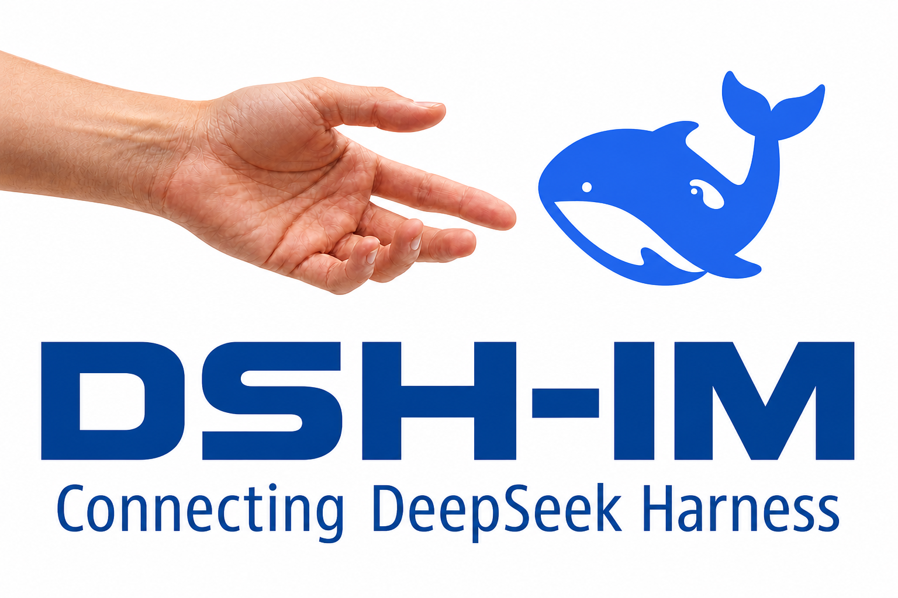

# 我用纯 Vibe Coding，把 DeepSeek Harness 接进了 9 个聊天软件

<p align="center">
  
</p>

<p align="center"><strong>让 DeepSeek Harness 触手可及</strong></p>

最近有人希望我分享一下开发 dsh-im 的经历。

我第一反应是：这个项目才刚开始几天，有什么好讲的？

再想想，这几天又确实有点不太正常。从第一个提交到 v2.0.1，不到十天；从最初想把几个机器人放到一个页面里，到后来同时支持微信、飞书、钉钉、企业微信、QQ、Slack、Telegram、Discord 和 WhatsApp，中间又加了多机器人、工作区、Session、Agent Preset、图片和文件收发、审批、提问、流式回复……现在仓库里也已经有了十多位 Contributor。

既然有人问，我就趁还没忘，把这几天怎么折腾的记一下。不是教程，就是一篇开发流水账，顺便说说我为什么这么做，以及所谓的“一行代码都不写”到底是怎么回事。

## 一、起因：先是沉迷 OpenClaw，然后被配置折磨

今年 2 月，我有一阵子沉迷 OpenClaw 不能自拔。

微信里放一个，飞书里放一个，再给其他群配上不同的机器人。刚开始很上头，但机器人一多，问题就来了：配置基本靠命令行，每个渠道的接入方式又不一样。换个平台，就像重新学一遍。

我当时最强烈的感受不是“功能不够”，而是“这事为什么要这么麻烦”。

上周 DeepSeek Harness 开源后，我的第一反应是：大家肯定会想在常用的聊天软件里使用 Harness。人已经在微信、飞书或 Telegram 里，为什么还要专门切回电脑，打开另一个界面？

但如果每家都做一个独立插件，新的麻烦又会重演一遍。所以 dsh-im 一开始就不是“再写一个聊天机器人”，而是想做一个统一入口：一个插件，把常见的聊天软件都接进 DeepSeek Harness。

## 二、产品路线：先把自己当用户，别先把自己当工程师

做这个项目时，我给自己定了几条很朴素的原则。

### 1. 不能让普通用户去碰命令行

插件安装好后，所有渠道都在 Harness 的同一个“IM 机器人”设置页里管理。选渠道、接入机器人、看连接状态、换工作区、选 Agent Preset、测试连接、重连和移除，全部在页面上完成。

用户是来使用 Harness 的，不是来接受 Shell 入门考试的。

### 2. 能扫码就扫码，扫不了再手工填

微信、钉钉、企业微信、QQ、WhatsApp 这些渠道，能扫码就尽量把流程收敛到扫码；飞书同时支持扫码创建和手工填凭据；Slack 用 App Manifest，Telegram 和 Discord 用 Token。

渠道的规则不可能真的一样，但用户每次都应该很快知道“下一步点哪里”。手工填入的 Secret 和 Token 只会送到本机 Host，页面和状态接口不会再把它们返回来。便利不能拿凭据安全换。

### 3. 界面统一，但不强迫渠道长得一样

同一个设置入口，同一套机器人卡片，同样的连接状态和操作位置，这些是需要统一的。而每家的群聊规则、权限申请、消息样式和交互能力，则应该被保留。

比如飞书适合用流式卡片，钉钉有 AI Card，Discord 有 Thread，Telegram 有 Rich Message，WhatsApp 会显示已读和“正在输入”。如果为了代码看起来整齐，最后让九个渠道都只会发一坨纯文字，那不叫统一，那叫把九家的优点一起抹掉。

### 4. 先把 9 个常用渠道做深，不急着把 Logo 墙做大

项目现在内置 9 个 IM 渠道。它们不只是“能收一句话，能回一句话”，而是继续往一个完整的 Harness 入口靠：保持会话，切换模型和工作区，处理审批和补充问题，收图片和文件，再把 Harness 生成的结果原生地送回来。

我当然也想接第十个、第十一个。但“支持 30 个渠道”很适合写在 README 里，未必适合留在用户手机里。我更在意的是：任务能不能真的做完，会话会不会串，文件能不能打开，连接断了能不能回来。

## 三、开发流程：代码可以一行不写，责任不能一分不担

这个项目基本是纯 Vibe Coding。

我坚决不手写一行代码，也尽量不手写一行文档。代码、测试、构建脚本、文档整理，都交给 Codex 去完成。

不过“不写代码”特别容易被误解。它不等于输入一句“给我做个插件”，然后等进度条跑完。恰恰相反，开发里最耗精力的部分，从敲键盘变成了做判断：

- 这个问题真正伤到的用户价值是什么？
- 哪些行为必须在九个渠道一致，哪些差异反而要保留？
- 这次改动会不会让旧功能悄悄退化？
- 平台返回的“成功”，在真实客户端里到底算不算成功？

这些事，AI 可以帮我查、帮我写、帮我反驳，但最后还得由我定。

### 我没有完全不要设计，只是不想把 SDD 变成负担

我也试着尽量抛弃那种很重的 SDD 流程：先用很长时间写一份无所不包的规格，再让后面所有实现去追一个很快过期的纸面世界。

我现在更喜欢一个短得多的循环：

1. 从一个真实的不爽或 Issue 开始。
2. 先说清用户最后应该看到什么，以及哪些事这次不做。
3. 让 Codex 改代码、补测试，把关键取舍留到 ADR 或方案里。
4. 跑完整回归，再到真实客户端验收。
5. 有问题就继续改，没问题才发版。

比如，“Harness 生成的文件怎么回到聊天里”是一个完整问题；“Discord 群里多个人会不会共用同一个 Session”是另一个问题；“Telegram 里 Markdown 结构全丢了”又是第三个问题。一次解决一个闭环，比先造一套大而全的框架踏实得多。

### 自动化测试是快速迭代的刹车，不是减速带

项目里现在有 1000 多个自动化用例。每次修改和新增功能后，都要跑完整的 `npm run check`：单元测试、Host 和 Client 构建、发布包校验，一样都不少。没过就继续修，不靠“这次改动应该影响不到那里”来安慰自己。

渠道一多，回归测试不是拖慢了开发，而是给了我继续快跑的底气。

### 协议跑通不等于用户收到，所以还得真机测

我的开发电脑里安装了这 9 个聊天软件。到真机验收时，我会让 Codex 用 Computer Use 去操作它们：打开会话、发消息、看回复、切换窗口、核对图片和文件有没有真的出现。

有一次为了验证“Harness 返回的图片要在各渠道里原生显示”，测试从凌晨 3:07 的 Telegram 开始，到 3:16 的 WhatsApp 结束。同一张 PNG，九个客户端挨个检查。最后看到的有 Telegram 的图片消息、飞书的图片、微信的图片气泡，也有 Slack 和 Discord 的内联附件预览。形式不一样，但用户都能直接看到，而且没有重复补发。

如果这一轮全靠人手工做，我大概测不了几轮就会开始“差不多得了”。AI 在这里节省的不只是时间，还有人在重复劳动里很快丢掉的耐心。

## 四、架构设计：统一的是“要做什么”，不是“长什么样”

九个渠道摆在一起后，有两条看起来很诱人的路。

一条是只取所有平台的最低公分母，最后就剩下纯文字收发。这条路开发快，但用户体验很快会撞墙。

另一条是九个渠道各写各的，每家都重新实现会话、命令、审批、问题、文件和错误处理。刚开始看着灵活，很快就会变成九套互相追不上的逻辑。

最后我们定下来的大原则是：**语义核心 + 渠道原生适配**。

```text
渠道事件
   ↓
渠道适配器：把微信 / 飞书 / Telegram 等平台事件翻译成统一语义
   ↓
语义核心：Session、命令、审批、问题、产物、路由、交付结果
   ↓
呈现意图：文字、Markdown、图片、文件、交互、进度
   ↓
渠道适配器：翻译为 image_item、CardKit、sendPhoto、Attachment……
```

说人话就是，核心层只关心“用户要完成什么”，渠道层负责“在这个平台上怎么表现得最自然”。

比如 Harness 要返回一张图，语义核心只保留“这是当前 Session 要交付的图片”。到 Telegram，适配器可以调 `sendPhoto`；到微信，变成 `image_item`；到 Slack，就用它本来就擅长的附件预览。没有原生能力时，可以明确降级，但不能静默丢掉。

这里还有一个很小、但很容易影响体验的细节：图片发送如果被平台明确拒绝，可以改发文件；但如果请求发出去后超时，我们不知道对方到底收没收到，就不能立刻补发，否则用户很可能收到两份。统一语义不只是为了代码好看，也是为了把这些不能出错的业务判断只写一次。

反过来，Discord 自动创建 Thread、飞书更新流式卡片、Telegram 更新 Rich Message Draft，都是平台自己的动作，没必要硬塞成九个渠道都实现的“通用接口”。

这套架构不是一开始坐在桌前凭空想出来的。它是被一个个具体问题逼出来的：会话串了，就补齐路由语义；Markdown 丢了，就保留呈现意图；文件送不回去，就建立产物和交付回执。我对这种架构更有信心，因为它的每一层都付过真实问题的学费。

## 五、展望：一个人能完成的速度变快了，但能覆盖的世界还是有限

截至现在，dsh-im 在 GitHub 上有 719 个 Stars、76 个 Forks，npm 包累计下载 1万+。仓库里也已经有了十多位 Contributor。这个速度坦白说比我预想得快，因为一开始，我只是想解决自己不想反复配机器人的麻烦。

当然，下载次数不等于真实用户数，Star 和 Fork 也不等于项目已经做完了。但它们至少说明，被多渠道配置和体验不一致折磨的，不只是我一个。

有人改交互，有人补英文，有人打磨飞书卡片，也有人从自己正在用的渠道里带回真实问题。这件事比版本号涨到多少更让我高兴。

AI 确实把一个人做开源项目的上限往上推了一大截，但它没有消灭现实世界的边界。我只有这么多设备、账号、时间和精力，目前能认真覆盖的就是这 9 个 IM 渠道。其他渠道即使把代码生成出来，如果没有人真正使用、真机验收和长期维护，那个“支持”也是虚的。

所以，如果你正好在用一个 dsh-im 还没覆盖的聊天软件，或者你对现有某个渠道的原生能力比我更熟，欢迎一起来做。不一定非得先提一大段代码，一个真实场景、一段可复现的步骤、一次真机验收，都是很有价值的贡献。

我对 dsh-im 的期待，不是把所有平台的 Logo 收集齐，而是让 DeepSeek Harness 真的变得触手可及：无论你当时正在微信里回消息，在飞书里开会，还是在 Telegram 里潜水，都可以随手叫它干活，然后把结果带回你所在的地方。

项目地址：[github.com/xmanrui/dsh-im](https://github.com/xmanrui/dsh-im)
