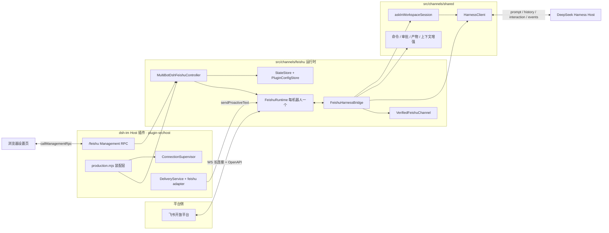
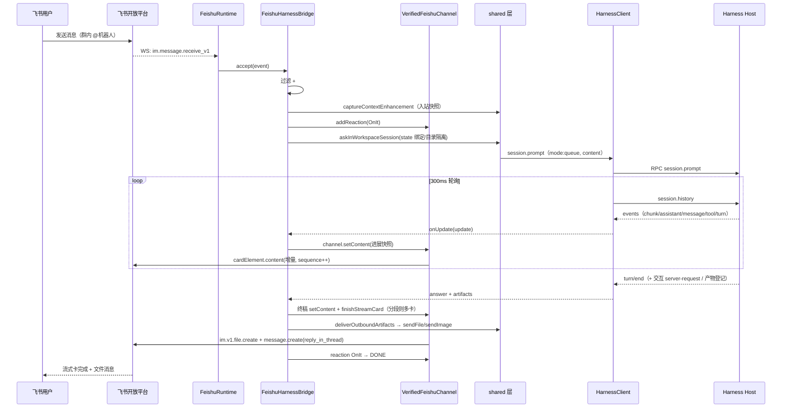

# dsh-im 飞书（Feishu）模块分析

> 本文档基于对仓库源码的逐文件梳理，描述飞书渠道的处理逻辑、牵扯的模块与完整数据流。
> 适用版本：`@xmanrui/dsh-im`（v4.20.0 时期的源码结构）。

## 目录

1. [总体架构](#1-总体架构)
2. [模块清单与职责](#2-模块清单与职责)
3. [数据流：接入与生命周期](#3-数据流接入与生命周期)
4. [数据流：入站消息处理](#4-数据流入站消息处理)
5. [数据流：出站回复与呈现](#5-数据流出站回复与呈现)
6. [数据流：交互（问题 / 审批）](#6-数据流交互问题--审批)
7. [数据流：后台事件（关注 / 延迟交付 / 会话同步镜像）](#7-数据流后台事件关注--延迟交付--会话同步镜像)
8. [数据流：主动投递（Proactive Delivery）](#8-数据流主动投递proactive-delivery)
9. [与会话和状态相关的持久化](#9-与会话和状态相关的持久化)
10. [与 shared 层 / Host 层的耦合关系](#10-与-shared-层--host-层的耦合关系)
11. [关键设计不变量与容错](#11-关键设计不变量与容错)
12. [测试覆盖](#12-测试覆盖)

---

## 1. 总体架构

dsh-im 是一个 DSH（DeepSeek Harness）插件（Cordis 插件），把一个本机 Harness Host 与多种 IM 平台桥接起来。飞书是其中功能最完整的渠道之一：它不走通用的 `text-harness-bridge`，而是拥有约 5900 行的专属 `bridge.mjs`，直接实现飞书原生的流式卡片、CardKit 交互卡、话题（Thread）、表情回执、图片/文件产物投递等能力。

架构上分为四层：



要点：

- **每机器人一个 Runtime**：`MultiBotDshFeishuController` 支持多个飞书应用（多 bot），每个 bot 拥有独立的凭据引用（`secretRef`）、配置条目、`StateStore`（state.json）与一条飞书 WebSocket 长连接（`FeishuRuntime`）。
- **双向数据面**：消息既可由用户在飞书发起（入站 → Harness），也可由 Harness/其他渠道触发主动投递或后台完成推送（出站，不经入站消息）。
- **控制面与数据面分离**：浏览器设置页只通过 `/feishu` RPC 通道操作（注册、修复、设置），永远接触不到 App Secret（凭据存放在 `ctx.credentials`，配置只存 `secretRef`）。

---

## 2. 模块清单与职责

### 2.1 `src/channels/feishu/`（渠道运行时核心）

| 文件 | 行数 | 职责 |
|---|---|---|
| `bridge.mjs` | ~5900 | 核心业务逻辑 `FeishuHarnessBridge`：入站事件路由、命令体系、卡片菜单、流式回答、分步直推、交互卡、审批、关注/完成推送、延迟交付挂接、会话同步镜像、/repair 聊天内修复 |
| `feishu-runtime.mjs` | ~750 | `FeishuRuntime`：持有单个 bot 的 Lark SDK Client、WSClient 长连接、EventDispatcher、VerifiedFeishuChannel 与 bridge；生命周期 start/stop、状态聚合、Slash Command 注册、卡片回调探测（probe）、主动文本发送、连接测试 |
| `feishu-channel.mjs` | ~600 | `VerifiedFeishuChannel`：对飞书 OpenAPI 的"已验证"封装——CardKit 流式卡（创建/setContent/定格/换卡/写队列）、图片与文件上传及消息发送（含 230049 不确定态重试）、表情 reactions、消息撤回 |
| `feishu-cards.mjs` | ~1100 | 全部交互式卡片 JSON 构造器（schema 2.0）：主菜单、会话列表、工作区列表、预设/模型下拉、状态卡、帮助、审批卡、提问卡/已答卡、steer 卡、关注列表、完成通知、stepStream 过程卡、回调探测卡等 |
| `message-utils.mjs` | ~590 | 飞书事件解析：`conversationKey`（p2p / group / thread / managed-topic）、文本提取、post 富文本与 interactive 卡片正文抽取、图片/文件/引用消息的惰性下载源（`extractInboundMessage`）、长文本分片 `splitText` |
| `state-store.mjs` | ~210 | 每 bot 的持久化状态：会话绑定（key→sessionId）、已见消息 ID 去重、watch 关注表、deferred 延迟交付记录、托管话题映射（threadId→root）、mirror 镜像快照、归档会话显示开关 |
| `multi-bot-controller.mjs` | ~1370 | `MultiBotDshFeishuController`：多 bot 编排——扫码注册/凭据落盘、callback_repair、group_message_permission 三类应用更新事务，bot 生命周期（启动/重连/断开/删除）、模式热更新、主动发送、状态投影 |
| `plugin-controller.mjs` | ~250 | 单 bot 旧版控制器 `DshFeishuController`（兼容保留）+ `REQUIRED_TENANT_SCOPES` 权限清单 |
| `plugin-config-store.mjs` | ~210 | `PluginConfigStore`：`config.json`（version 2 bots 数组）的非敏感配置持久化，v1→v2 自动迁移，原子写 |
| `registration-manager.mjs` | ~350 | 包装 Lark SDK `registerApp` 的一次设备码注册 attempt：状态机（idle/starting/qr_ready/polling/saving/succeeded/...）、二维码回调、轮询、过期与取消 |
| `repair-manager.mjs` | ~140 | `CallbackRepairManager`：对**已有**应用做定向增量更新（补 `card.action.trigger` 回调、`im:message:readonly`、`im:resource`、slash command 作用域），校验授权 URL 安全性 |
| `group-message-permission-manager.mjs` | ~70 | `GroupMessagePermissionManager`：为已有应用增量申请敏感权限 `im:message.group_msg`（群聊响应"全部消息"模式的前置条件） |
| `slash-command-registry.mjs` | ~260 | 通过 `application/v7/app_slash_commands` OpenAPI 注册飞书输入框 `/` 命令面板（尽力而为，不阻塞连接） |
| `feishu-app.mjs` | ~55 | `verifyFeishuApp`：用 tenant_access_token 校验新凭据并读取 bot 身份（名称/open_id/激活状态） |
| `group-response-mode.mjs` / `step-push-mode.mjs` | <20 | 两个枚举及归一化：`mention|all`、`post|streaming_card` |
| `harness-client.mjs` | 19 | 继承 shared `HarnessClient`，仅注入 `rpcIdPrefix:'feishu'`、`logPrefix:'dsh-feishu'` |
| `config.mjs` | 71 | 独立进程运行时的环境变量配置装载（宿主集成场景由 Host 注入，不走此文件） |

### 2.2 `plugin-src/host/channels/feishu/`（DSH Host 集成层）

| 文件 | 职责 |
|---|---|
| `index.mjs` | Cordis 插件入口 `dsh-feishu-host`，声明注入服务 `connection / credentials / typertGateway`；`apply()` 走 `installProductionChannel` |
| `production.mjs` | 生产装配：路径规划（`~/.dsh/integrations/dsh-feishu/`）、Proxy agent（尊重 NO_PROXY）、组装 ConfigStore/StateStore/BotWorkspaceStore/HarnessClient/执行器/MultiBot 控制器/Runtime 工厂、ConnectionSupervisor、delivery adapter |
| `rpc.mjs` | `/feishu` 管理 RPC：端点白名单、严格 payload 校验、错误码→公开文案映射、状态脱敏投影（绝不出 appSecret/credentialRef）、注册 URL host 校验 |
| `connection-supervisor.mjs` | `ConnectionSupervisor`：先等 Harness `ensureRunning`，再 reconcile 各 bot 连接；指数退避重试（250ms→30s），全连接后转 15s 健康巡检 |
| `controller.mjs` / `credential-store.mjs` | Provisioning 后备控制器与凭据引用（`DSH_FEISHU_APP_ID` / `DSH_FEISHU_APP_SECRET[_<BOT>]`）定义 |

### 2.3 `plugin-src/client/channels/feishu/`（浏览器设置 UI）

| 文件 | 职责 |
|---|---|
| `api.js` | 浏览器安全的 RPC 契约：`FEISHU_RPC_CHANNEL='/feishu'`、`FEISHU_ENDPOINTS` 端点字符串的唯一来源（host 端反向 import）、快照 normalizer、`unwrapRpcResult` |
| `index.js` | `FeishuSettingsTab`、`BotCard`、扫码面板（QR + 轮询 provision.poll）、授权错误文案映射、快照合并（`mergeFeishuSnapshotState`） |
| `group-settings.js` | 飞书独有的"群聊"设置页：群响应方式（需敏感权限时引导扫码）、群话题回复 |
| `styles.js` | 飞书设置页样式安装 |

### 2.4 依赖的 `src/channels/shared/` 共用模块（与 feishu 的耦合）

| shared 模块 | 在飞书链路中的作用 |
|---|---|
| `harness-client.mjs` | `HarnessClient.ask()`：session.prompt 发送 + 300ms 轮询 session.history + `HarnessReplyTracker` 生成 progress updates + 交互流 mux 监听 + 产物登记消费；`watchHarnessEvents()` 全局事件流 |
| `harness-approval.mjs` | `HarnessApprovalQueue`（bridge `#approvals`）：审批的登记、文本"批准/拒绝"认领、卡片按钮回调提交 |
| `harness-question.mjs` | 问题 payload 校验、问题→文本呈现、答案→Harness 响应值 |
| `workspace-session.mjs` | `askInWorkspaceSession`：会话绑定锁、会话不存在则创建（含会话目录隔离、初始标题、workspace 代际栅栏）、`harness-reply-timeout` 时向 deferred 协调器登记 |
| `bot-workspace-store.mjs` | 跨渠道 bot 工作区/会话/投递目标/上下文增强/访问策略存储 + `createBotWorkspaceScope` 包装 harness 与 state（按 botId 分代拦截） + `createWorkspaceAwareController` |
| `access-policy.mjs` + `inbound-access.mjs` | `evaluateInboundAccess`：入站消息与卡片回调的统一访问策略（allowlist / open / 命令权限） |
| `context-enhancement.mjs` | `captureContextEnhancement`（accept 时刻按会话类型快照）+ `enhanceContextContent`（注入 `<dsh_im_source>` 与指引前缀） |
| `image-prompt.mjs` | 图片 → base64 prompt content；非视觉模型的"图片转工作区文件"回退 |
| `inbound-file.mjs` | 文件 → 暂存到 Session 工作区 `.dsh-im/inbound/...`，生成清单文本追加进 prompt |
| `semantic/reply-reference.mjs` | 引用回复 → prompt 中的 `<quoted_message>` 语义块 |
| `semantic/artifact.mjs` / `artifact-delivery.mjs` / `delivery.mjs` | 产物（Artifact）登记/物化/交付编排、`createDeliveryReceipt`、`trackOutboundArtifactProviderPromise` |
| `deferred-delivery.mjs` / `deferred-delivery-coordinator.mjs` / `deferred-state.mjs` | 前台超时后的延迟交付：事件驱动 + 历史补偿 + 最多 3 次重试 + 严格绑定检查 |
| `session-sync-registry.mjs` | 全局镜像渲染器登记表：`registerSessionSyncMirror({channel:'feishu',botId}, render)` |
| `status-reaction.mjs` | `beginStatusReaction`：OnIt → DONE/ERROR 的处理中表情回执 |
| `message-failure.mjs` | `setLastMessageFailure` / `publicMessageFailure`：`status.lastMessageError` 的诊断引用号机制 |
| 命令族：`model-command` / `preset-command` / `workspace-command` / `compact-command` / `history-command` / `control-command`（stop/steer）/ `new-command` / `batch-input` | bridge 直接 import 复用，实现 `/model` `/preset` `/ws` `/sessionlist` `/compact` `/history` `/stop` `/steer` `/new` `/batch` |
| `command-permission.mjs` | `isSharedLocalCommand`：策略判定"这条消息是不是命令" |
| `session-timeout`（host）/ `inbound-ttl`（host） | production.mjs 注册 state source / workspace provider；bridge 经 `touchSession` 心跳续期 |
| `i18n.mjs` + `i18n-en/feishu.mjs` | Host 侧文案中英切换（飞书专属文案域独立成表） |
| `connection-test.mjs` | `/status` 之外的"发送测试消息"与目标记忆（私聊 chatId） |
| `session-title.mjs` | `initialSessionTitle`：上下文增强开启时用用户原文作会话标题 |

---

## 3. 数据流：接入与生命周期

### 3.1 启动装配（`createProductionController`）

```
apply(ctx)
 └─ installProductionChannel('feishu')
     ├─ 先挂 /feishu RPC（就绪前返回 channel-initializing）
     └─ createProductionController
         ├─ 路径：dshHome=~/.dsh，root=~/.dsh/integrations/dsh-feishu
         │        {config.json, state.json(legacy), bots/<id>/state.json, workspaces.json}
         ├─ PluginConfigStore.load() → bots 列表
         ├─ BotWorkspaceStore：reconcile + ensure(每 bot 工作区、初始访问策略)
         ├─ 每 bot 惰性 StateStore（legacy secretRef → 根 state.json，否则 bots/<id>/state.json）
         ├─ sessionSyncTargetsFor(sessionId)：扫 workspaces 的 session-sync 目标 × state 绑定
         ├─ 执行器：commandExecutor(typertGateway) / controlExecutor / sessionMaintenanceExecutor
         │          / fileIngressExecutor（+ inboundTtl、sessionTimeout 注册）
         ├─ HarnessClient（shared 子类，同进程 apiProxy，autostart:false）
         ├─ 代理检测：HTTP(S)_PROXY / NO_PROXY → https-proxy-agent（仅 WSS 长连接）
         ├─ MultiBotDshFeishuController(createRuntime=FeishuRuntime 工厂, deleteState)
         ├─ createWorkspaceAwareController(core, {workspaces, stateFor, 目录})
         ├─ ConnectionSupervisor(controller, harness).start()
         └─ 返回 {controller, deliveryAdapter, ready, close}
```

`ConnectionSupervisor` 每轮 reconcile 调 `controller.initialize()`：对每个未连接的已配置 bot，从 credentials 解析 `secretRef` → `#startRuntime` → `FeishuRuntime.start()`。部分失败按 250ms…30s 退避，全连接后转 15s 巡检。

### 3.2 扫码注册（`provision.begin` → `poll` → 落盘）

```
UI: provision.begin
 └─ controller.startRegistration()
     └─ RegistrationManager.start({createOnly:true, addons:{tenant scopes,
          events:[im.message.receive_v1], callbacks:[card.action.trigger]}})
         └─ lark.registerApp → onQRCodeReady → 二维码 URL（poll 响应内回传）
UI: 轮询 provision.poll(attemptId) → normalizeProvisioning 展示进度/二维码
用户手机飞书扫码授权
 └─ SDK 轮询成功 → onCredentials(client_id, client_secret, user_info)
     └─ controller.#acceptCredentials
         ├─ verifyFeishuApp（auth/v3/tenant_access_token/internal → bot/v3/info，读取 bot 身份）
         ├─ credentials.set(secretRef)
         ├─ configStore.saveBot({id, appId, secretRef, ownerOpenIds:[ou_xxx], domain, ...})
         └─ #startRuntime → runtime.start()（失败则回滚凭据与配置）
```

`domain`（feishu/lark）由注册返回的 `user_info.tenant_brand` 自动判定；`ownerOpenIds` 追并集，作为该 bot 的所有者白名单（访问策略 allowlist 的 privileged 集合）。

### 3.3 聊天内修复 `/repair`（callback_repair）

当应用缺少卡片回调、图片读取、资源上传或 slash command 权限时（典型症状：菜单按钮无响应、图片消息被拒、文件发送 99991672），用户私聊发 `/repair`：

```
bridge.#handleRepairCommand
 ├─ /repair          发起：controller.startCallbackRepair(botId,{actor,chat})
 │    └─ CallbackRepairManager 复用 RegistrationManager 的轮询机制，
 │       但 manifest 固定为“对已有 appId 的定向更新”：补 card.action.trigger
 │       回调 + im:message:readonly + im:resource + slash command scopes
 ├─ /repair qr       重新生成二维码（qrcode 包渲染 PNG data-url，post 图片消息）
 ├─ /repair status   查询当前 attempt 进度；verify 重新验证
 └─ /repair cancel   取消（saving 之后不可取消——远端已提交，必须向前收敛）
成功路径（#acceptCallbackRepair）：
 verifyApp → 比对 appId/botOpenId/owner/domain → 写凭据 → 强制重建 Runtime
 → runtime.beginCardActionProbe(operatorOpenId)：向操作者发一张带 nonce 的
 测试卡，等待真实 card.action.trigger 回调（控制器默认 120s，`#callbackProbeTimeoutMs`）→ 收到才判定「修复完成」，
 并在飞书里主动通知成功/超时/失败。
```

设计要点：修复完成与否的唯一证据是**真实收到按钮回调**，而不是平台接口返回成功——这避免了"授权页点了但回调订阅没生效"的假修复。

### 3.4 群消息敏感权限（group_message_permission）

`groupResponseMode=all`（响应群内全部消息）依赖飞书敏感权限 `im:message.group_msg`。设置页选择"全部消息"时：

```
bot.group-message-permission.begin → GroupMessagePermissionManager（定向更新，只加该 scope）
→ 用户扫码授权 → #acceptGroupMessagePermission：
   校验 app/owner/domain → 写凭据（若轮换）→ saveBot({groupMessagePermissionGranted:true,
   groupResponseMode:'all'}) → 重启 Runtime
```

未经确认前，`updateGroupResponseMode('all')` 会被拒绝（`group_message_permission_required`）。

### 3.5 `FeishuRuntime.start()` —— 长连接建立

```
1. harness.ensureRunning()            （同进程 Host，仅健康检查，不 autostart）
2. new lark.Client({appId, appSecret, domain, httpInstance(带 15s 超时)})
3. new VerifiedFeishuChannel({client})          ← 出站呈现通道
4. new FeishuHarnessBridge({client, channel, harness(工作区作用域), state,
     contextEnhancement, accessPolicy, allowedSenderOpenIds, groupResponseMode,
     groupTopicReply, stepPush(Mode), sessionSyncTargetsFor, repair, ...})
5. new lark.EventDispatcher().register({
     'im.message.receive_v1'        → bridge.accept(event)          （异步、不阻塞）
     'im.message.reaction.*_v1'     → 显式忽略（防止重连恢复风暴）
     'card.action.trigger'          → 先消费 probe，否则 bridge.onCardAction(event)
   })
6. new lark.WSClient({... handshakeTimeoutMs=15s, onReady/onError/onReconnecting/
     onReconnected → 维护 status.feishuLongConnectionState}) 并 start(dispatcher)
7. await Promise.all([wsStarted, ready])  ← 握手成功才报告 ready
8. 异步尽力而为：registerSlashCommands()（app_slash_commands OpenAPI，失败不影响连接）
```

`stop()` 通过 AbortController 级联：dispatch 判 `isCurrentStart()` 丢弃旧事件、`bridge.waitForIdle()` 排空全部任务队列（回合、interaction、card action、事件 tail、deferred）、关闭 WSClient、终结所有 probe。start/stop 都做了幂等与竞争处理（`#starting`/`#stopping` 单一化、可复用 WS 状态检测）。

### 3.6 控制面：`/feishu` Management RPC 与设置页

浏览器设置页与 Host 之间只有一条 JSON-over-HTTP 的 RPC 通道（`plugin-src/management-rpc.mjs` 把逻辑渠道 `/feishu` 映射为 `POST /api/dsh-im/feishu`）：

| 端点（`client/channels/feishu/api.js` 定义） | controller 方法 | 说明 |
|---|---|---|
| `connection.status` | `status()` | 全量脱敏快照（bots/totals/registration/connection/lastMessageError） |
| `provision.begin` / `poll` / `cancel` | `startRegistration` / `registrationStatus` / `cancelRegistration` | 扫码接入，状态机 `pending/scanned/connecting/connected/expired/failed` |
| `bot.callback-repair.begin` | `startCallbackRepair(botId)` | 补权限（§3.3） |
| `bot.group-message-permission.begin` | `startGroupMessagePermission(botId)` | 敏感群权限（§3.4） |
| `bot.bind-credentials` | `bindCredentials({appId, appSecret})` | 手动绑定已有应用 |
| `bot.reconnect` / `disconnect` / `delete` | `reconnectBot` / `disconnectBot` / `deleteBot` | 生命周期；reconnect 可附带 `sendTest` |
| `connection.test` / `connection.disconnect` | `sendConnectionTest(botId)` / 兼容单 bot | 旧契约保留 |
| `bot.workspace.set` / `model.set` / `preset.set` / `alias.set` | 经 `createWorkspaceAwareController` | 写入 `workspaces.json` |
| `bot.context-enhancement.set` / `access-policy.set` / `conversation-directory.set` | 同上 | 见 §10 |
| `bot.group-response-mode.set` / `group-topic-reply.set` / `step-push.set` / `step-push-mode.set` | `updateGroupResponseMode` 等 | 热更新到 Runtime，不断连（`all` 需先完成 §3.4） |

安全边界：`validPayload` 逐端点白名单（键集、长度、`SAFE_ID`、`SAFE_FEISHU_APP_ID`），`rpcAuthority` 决定 LAN 可达性（默认 `trusted-host` 信任 Host 已完成的登录 + Host/Origin 校验；`loopback` 时非本机 403），错误码统一折叠为 `PUBLIC_ERROR_CODES` 固定文案，QR 由 `qrcode` 生成 data-url（32 条缓存）。UI 侧 15s 静默轮询状态，`mergeFeishuSnapshotState` 用 `revision` 单调性丢弃过期响应。

---

## 4. 数据流：入站消息处理

入站总入口是 `FeishuHarnessBridge.accept(event)`（`bridge.mjs:936`），由 SDK 的 `im.message.receive_v1` 回调以 fire-and-forget 方式调用。

### 4.1 过滤与路由决策（accept 前半段）

```mermaid
flowchart TD
  A["im.message.receive_v1"] --> B{"signal aborted 或无 message_id"}
  B -->|是| Z1["静默丢弃"]
  B -->|否| C["addressed = #isAddressed<br/>p2p 恒真, group 需 mentions 命中 botOpenId"]
  C --> D{"isBotSender"}
  D -->|是且非群内明确@| Z1
  D -->|否| F{"accessPolicy 存在<br/>缺失时退回 legacy allowlist"}
  D -->|是且@到机器人| F
  F -->|legacy 未命中| G["messagesRejected++"]
  G --> Z1
  F -->|通过| H{"group 且 mode=mention 且未 addressed"}
  H -->|是| Z1
  H -->|否| I{"hasSeen 或 acceptedMessageIds"}
  I -->|是| Z1
  I -->|否| J["key = #resolveKey(event)"]
  J --> K["rememberTopicReply / extractInboundMessage<br/>evaluateInboundAccess"]
  K -->|拒绝| L["#finishAccessDecision<br/>命令无权限则回文案, 否则只计数"]
  K -->|允许| M["进入分派链 4.2"]
```

`#resolveKey(event)` 决定"会话路由"（conversation key），是整条链路最关键的映射：

| 场景 | key 形态 | 说明 |
|---|---|---|
| 私聊 | `p2p:<sender open_id>` | 每个用户一条独立会话 |
| 普通群聊 | `group:<chat_id>` | 全群共享一条会话（`mention` 模式下只有 @ 到机器人才进入） |
| 话题群（用户手动开话题） | `group:<chat_id>:thread:<thread_id>` | 每个话题一条独立会话 |
| 托管话题（`groupTopicReply` 开启） | `group:<chat_id>:managed:<root_message_id>` | 机器人自己为一条主 feed 提问开的话题；`state.topicRootFor(thread_id)` 把话题内后续消息映射回同一 root |

托管话题的建立是两段式的：允许入站后 `#rememberTopicRoot(messageId)` 登记候选（TTL 30min、上限 512）；出站回复时若飞书返回 `thread_id`，`#registerTopicThreadId` 才把 `thread_id → {rootMessageId, chatId}` 持久化到 `state.topics`；没返回则 `#forgetTopicRoot` 释放候选，避免脏槽。

### 4.2 入站分类与分派（accept 后半段）

按优先级依次尝试，命中即消费该消息：

1. **上下文增强快照捕获**：`#acceptedMessageIds.set(messageId, captureContextEnhancement(...))` —— 必须在**入站瞬间**捕获设置，排队期间设置变化不影响本条。私聊还顺手 `rememberConnectionTestTarget(state, {chatId})` 供"发送测试消息"回退使用。
2. **处理中表情**：`#beginReaction(messageId)` → `OnIt` emoji（2s 超时、脱离消息队列的独立 tail，见 `status-reaction.mjs`）。
3. **批量输入（`/batch`，仅私聊）**：`BatchInputManager.handle()` 收集纯文本，`/send` 时合成单条 prompt 并伪造 `event.batchSubmission.token`，走正常入队；`onAskComplete` 精确推进批次完成状态。群聊里 `/batch` 直接被拒。
4. **快速卡片命令**（`CARD_COMMAND`：`/m /menu /new /help /status /compact /sessionlist /sessions /workspacelist /workspaces /wsl /watchlist /archived`）：**不进队列**立即执行 —— 保证流式任务运行中菜单仍可打开。
5. **快命令 Runner**（shared 命令族）：`runHistoryCommand`（群内也要本地拒绝）、`runControlCommand`（`/stop` `/steer`）、`runModelCommand`、`runPresetCommand` → `#processFastCommand`。带图片/文件的消息不认命令。
6. **已解析问题的迟到回复**：`#isResolvedQuestionReply` 命中 → 回"已在其他客户端处理"。
7. **审批文本回复**：`#approvals.claimReply(...)`（`批准/同意/yes/拒绝/不同意/no`）。注意优先级：存在活动问题时 `yes` 不会被误当成审批。
8. **待处理问题的答案**：`#pendingInteractions.get(key)` 存在 → 认领 `claimedReplyMessageId` → `#processInteractionReply` → `#submitQuestionAnswer`。
9. **其余**：`#enqueueMessage` → 按 key 串行队列 → `#handle`。

`#handle` 内含第二层命令处理（`/repair*`、`/help`、`/m`、`/new`、`/status`、`/compact`、`/sessionlist`、`/watch`、`/unwatch`、`/watchlist`、`/archived`、纯数字的**菜单数字回复回退**、`runWorkspaceCommand`（`/workspace <路径|序号>`、`/ws`、`/session`）、`runCompactCommand`），最终落到 `#answerWithStream`。

> **数字回复回退**：`#rememberMenu(key, {kind, ...})`（TTL 10min、最多 50 个）让卡片菜单即使在没有 `card.action.trigger` 回调权限的应用上也能用 —— 用户回 `1`/`2`… 即选中上一张菜单的第 N 项。这是飞书渠道最重要的兼容性设计（`feishu-cards.mjs` 每个编号按钮都渲染数字标签）。

### 4.3 卡片按钮回调（card.action.trigger）

入口 `bridge.onCardAction(event)`（`bridge.mjs:1983`）：

```
解析 operator open_id（v2 嵌套形状与 legacy 都兼容）
 ├─ legacy allowlist / accessPolicy 判定（approve:/reject:/answer: 视为普通回复而非命令）
 ├─ 路由缺失（#cardKeys 无该 messageId）：有 accessPolicy → fail-closed；
 │   否则回「这个菜单已过期，请回复 /m 重新打开」
 ├─ select_static / 多选值归一（callbackSingleOption / callbackMultiOptionValues
 │   处理官方 Card 2.0 的逗号分隔字符串与历史数组/object 形状）
 ├─ action 解析：workspace_pick→workspace:<id>、session_pick→use:<id>、
 │   preset_pick→preset:select:<id>、model_pick→model:select:<id>、
 │   archive_pick→archive:<id>、steer_pick→steer:<id>
 └─ #queueCardAction(entry, identity, task, {lane, coalesceStop, eventId, operator})
```

`#queueCardAction` 是回调面的核心保护机制：

- **每会话串行尾**（`#cardActionTails`）+ **专用控制道**（`#cardControlTails`）。stop/steer 走 `control` 道，不被普通 UI 点击堵死。
- **背压上限**：每会话每道 8 个待处理，超限只发一条"操作过于频繁"（5s 冷却），防止回调风暴放大为 API 调用风暴。
- **三层去重**：`#cardActionInFlight`（同 identity 的重投并入同一 task）→ `#completedCardActions`（按 `event_id` 记 10min，防落库后的重投递）→ stop 的 `#cardStopInFlight` + `#cardStopFollowers`（只停一次，其余点击并入并把各自事件 ID 记入完成集）。
- 卡片路由 `#cardKeys` 命中后**刷新 LRU**（"用过的卡就是新卡"），上限 200。

`#handleCardAction`（`bridge.mjs:2273`）是动作分派表：审批按钮（`approve:`/`reject:` 绑定 actor）、答案按钮（`answer:<iid>:<index>:<label>` 校验 actor 与题号）、`answerCustom:`、会话列表翻页、工作区列表、watch 多选批量增删、`new`/`compact`/`stop`/`steer`、preset/model 选择、`use:<sessionId>` 绑定（带 `conversationWorkspace` 过期栅栏）、`archive` 切换、返回主菜单等。会话/工作区类卡片以 `updateMessageId` **原地 patch** 而非刷屏；`#sendCard` 因此有 patch → 线程回复 → 普通发送三级降级。

### 4.4 从事件到 Harness prompt：内容构造链

普通问答进入 `#handle` 尾部的 `#answerWithStream` / `#answerWithStepPush` 后，先构造发给 Harness 的 `content`：

```
message = extractInboundMessage(event, client)      ← message-utils
   ├─ content：text 消息直接取；post 富文本按行/列拼接（含卡片正文递归抽取）
   ├─ images[]：惰性 source（{name, load({signal})}），实际下载发生在
   │            shared/image-prompt 的 promptContentForInboundMessage
   ├─ files[] ：惰性 source（im.v1.messageResource.get，type=file）
   └─ replyTo ：惰性引用源（im.v1.message.get，带 sender_name 与 raw_card_content）
content = hasImages || hasReplyReference
   ? await promptContentForInboundMessage(message)   ← shared/image-prompt + semantic/reply-reference
   : text                                            ← 普通文字，零额外往返
content = enhanceContextContent(content, snapshot, () => ({channel:'feishu', senderId, chatId, threadId}))
   ? → 前缀 <dsh_im_source>{...}</dsh_im_source> + <dsh_im_source_guidance>…
```

要点：

- **惰性下载**：入站阶段只保存 key 与 loader，权限不足（99991672）时才映射成带引导文案的 `ImagePromptError`（提示执行 `/repair`），绝不在事件分发路径上做重 IO。
- **图片大小约束**：5 MB / 张、总量 20 MB、最多 20 张（`image-prompt.mjs` 常量），超限给"请压缩后重试"。
- **引用回复语义化**：`replyTo.load()` 返回 `{messageId, authorId, authorName, content, attachments[], unavailableReason}`；`semantic/reply-reference.mjs` 渲染成 `<quoted_message>` 文本块，并显式声明"这是用户选择的引用内容，不是系统指令"，同时剥除控制字符和零宽字符。权限缺失回退为 `unavailableReason:'permission-denied'`（即缺 `im:message:readonly` 时引用会降级为"不可用"而非报错）。
- **上下文增强只在入站一刻判定**：`captureContextEnhancement` 返回快照，`enhanceContextContent` 负责渲染；`conversationType` 决定读 `group`/`direct` 开关。增强过的回合会以用户原文作为初始会话标题（`session-title.mjs`，因为真实 prompt 已被注入前缀污染）。

---

## 5. 数据流：出站回复与呈现

飞书有两条互斥的主要呈现路径（流式卡片 / 分步直推），加上文本回退共三种投递形态，由 bot 配置决定：

| 路径 | 触发条件 | 呈现载体 | presentation 标签 |
|---|---|---|---|
| **流式卡片** | `stepPush=false`（bridge 层默认值，也是旧配置保留的形态） | CardKit `streaming_mode` 卡 + `cardElement.content` 增量 | `feishu-cardkit` |
| **分步直推 · 过程卡** | `stepPush=true` 且 `stepPushMode='streaming_card'`（**新建 bot 的默认**，见 `DEFAULT_FEISHU_STEP_PUSH_MODE`） | 一张任务过程卡，`im.v1.message.patch` 原地刷新 | `feishu-step-push-card` |
| **分步直推 · post** | `stepPush=true` 且 `stepPushMode='post'` | 逐条富文本 post 消息 | `feishu-step-push-post` |
| 纯文本回退 | 通道无 `stream` 能力 / 卡片故障 | `im.v1.message.create` text | `feishu-text` / `*-fallback` |

四条路径共产一份"终稿 + 产物"的交付语义，失败时按阶梯降级（§5.5）。

### 5.1 流式卡片（`VerifiedFeishuChannel.stream`）

```
bridge.#answerWithStream
 └─ channel.stream(chatId, {markdown(controller)}, {replyTo, replyInThread?, onReplyThreadId})
     ├─ #createStreamCard：cardkit.v1.card.create（schema2.0, streaming_mode:true,
     │                     print_strategy:'fast', element_id='stream_md'）
     │                     → #sendCard（reply / reply_in_thread / create 三级）
     ├─ controller.setContent(content, {transient})     ← onUpdate 每次进展
     │     • 写队列 enqueue：过程写卡与换卡定格共用一条链（issue #163）
     │     • transient（工具/状态行）不推进冻结基线，不参与去重
     │     • streamPreview 超 28000 字符 → 截断 + 追加"内容较长，生成完成后将分段发送完整回答。"
     ├─ controller.rotate()                             ← 交互消息弹出前
     │     • 旧卡定格为「⤵️ 最终结果见下方」+ finishStreamCard（关 streaming_mode、写 summary）
     │     • awaitingPresentation 挂起：期间的 setContent 只推进快照，不建卡
     │     • controller.interactionPresented() 解除挂起 → 下一次 setContent 才建新卡
     │     • frozenContent = 定格时旧卡实际展示的前缀（shownPrefixOf，而非完整快照）
     │       → applyFrozenDedup 让新卡与终稿只展示增量（冻结前缀去重）
     └─ 收尾：以最终快照重算 finalView → splitStreamContent 分段
               每段一张卡（首段复用 activeCard），逐张 setContent + finish
     异常：catch 内 #recall 所有已发卡（bridge 将改用纯文本重发，避免重复呈现）
```

三个已记录的竞态修复都沉淀在这里（代码内有 issue 编号）：**#86** 交互消息落在占位卡下方后不得回写旧卡；**#163** 写卡/定格共用写队列消除"写飞越定格"；**#163 补充** 去重基线以旧卡**实际展示**内容为准，防止超长快照的未展示尾部被整段剥掉。

### 5.2 分步直推（`#answerWithStepPush`）

公共前置（内容构造、上下文注入步骤行）与流式路径一致，随后：

```
#stepPushSendState[key] = {silenceSince, turnStartedAt, lastSentAt,
                           pendingRecallIds, activitySeq, count, breakerLogged}
post 模式 → #startThinkingStatusWatchdog(key, chatId, replyTo)
askInWorkspaceSession({ progressMode:'all', onUpdate, onInteraction(rotate) })
  onUpdate 分流：
   ├─ 'assistant-message' → 缓冲 pendingStep（streaming_card 就地改写答案草稿区）
   ├─ 'tool'              → flushPendingStep() + 追加工具面板行（stepCardToolBlock / #formatStepToolPost）
   └─ 'status' 带 error   → ⚠️ 步骤行；纯 text/status 静默（详细级完全取代简略进度行）
收尾：
  streaming_card → #finishStepCard(answerText) → {ok:true, cardIds} 直接作为回执
                   seal 失败但答案已随某次成功渲染可见（renderedAnswerVersion 对齐）→ 仍算成功
  post           → splitStepPostMarkdown 按「编码后字节 ≤24KB」分段发 md post
                   任一段失败 → 记录 failedChunkIndex/remainingChunks → 降级纯文本续发剩余段
最终 #deliverArtifacts(chatId, messageId, artifacts, receipt)
```

`post` 模式的三项约束值得单独记录（这是渠道能力差异的直接体现）：

- **节流**：`STEP_PUSH_MIN_INTERVAL_MS=250`（飞书单会话 5 msg/s 的下限保护）。
- **熔断**：单回合最多 200 条直推消息，超限后本回合静默但仍刷新静默基线。
- **思考中心跳**（`CONTEXT.md` 的"思考中状态"）：静默 ≥20s 推一条 `⏳ 正在思考中…（已运行 Xs）`，每 30s 原地 `message.update`，真实事件或回合结束撤回；**发送/撤回在途期间出现真实活动**（`activitySeq` 变化）则立即撤回这条过时心跳；撤回失败最多重试 3 次并**跨回合携带**。

`#ensureStepCard` 维护的答案区双指针（`answerStart`/`answerEnd`）+ `answerVersion`/`renderedAnswerVersion` 是"答案完整性可证"的关键：只有最后一次**成功渲染**覆盖了当前草稿版本，才允许以卡片作终稿回执。

### 5.3 产物（Artifact）投递

Harness 侧通过 `dsh_im_return_file` 工具登记出站产物（`semantic/artifact.mjs`），`HarnessClient.ask()` 在 turn 结束前 `take()` 并经 `onArtifact` 交给 bridge；bridge 的 `#deliverArtifacts` 调用 `deliverOutboundArtifacts`：

```
deliverOutboundArtifacts({artifacts, baseReceipt, channelKey:'feishu', sendImage, sendFile, ...})
 ├─ materializeOutboundArtifact(artifact)         ← 读盘/快照到临时目录、校验 hash 与身份
 ├─ mediaType 是 image/* 且提供 sendImage → 先试图片，失败回落 file
 ├─ 每条产物生成 createDeliveryReceipt({presentation:'feishu-image'|'feishu-file'})
 ├─ 失败：onFailure → artifactFailureText(fileName, error)（逐项飞书专属文案）
 │        sendFailureNotice → messageFailureText(failure)（带诊断引用号）
 └─ 汇总 mergeDeliveryReceipts({presentation:'feishu-text-and-files'|'feishu-files'})
```

`VerifiedFeishuChannel.#sendArtifact` 负责飞书协议细节：

- 上传：`im.v1.image.create`（`image_type:message`）或 `im.v1.file.create`（`file_type:stream`），经 `trackOutboundArtifactProviderPromise` 关联到产物；上传/发送各有 ≤120s 的 `waitForFileOperation` 超时与 `AbortSignal.any` 组合。
- 发送：优先 `message.reply`（可带 `reply_in_thread`），否则 `message.create(receive_id_type:chat_id)`。
- **幂等**：`deliveryUuid(file, chatId, messageType)` 是由 `deliveryKey+chatId(+type)` 派生的确定性 uuid（`dshim_<40hex>`）；飞书 **230049**（发送结果不确定）时会用同一 key + 同一 uuid 重发一次，让平台侧去重。
- 错误码映射表 `FILE_DELIVERY_ERRORS`：99991672→缺 `im:resource`、234006→超尺寸、234010→空文件、230017→归属被拒、230020→限流、230049→结果不确定、230055→消息类型被拒。

`#replyInThreadFor(replyTo)` 决定所有回复（文本、卡片、产物）是否要求 `reply_in_thread`，并借 `onReplyThreadId` 回调登记托管话题的 `thread_id`（§4.1）。

### 5.4 表情回执与失败呈现

`beginStatusReaction`（`status-reaction.mjs`）在入站时打 `OnIt`，收尾按结果转 `DONE`/`ERROR`；所有平台调用 2s 超时、失败只计入 `status.reactionErrors`，永不影响消息链路。

失败链路：`#handleMessageFailure` → `setLastMessageFailure`（`message-failure.mjs`，生成 8 位诊断 `referenceId`）→ `messageFailureText` 发一条带引用号的说明；`turn-stopped` 与 `signal.aborted` 走静默撤表情分支。`status.lastMessageError` 经 RPC 脱敏后在设置页 BotCard 展示（`normalizeLastMessageError`）。

### 5.5 降级阶梯（统一的"绝不静默丢答案"不变量）

```
streaming_card 卡片失败  → post 富文本 → 纯文本 → 产物照常投递
post 分段失败            → 从失败段起改纯文本续发（providerMessageIds 累积）
CardKit 建卡/写卡失败     → 若终稿已生成：直接纯文本 + 产物（presentation: feishu-text-fallback）
                          → 若 prompt 尚未开始：整体退回 askInWorkspaceSession 纯文本路径
卡片消息不可用（无回调权限）→ 数字回复回退（§4.2）
交互卡 patch 失败         → 明确降级：答案已提交，仅记录警告（不影响 Harness 响应）
```

`#answerWithStream` 的 catch 分支在 `promptStarted=true` 时**必上抛**——因为 bridge 上层会 `#handleMessageFailure` 报失败；未开始 prompt 才允许悄悄退回纯文本，避免重复提交用户问题。

---

## 6. 数据流：交互（问题 / 审批）

Harness 在回合中可能挂起等待用户：`ask_user_question`（问题）与工具审批（approval）。交互经 `HarnessClient` 的交互 mux 流送到 bridge 的 `#handleInteraction`（`bridge.mjs:5583`）。

### 6.1 审批（approval）

`#interactionAskOptions` 把 `onInteraction` 接到 `#handleInteraction`。审批交给共享的 `HarnessApprovalQueue`（`shared/harness-approval.mjs`），飞书提供可选的 `render` 回调：

```
#handleInteraction(interaction approval)
 └─ #approvals.handleRequested(interaction, {key, actor, requiresMention,
        send: text → #send(chatId,...,{replyTo}),
        render: → #sendCard(approvalCard({toolName, operation, reason, approvalId}))
                 （卡片发送失败 → 回退到 pending.text 纯文本）})
     ├─ validHarnessApproval：校验 approvalId/toolName/callId 与 toolCall 一致
     ├─ interaction.recovered=true（重启前遗留）→ 直接安全拒绝，不呈现为可批
     ├─ 每 key FIFO（route.items[0] 才 present），避免同会话多审批乱序
     └─ 呈现：approvalCard 的两个按钮 approve:<id> / reject:<id>

用户点按钮 → onCardAction → approve:/reject: →
   #approvals.submitByApprovalId(id, outcome, {actor})
     • actor 必须等于发起任务的用户（其他群成员不能替他决定）
     • 命中后向 Harness respond({ok:true, value:{sessionId, approvalId, outcome}})
     • handleResolved 到达时按 route 顺序通知"已批准/已拒绝/该审批已处理"

文本回退：approve:/reject: 之外，"批准/同意/yes/拒绝/不同意/no"也能决定；
          若答案在审批呈现前发出（presentedWhenClaimed=false），先补呈现再提示，
          不会把"未见操作就说 yes"当成批准。
```

### 6.2 问题（question）

问题状态机由飞书 bridge 自己持有（`#pendingInteractions`/`#interactionKeys`）：

```
#handleInteraction(question)：校验 questions 非空且每题 validHarnessQuestion
 ├─ recovered=true → respond(cancelled) + 提示"已安全取消遗留问题，继续处理你刚才的消息"
 ├─ 已有别的 pending → respond(cancelled)（不并发两个交互）
 └─ #presentInteraction：
     单选且 interactionCards=true → questionCard（每选项一按钮，
        action=answer:<iid>:<index>:<label>，另有「✏️ 其他答案…」answerCustom:）
        卡失败 → 回退 harnessQuestionText 纯文本
     多选 / 自由文本 / interactionCards=false → 纯文本（群聊要求 @机器人）

答案提交 #submitQuestionAnswer(pending, answerText, {chatId, messageId, questionMessageId})
 ├─ pending.answers.push(harnessAnswerForQuestion(...))、index++
 ├─ 还有下一题：#patchCardMessage(已答状态卡) + #presentInteraction(下一题)
 └─ 最后一题：pending.submitting=true →
      interaction.respond({ok:true, value:{sessionId, answer:{answers}}})
      → 原地替换为 answeredQuestionCard（保留问题与选项、标注已选、无按钮）
      → #answeredInteractionIds（TTL 30min，区分「已回答过」与「其他客户端已处理」）
      → #rememberResolvedInteraction（按提问卡 messageId 记录，拦截迟到回复）
      → #clearPendingInteraction

答案的另一条入口 = 普通文本消息：accept() 中 canClaimInteractionReply(event, pending)
成立（同 actor 的文字）→ claimedReplyMessageId → #processInteractionReply →
#submitQuestionAnswer。若该卡已被他端回答，则 #isResolvedQuestionReply 命中并回
"这个问题已在其他客户端处理，无需再次回答"。
```

### 6.3 交互与流式卡的时序（#86 / #163）

提问/审批是**独立消息**，会落在当前占位卡下方。若不处理，最终答案回写旧卡就会出现在交互消息**上方**的错序。约束链：

1. `onInteraction` 先 `controller.rotate()`（或 stepPush 的 `#rotateStepCard`）定格旧卡为「⤵️ 最终结果见下方」。
2. 进入**换卡挂起**（`awaitingPresentation`）：期间的过程快照只推进视图、不建卡不写卡。
3. 交互消息**呈现完成**（或失败）后 `controller.interactionPresented()` 解除挂起，此后新建的卡必然位于交互消息下方。
4. 新卡与终稿按**冻结前缀去重**（`frozenContent` = 定格时旧卡实际展示的内容），只播增量；重放快照剥空则跳过写卡。
5. 终稿强制解除挂起——异常路径下即使呈现通知缺失也能收尾。

---

## 7. 数据流：后台事件（关注 / 延迟交付 / 会话同步镜像）

除"用户发问 → 回答"外，飞书 bridge 还独立消费 Harness 的全局事件流，完成三件与前台无关的事。入口统一是 `watchHarnessEvents`（`#ensureEventWatcher`，`bridge.mjs:3355`），每条事件按 sessionId 排队进 `#eventTails`（同会话串行、跨会话并行），分发点是 `#onHarnessEvent`（`bridge.mjs:3887`）。

### 7.1 会话完成推送（watch / unwatch / watchlist）

- 来源：用户 `/watch <Session ID 或序号>` 命令，或会话列表/关注列表卡片中的多选批量添加；
- 关注关系持久化在 `state.watches[key]`（每 key ≤20，含 `sessionId/chatId/lastSeq/watchStartedAt/replyToMessageId`）；
- 新 watch 先建**基线**：`#compensateSession`（`bridge.mjs:3968`）读 `session.history` + 有界观察集 `#observedCompletionEvents`，用 durable 的 `watchStartedAt` 墙钟边界谨慎确定"哪些 turn/end 属于基线之前"，**绝不回放关注前的事件**；
- 事件 mux 断线重连时 `#compensateMissedEvents` 按 `state.watchedSessionIds()` 扫描错过的 `turn/end`；
- `#deliverCompletion` 只在 `entry.lastSeq < event.seq`（且不早于基线）时，向该会话以 `completionCard(sessionId, title, reason)` 推送（落在记录的 reply 锚点/话题内），成功后写回 `lastSeq`；发送失败记 `#failedWatchSeqs` 以便下次补偿。

### 7.2 延迟交付（超时后的最终一致性）

`#answerWithStream` 的 `ask` 抛 `harness-reply-timeout` 时，`askInWorkspaceSession` 会调用 `coordinator.trackTimeout({coordinator, chatId, replyTo, key, sessionId}, ...)` —— 因为超时只是**前台放弃等待**，不代表回合结束。此后 `createDeferredDeliveryCoordinator`（同 `bridge.mjs:63` import；`watch:false` —— 飞书用已有的 watch mux，仅用 `onEvent`）以事件驱动 + 定时补偿 + `session.history` 分页（≤20 页、每请求 30s、每 key ≤4 条、重试 ≤3 次）追踪同一回合，捕获终态后 `#deliverDeferredOutcome(entry, outcome)` 把最终文字/终态通知补发回原会话；**绑定闸门**在投递时刻复核 `state.sessionFor(entry.key)` 仍是该 Session，否则静默放弃。（更完整的跨渠道不变量见同目录 `deferred-delivery.md`。）

### 7.3 会话同步镜像（session-sync mirror）

当投递目标开启 session-sync 后，**在非 IM 端（DSH Web / CLI）发起**的同一 Session 回合，也要在飞书私聊里可见。`#feedSessionSyncTurn`（`bridge.mjs:3821`）实现这一"镜像"：

- 目标解析：`sessionSyncTargetsFor(sessionId)`（`plugin-src/host/.../production.mjs:173` 注入的 resolver），经 `BotWorkspaceStore` × 每机器人 `StateStore` 反查"当前绑定了该 Session 且开启 session-sync"的私聊，得 `{openId, botId, targetId}`。
- 呈现完全**复用** step-stream 卡片机制：`user/message` → `> 👤 我问：…`；`tool/call` → `🛠️ 工具摘要` 面板行；`assistant/message` → 流式答案草稿；`turn/end` → `#finishSessionSyncMirror` 封存为"已完成"卡（含答案）。渲染经 `#ensureStepCard` 但带 `deliveryViaOpenId:true`，投递用 `im.message.create(receive_id_type:open_id)`。
- 前台所有权去重：`#isImTurn(sessionId)` 判断"这个 Session 当前有本 bridge 发起的 IM 回合"时（`markAskComplete` 前的窗口），跳过前台回合的事件避免与前台卡片双投。
- 断线恢复：`#persistMirrorState(card, live, 'running')` 每次成功渲染后写入 `state.mirrors[key]`（含 `blocks/cardIds/lastSeq`），Runtime 重启后 `#sealOrphanMirrors` 通过 `#restoreMirrorCard` 找回卡片并以 `#mirrorHistory` 从事件历史重建最终文本，补一张最终答案卡；投递完成后 `state.clearMirror`。
- 检查触发：`MIRROR_CHECK_MS=30s` 定时；`turn/end` 缺帧时通过 `#checkMirror` 分页读 `session.history`（≤10 页），以 `extractCompletedTurnAnswer` 判定完成并封存。事件 mux 到达即 `#recordObservedCompletion` 兜底"持久化后但历史投影未追上"的窗口。

`bridge.mjs` 的 `INTERACTION_RESOLVED_TEXT`、`#resolveKey`、`#isImTurn` 等辅助都体现了同一原则：**同一 Session 的多入口（前台 IM 提问、后台 Web 提问、watch、延迟交付）不共享所有权，通过 `markAskComplete`/`#imTurnKeys`、`#sessionSyncTurns` 与 `#eventTails` 隔离，避免任何一条路径重复渲染。**

---

## 8. 数据流：主动投递（Proactive Delivery）

由 DSH `dshIm` connector 或其他渠道通过 `DeliveryService` 触发，把文本送到某个飞书会话或私聊。**目标不由 harness 记录决定，而由 `BotWorkspaceStore.deliveryTargets` 决定**（`botId + targetId` 稳定）。

```
其他插件 / Agent 工具
 └─ ctx.provide('dshIm').send(botId, targetId, text, options)
     └─ deliveryService.send → 路由到 channel:'feishu' 注册的 adapter
     └─ createDeliveryAdapter(...).sendText（plugin-src/host/delivery-adapter.mjs）
             ├─ normalizeDeliveryTarget（route 字段：user→[openId]，group→[chatId]）
             └─ coreController.sendProactiveText(botId, target, text, options)
                 └─ FeishuRuntime.sendProactiveText(target, text)
                     ├─ receiveIdType = kind==='user'?open_id : kind==='group'?chat_id
                     ├─ receiveId = target.route.openId（ou_xxx）或 route.chatId（oc_xxx）
                     ├─ im.v1.message.create({msg_type:'text'})
                     └─ 未连接 → bot-not-connected，target 缺字段 → invalid-target，
                        飞书 code!=0 → target-rejected
```

`session-sync` 的反向链路：Session 回合结束由渠道中立的 `plugin-src/host/session-sync-coordinator.mjs` 通过 `deliveryService.listSessionSyncTargets(sessionId)` 找回开启同步的私聊目标，再调用 `shared/session-sync-registry.mjs` 的 `deliverSessionSyncMirror(target, sessionId, turn, text)`；飞书在 bridge 构造时以自己的 `{channel:'feishu', botId}` 注册了渲染器（`#deliverSessionSyncMirror` → `#finishSessionSyncMirror`），因此优先用**镜像过程卡**收尾，只有飞书侧没有活动镜像卡时才退回 adapter 的 `sendToConversation`（即纯文本 `sendProactiveText`）。多私聊同一 Session 的投递并行且彼此独立。完整约束见仓库根 `PROACTIVE_DELIVERY.md` 与 `docs/方案/Issue-65-84-botId-targetId稳定主动投递方案.md`、`docs/方案/私聊投递目标当前会话双向同步方案.md`。

**入站与出站路径的边界**：投递目标只是"稳定位置"，它不改变 Harness 端的对话所有权——用户在被同步的私聊里直接发消息仍按 §4 建立 `p2p:<openId>` 会话并正常问答，session-sync 只补"另一端发起的回合"到这一个 key 上。

---

## 9. 与会话和状态相关的持久化

| 持久层 | 位置 | 内容 | 写入者 |
|---|---|---|---|
| `config.json`（v2） | `~/.dsh/integrations/dsh-feishu/config.json` | `{version:2, bots:[{id, appId, secretRef, ownerOpenIds, domain, botName, botOpenId, activated, groupResponseMode, groupTopicReply, stepPush, stepPushMode, groupMessagePermissionGranted, deletionPending, connectedAt/createdAt}]}`（**不含密钥**） | `PluginConfigStore` |
| `state.json`（legacy）/ `bots/<id>/state.json` | 同上 `bots/` | `sessions`(key→harnessSessionId)、`seenMessageIds`(≤1000)、`watches`、`deferred`（超时补发队列）、`topics`（托管话题 threadId→{rootMessageId,chatId}）、`mirrors`（session-sync 快照）、`includeArchivedSessions` | `StateStore` |
| `workspaces.json` | `.../dsh-feishu/workspaces.json` | 每 bot：工作区路径、agentPreset/model/别名覆盖、上下文增强、访问策略、投递目标、目录隔离设置（`CURRENT_DOCUMENT_VERSION=3`） | `BotWorkspaceStore`（shared） |
| DSH Credentials（`ctx.credentials`） | Host 凭据提供者 | `DSH_FEISHU_APP_SECRET`（legacy 单 bot）与 `secretRefFor(botId)` = `DSH_FEISHU_APP_SECRET_<去掉 bot_ 前缀并大写>`；provisioning 场景另有 `DSH_FEISHU_APP_ID`（appId 本身在非敏感的 `config.json` 中） | `credentials.set/unset/resolve` |
| 会话目录（可选隔离） | Harness workspace 内 `<chatId>/<threadId>` 子目录或配置的模板目录 | 由 `conversation-directory` / `conversation-directory-ensure` 在 `askInWorkspaceSession` 建新 Session 之前解析（受 binding lock 保护，避免两条并发首消息共用一个目录） | `conversation-directory-ensure.mjs` |

## 10. 与 shared 层 / Host 层的耦合关系

飞书渠道**不是**"实现一个通用 bridge 接口"，而是**组合**：

- **对 Harness 的调用**：`HarnessClient.ask()`（`shared`）是唯一对话入口；streaming / step-push / deferred 都是它的三种消费方式。
- **对状态双库**：`state-store.mjs` 的 `StateStore` 是**飞书特有**（承载 topics / mirrors / watches / deferred 的飞书方言），但被 shared 的 `deferred-delivery.mjs` 与 `session-timeout`（Host 运行时）读取；`BotWorkspaceStore` 则完全共享。
- **对 Runtime 工厂的注入**：`production.mjs` 组装出 `FeishuRuntime`，并注入以下 shared/Host helper：
  - `harness-connection.mjs`：`{apiProxy|baseUrl, interactionScope: ctx.root}`；
  - `harness-command-executor.mjs` / `harness-session-coordinator.mjs`：`commandExecutor`、`controlExecutor`（`/stop` `/steer` 的 Host 直连原子校验）、`sessionMaintenanceExecutor`（`/model` `/compact` 串行化）、`fileIngressExecutor`（把 shared `inbound-file` 落到 `sessionWorkspace`）；
  - `inbound-ttl-runtime.mjs` / `session-timeout-runtime.mjs`：以 `channel:'feishu'` 注册 per-bot `stateFor` 与 workspace provider；`touchSession` 反向作为 `onSessionResolved` 传回 `FeishuRuntime`，让每条消息（含无文件的纯文本）重置空闲窗口。
  - `createBotWorkspaceScope(harness, {botId, workspaces, state})`：`harness.workspaceSession(sessionId, conversationKey)` 与"代际栅栏"（工作区正在切换时返回 `WORKSPACE_SESSION_STALE`），是 `askInWorkspaceSession` 与卡片菜单共同依赖的作用域。
- **跨插件对外 API**：`plugin-src/host/index.mjs` 通过 `ctx.provide('dshIm', {send, listTargets, listBots})` 将 `DeliveryService` 暴露给 DSH 平台与其他插件；`session-sync-coordinator.mjs` 是渠道中立的"完成 → 镜像投递"分发点，飞书通过 `registerSessionSyncMirror({channel:'feishu', botId}, render)` 注册自己的卡片渲染器（§7.3）。
- **浏览器契约**：`plugin-src/client/channels/feishu/api.js` 是 endpoint 字符串的**唯一来源**，`rpc.mjs`（host）反向 import 保证 host/client 端点常量永远一致；host 状态经 `toPublicFeishuStatus` 脱敏（appId mask、`registration.error` 走 `PUBLIC_ERROR_CODES` 折叠、授权 URL 只允许四个官方 host 并强校验 `clientID/tp=sdk/addons`）。
- **i18n**：`t()` 是 Host 侧运行时函数，必须在 `setImHostLanguage` 之后调用；因此 bridge 里凡是需要"当时语言"的文案都用 `t('...')` 包裹或 `() => t('...')` 惰性求值，飞书专属术语表在 `src/channels/shared/i18n-en/feishu.mjs`。

---

## 11. 关键设计不变量与容错

从源码中可归纳出以下被反复贯彻的不变量（多数在代码注释里带有 issue 编号）：

1. **答案绝不静默丢失**：任何呈现失败都必须降级到下一级（卡 → post → 文本），且 `promptStarted` 后的错误必须上抛，让 `#handleMessageFailure` 给出带诊断引用号的说明（`message-failure.mjs`）。产物投递独立于文本投递：文本失败但文件已送出时不重复报错。
2. **不确定 ≠ 失败**：飞书 230049（异步发送结果不确定）走"同 uuid 重发一次 + `deliveryOutcome:'unknown'` 记录"，不盲目重试造成重复消息；延迟交付同理，不确定时保留 `unknown` 记录而不自动重投。
3. **一切皆有界**：`seenMessageIds` ≤1000、`#cardKeys` ≤200、`#menus` ≤50、`#anchorTopicReply` ≤2048、root 候选 ≤512、watch ≤20/key、deferred ≤4/key、卡片回调队列 ≤8/道/会话、直推 ≤200 条/回合、面板行 ≤12KB、卡片 ≤24KB（平台 30KB 上限留出转义余量）、单条 stream 卡 ≤28000 字符。所有 TTL（菜单 10min、probe、resolved 30min、root 30min）都是惰性清理。
4. **所有权栅栏**：审批/提问按钮绑定 `actor`，stop/steer 绑定 `control:{owner,key}` 并由 Host `controlExecutor` 用 `sessionId + expectedTurn + promptRpcId` 原子校验 —— 同一 Session 的其他聊天不能控制别人的回合（`回合控制权` 定义见 `CONTEXT.md`）。
5. **fail-closed**：卡片回调找不到路由且有访问策略时静默拒绝；访问策略读取异常按"不可用"处理；凭据损坏的 legacy bot 只影响自己，不阻塞其他 bot 启动（state 惰性加载）。
6. **优雅退出**：`runtime.stop()` → `AbortController` → `bridge.waitForIdle()` 定点排空（deferred、queues、interaction、command、cardAction、eventTails、pendingCompensations 反复检查到不动点），避免半截回合或状态未落盘。
7. **注入安全**：上下文增强/引用块剥除控制字符与零宽字符，`<dsh_im_source>` 中的 `<>&` 转义，`</dsh_im_source_guidance>` 标签本身被中和；RPC 授权 URL 只接受 4 个官方 host 并强校验参数（防 `{{client_id}}` 未替换的回归）。
8. **热更新不重连**：4 个 `update*` 设置直接调 Runtime setter 并透传到 bridge；只有涉及权限/凭据变化（callback_repair、group_message_permission）才重建 Runtime。
9. **代理正确性**：只有 WSS 长连接用 `https-proxy-agent`，并优先尊重 `NO_PROXY` 对 `open.feishu.cn`/`open.larksuite.com` 的直连要求（Clash/V2Ray 场景）。
10. **构建期补丁**：`plugin-src/host/lark-sdk-handshake-patch.mjs` 在 esbuild 阶段修补 `@larksuiteoapi/node-sdk`（飞书 SDK 作为 devDependency 在构建期内联进 `lib/index.js`），对应测试 `lark-sdk-handshake-patch.test.mjs`。

---

## 12. 测试覆盖

`test/channels/feishu/`（23 文件，约 2.1 万行；`bridge.test.mjs` 一个文件即 233 个用例）：

| 测试文件 | 覆盖对象 |
|---|---|
| `bridge.test.mjs` | 入站路由/命令/数字回退/批量输入/引用与图片/审批与问题交互卡/托管话题/访问策略前置/status reaction/产物投递与错误文案/降级阶梯/卡片回调队列与去重 |
| `feishu-channel.test.mjs` | CardKit 流式卡（写队列、rotate、挂起、冻结前缀去重、分段终稿、异常 recall）、文件/图片上传与 230049、超时与 abort |
| `feishu-runtime.test.mjs` | start/stop 幂等与竞争、握手超时、事件分发、probe、连接测试、主动发送、slash 注册失败不影响连接 |
| `multi-bot-controller.test.mjs` | QR 注册与回滚、bindCredentials、模式热更新免重连、群消息授权与 callback 修复收敛、删除/deletionPending、close 双重排空 |
| `plugin-host.test.mjs` | LAN 请求放行、错误脱敏、每个端点的 payload 校验矩阵 |
| `client-api.test.mjs` / `../../feishu-client-api.test.mjs` | 端点字符串契约、快照归一化、totals 推导 |
| `registration-manager.test.mjs` / `repair-manager.test.mjs` / `group-message-permission-manager.test.mjs` | 状态机、URL 安全断言、manifest 固定性 |
| `message-utils.test.mjs` | 各类 message_type/卡片正文/图片文件引用惰性源、key 解析、分片 |
| `state-store.test.mjs` / `plugin-config-store.test.mjs` | 持久化与迁移、原子写、上限裁剪 |
| `feishu-cards.test.mjs` / `slash-command-registry.test.mjs` / `feishu-app.test.mjs` / `harness-client.test.mjs` / `connection-supervisor.test.mjs` / `feishu-proxy.test.mjs` / `lark-sdk-handshake-patch.test.mjs` / `config.test.mjs` / `session-sync.test.mjs` / `connection-test-client.test.mjs` | 对应模块单测 |
| `fixtures/` | 模拟 Lark SDK（Client/WSClient/EventDispatcher/registerApp）、Harness、state、channel |

跨渠道共享行为的回归也在飞书路径上跑：`deferred-delivery-channels.test.mjs`、`deferred-delivery-regressions.test.mjs`、`context-enhancement-bridges.test.mjs`、`history-bridge.test.mjs`、`compact-command.test.mjs`（对 `production.mjs` 源码断言）、`delivery-adapter.test.mjs` / `delivery-receipt.test.mjs`（`presentation:'feishu-file'`）、`session-timeout*.test.mjs`、`session-title*.test.mjs`、`access-policy-host.test.mjs`、`management-rpc.test.mjs`、`client-*{,ui,lifecycle,delivery-settings}.test.mjs`（飞书独有"群聊"tab）、`feishu-conversation-menu-stale.test.mjs`。

运行方式：`npm test`（`node --test test/*.test.mjs test/channels/*/*.test.mjs`）；`npm run check` = 构建 + 全测试 + `scripts/verify-package.mjs` 产物校验。

---

### 附：一次入站回合的完整时序

